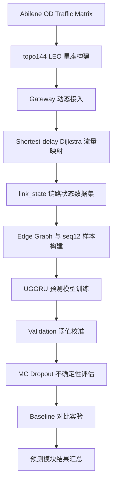
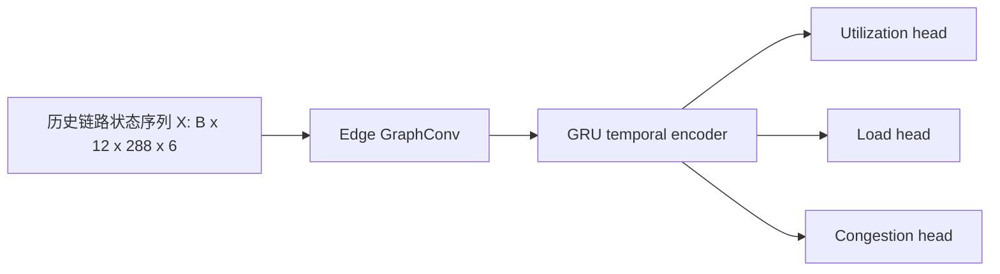

# 低轨卫星网络流量预测模块阶段性总结

## 1. 当前工作概述

本项目围绕“基于流量预测与强化学习的低轨卫星网络负载均衡路由算法研究”中的**流量预测模块**完成了阶段性实验闭环。当前已经完成 Abilene 数据下载解析、Abilene PoP 到地面 gateway 的建模、topo144 Walker-like LEO 星座构建、gateway 动态接入卫星、基于 shortest-delay Dijkstra 的链路状态数据集生成、edge graph 与 seq12 监督学习样本构建、UGGRU 主模型训练、validation 阈值校准、MC Dropout 不确定性评估，以及 Last、HA、GRU-only、LSTM-only baseline 对比。

需要明确的是，当前完成的是**流量预测模块**，不是完整强化学习路由系统。现阶段输出已经能够提供下一时刻链路利用率、负载、拥塞概率、不确定性和风险分数，为后续路由智能体提供状态输入与风险约束；但路由动作影响模型、候选路径动作空间、动作掩码机制和强化学习路由策略尚未开始实现。

## 2. 与原技术路线的对应关系

项目目录中已找到技术路线文档 `低轨卫星流量预测强化学习路由技术路线.md`。当前实现与原技术路线的对应关系如下。

| 技术路线阶段 | 原计划内容 | 当前完成情况 | 说明 |
|---|---|---|---|
| 低轨卫星网络时变拓扑建模 | 构建 Walker/Iridium-like 星座，生成卫星位置、星间链路和星地接入关系 | 基本完成 | 已实现 topo144、动态卫星位置和动态 gateway 接入；但 ISL 边集合固定，尚非完整动态断链/重连拓扑。 |
| 多场景业务流量建模 | 构建均匀、人口、周期、突发等多类业务流量 | 部分完成 | 当前采用 Abilene 真实 OD 矩阵驱动 LEO 仿真，具备真实地面流量基础；尚未扩展到四类多场景流量。 |
| 链路负载数据集生成 | 将业务流量映射到 LEO 链路，生成负载、利用率、队列等状态 | 基本完成 | 已使用 shortest-delay Dijkstra 生成 `link_state` 数据集；Dijkstra 仅作为数据集构建基线路由，不是最终路由算法。 |
| 不确定性感知时空流量预测 | 建立 GNN/GRU 类模型，预测下一时刻链路状态和拥塞风险 | 完成 | 已实现 UGGRU、阈值校准、MC Dropout 不确定性与 `risk_score`。 |
| 路由动作影响模型 | 预测不同路由动作对未来负载分布的影响 | 未开始 | 后续需要建立动作—链路负载变化的数据或仿真接口。 |
| 安全分层强化学习路由 | 候选路径、动作掩码、PPO/DQN 类策略与回退机制 | 未开始 | 后续在预测模块基础上构建强化学习环境和路由策略。 |

## 3. 总体实现流程



## 4. 数据来源与业务流量建模

**输入—处理—输出：**输入为 Abilene 全量 OD traffic matrix 和 Abilene 拓扑文件；处理过程包括 X01.gz 到 X24.gz 解析、PoP 经纬度提取、链路信息提取；输出为 `od_matrices_full.npy`、`abilene_gateways.csv` 和 `abilene_links.csv`。

| 项目 | 数值/说明 |
|---|---:|
| OD 矩阵 shape | `(48384, 12, 12)` |
| OD dtype | `float32` |
| Abilene gateway 数量 | `12` |
| Abilene 拓扑链路数量 | `30` |
| gateway 解释 | Abilene 12 个 PoP 作为地面 gateway，不是普通用户终端 |
| 数据检查 | 第 1 阶段已通过 `check_abilene_data.py` 检查 |

Abilene 原始 traffic matrix 的单位已经修正。raw value 的单位是：

```text
100 bytes / 5 minutes
```

不是 bps。正确换算为：

```text
Mbps = raw * 100 * 8 / 300 / 1e6
```

因此，本项目当前使用真实地面骨干网 OD 流量来驱动 LEO 链路状态生成，而不是随机流量。需要注意的是，当前还没有构造均匀流量、人口分布、时区周期和突发热点四类多场景业务流量。


## 5. LEO topo144 星座与 gateway 接入

**输入—处理—输出：**输入为 `configs/base.yaml`、Abilene gateway 经纬度和 OD 时间长度；处理过程包括 Walker-like topo144 卫星位置生成、4-ISL 边集合构建、gateway 到卫星仰角计算；输出为 `leo_topo144_edges.csv`、`leo_topo144_sat_positions.npy` 和 `gateway_access_topo144.npy`。

| 项目 | 数值 |
|---|---:|
| topo_name | `topo144` |
| 卫星数量 | `144` |
| 轨道面数量 | `8` |
| 每轨卫星数量 | `18` |
| 轨道高度 | `550 km` |
| 轨道倾角 | `53°` |
| ISL 无向边数量 | `288` |
| 每颗卫星度数 | min=4, mean=4.00, max=4 |
| `sat_positions` shape | `(48384, 144, 3)` |
| `gateway_access` shape | `(48384, 12)` |
| gateway 最小仰角 | `15°` |
| fallback_rate 平均值 | `0.5232%` |
| fallback_rate 最大值 | `6.2789%` |

每个 gateway 在全时间段内使用过的卫星数量如下。可以看到，在当前星座运动模型和 15° 最小仰角约束下，12 个 gateway 均覆盖到了 144 颗卫星；其中 Houston gateway 的 fallback 率最高，为 `6.28%`。

| gateway | unique satellites used | fallback_rate |
|---|---:|---:|
| ATLA-M5 | 144 | 0.0000% |
| ATLAng | 144 | 0.0000% |
| CHINng | 144 | 0.0000% |
| DNVRng | 144 | 0.0000% |
| HSTNng | 144 | 6.2789% |
| IPLSng | 144 | 0.0000% |
| KSCYng | 144 | 0.0000% |
| LOSAng | 144 | 0.0000% |
| NYCMng | 144 | 0.0000% |
| SNVAng | 144 | 0.0000% |
| STTLng | 144 | 0.0000% |
| WASHng | 144 | 0.0000% |


**重要简化假设：**当前卫星位置和 gateway 接入是动态的，但 ISL 边集合固定为 4-ISL，即“固定边集合 + 动态节点位置”的简化实验拓扑。因此当前星间拓扑还不是完整的动态断链/重连模型。由于固定 ISL，`remain_visible_time` 当前统一使用 9999 作为占位特征，尚未真实计算链路剩余可见时间。

## 6. 链路状态数据集生成

**输入—处理—输出：**输入为 Abilene OD、gateway 接入卫星表、topo144 ISL 边和卫星位置；处理过程是在每个 5 分钟时间片上使用 shortest-delay Dijkstra 将 OD 流量映射到星间链路；输出为 `link_state_topo144_shortest_delay.csv` 及诊断图表。

| 项目 | 数值/说明 |
|---|---:|
| link_state 文件大小 | `718.35 MB` |
| 行数 | `13934304` |
| time 数量 | `48383` |
| edge_id 数量 | `288` |
| capacity | `1000 Mbps` |
| congestion_threshold | `0.8` |
| congestion_label 正样本比例 | `1.3596%` |

字段包括：`time`、`edge_id`、`src_sat`、`dst_sat`、`load_mbps`、`capacity_mbps`、`utilization`、`delay_ms`、`queue_len`、`remain_visible_time`、`congestion_label`、`next_load_mbps`、`next_utilization`、`next_congestion_label`。

| 指标 | min/mean/p95/p99/max |
|---|---:|
| utilization | min=0.000000, mean=0.032433, p95=0.088715, p99=0.938044, max=9.912515 |
| MLU | mean=1.353604, p95=2.423862, p99=6.638652, max=9.912515 |

链路状态诊断结果如下。

| 诊断项 | 结果 |
|---|---:|
| Top 10 拥塞边占全部拥塞样本比例 | `16.13%` |
| 有拥塞 time 数量 | `40859` |
| 有拥塞 time 占比 | `84.45%` |
| 最大同时拥塞链路数 | `15` |
| 平均每个 time 拥塞链路数 | `3.91575553` |
| utilization 公式最大误差 | `1.7763568394e-15` |
| next 标签抽样检查 | `passed=True, checked_pairs=160` |

需要强调，shortest-delay Dijkstra 在这里只是**数据集构建阶段的基线路由**，用于把地面 OD 流量映射到 LEO 链路状态，不是本文最终要提出的负载均衡路由算法。


## 7. 预测样本与 edge graph 构建

**输入—处理—输出：**输入为 link_state CSV 和 topo144 ISL 边表；处理过程包括 edge-to-edge adjacency 构建、训练集统计量归一化、按时间顺序构造 seq_len=12 的监督样本；输出为 `edge_adj_topo144.npy`、`samples_topo144_seq12.npz` 和 split/scaler 元信息。

edge graph 的节点是“星间链路 edge”，不是卫星节点。如果两条 ISL 共享同一颗卫星，则认为这两条 edge 在 edge graph 中相邻。归一化邻接矩阵使用 `A + I` 后的 GCN 对称归一化。

| 项目 | 数值 |
|---|---:|
| `edge_adj_topo144.npy` shape | `(288, 288)` |
| edge graph degree | min=6.0, mean=6.0, max=6.0 |
| `samples_topo144_seq12.npz` 文件大小 | `487.62 MB` |
| `X.shape` | `(48372, 12, 288, 6)` |
| `y_utilization.shape` | `(48372, 288)` |
| `y_load_mbps_norm.shape` | `(48372, 288)` |
| `y_congestion.shape` | `(48372, 288)` |
| `X dtype` | `float32` |
| `y_congestion dtype` | `int8` |
| feature_names | `utilization, load_mbps_norm, delay_ms_norm, queue_len_norm, remain_visible_time_norm, congestion_label` |
| y_congestion overall positive ratio | `1.3596%` |

| split | start | end | samples |
|---|---:|---:|---:|
| train | `0` | `33860` | `33860` |
| val | `33860` | `41115` | `7255` |
| test | `41115` | `48372` | `7257` |

归一化参数保存在 `sample_scaler_topo144_seq12.json` 中，`load_mbps`、`delay_ms`、`queue_len`、`remain_visible_time` 均使用训练时间段统计量做 z-score；`utilization` 和 `congestion_label` 保持原值。因此 scaler 基于 train split，避免了验证集和测试集信息泄露。`remain_visible_time` 当前为常数 9999，其 raw std 为 0，归一化时采用安全处理。`y_congestion` 以 int8 保存，训练时转换为 float32 送入 BCEWithLogitsLoss。


## 8. UGGRU 模型设计

UGGRU 的输入为：

```text
X = [B, 12, 288, 6]
```

其中 12 是历史时间窗口长度，288 是 ISL edge 数量，6 个特征分别为 `utilization`、`load_mbps_norm`、`delay_ms_norm`、`queue_len_norm`、`remain_visible_time_norm`、`congestion_label`。

模型结构包括：GraphConvLayer 在 edge graph 上聚合相邻链路状态，提取空间关联；GRU 对每条链路的历史序列建模，提取时间依赖；三个输出 head 分别预测 `next_utilization`、`next_load_mbps_norm` 和 `next_congestion` logit。

```text
loss = 1.0 * MSE(util) + 0.3 * MSE(load) + 0.5 * BCE(congestion)
```

其中 BCE 使用训练集拥塞正负样本比例计算的 `pos_weight`，以缓解拥塞样本严重不平衡问题。



| 训练配置 | 数值 |
|---|---:|
| model | `uggru` |
| seq_len | `12` |
| batch_size | `16` |
| lr | `0.001` |
| gcn_hidden | `32` |
| gru_hidden | `64` |
| dropout | `0.2` |
| pos_weight | `66.294270` |
| device | `cuda` |
| total_epochs | `50` |
| best_epoch | `43` |
| best_val_loss | `0.186405` |
| final_train_loss | `0.356358` |
| final_val_loss | `0.192615` |


## 9. 阈值校准与拥塞分类结果

普通二分类默认 threshold=0.5 并不适合当前拥塞检测任务，因为真实拥塞样本比例只有 `1.32%` 左右，类别极不平衡。若直接使用 0.5，模型倾向于高召回但低精度，不利于后续路由系统中的风险控制。

因此，本项目采用更严谨的流程：**先在 validation set 上扫描阈值并选择最佳阈值，再固定该阈值应用到 test set**，避免在测试集上调参。validation set 上 best F1 对应阈值为 0.95，固定到 test set 后结果如下。

| 指标 | 数值 |
|---|---:|
| selected_threshold | `0.95` |
| Precision | `0.460489` |
| Recall | `0.625566` |
| F1 | `0.530482` |
| predicted_positive_ratio | `1.7929%` |
| true_positive_ratio | `1.3198%` |


## 10. MC Dropout 不确定性评估

**输入—处理—输出：**输入为 UGGRU `best_model.pt` 和 test split；处理过程是在推理阶段保持 Dropout 随机性，进行 `20` 次 Monte Carlo forward；输出为预测均值、预测标准差、拥塞概率均值/标准差、风险分数、指标 JSON 和图表。

风险分数定义为：

```text
risk_score = util_pred_mean + lambda * util_pred_std
```

拥塞风险分数定义为：

```text
congestion_risk_score = cong_prob_mean + lambda * cong_prob_std
```

本阶段 `lambda=1.0`，分类阈值使用 validation 选择得到的 `threshold=0.95`。

| 指标 | 数值 |
|---|---:|
| MC samples | `20` |
| MAE_util | `0.033984` |
| RMSE_util | `0.161991` |
| coverage_1std | `76.46%` |
| coverage_2std | `89.95%` |
| uncertainty_error_corr | `0.555298` |
| Precision | `0.477283` |
| Recall | `0.598702` |
| F1 | `0.531142` |

风险排序结果是本阶段最有价值的输出之一。以全体 test 位置真实拥塞比例 `1.3198%` 作为随机基线，风险分数显著富集真实拥塞链路。

| 风险位置 | 真实拥塞率 | lift |
|---|---:|---:|
| Top 1% | `57.46%` | `43.539562x` |
| Top 5% | `22.27%` | `16.873404x` |
| Top 10% | `12.30%` | `9.321666x` |

这说明 `risk_score` 是当前预测模块中最适合接入后续路由决策的结果，可作为强化学习路由的风险感知状态、候选路径惩罚项或动作掩码约束。MC Dropout 的价值并不是显著降低 MAE/RMSE，而是提供不确定性估计和风险排序能力。


## 11. Baseline 对比实验

**输入—处理—输出：**输入为同一份 seq12 样本和 train/val/test split；处理过程包括无训练 Last/HA baseline 评估、GRU-only/LSTM-only 训练与测试，以及与 UGGRU/MC Dropout 汇总对比；输出为 `prediction_model_comparison.*` 和对比图。

| Model | MAE_util | RMSE_util | Precision | Recall | F1 | 说明 |
|---|---:|---:|---:|---:|---:|---|
| Last | 0.031954 | 0.211180 | 0.447329 | 0.447232 | 0.447281 | No-training persistence baseline |
| HA | 0.057850 | 0.221878 | 0.002793 | 0.000036 | 0.000072 | No-training historical average baseline |
| GRU-only | 0.033540 | 0.170046 | 0.145799 | 0.852047 | 0.248991 | Temporal baseline without edge graph |
| LSTM-only | 0.035003 | 0.169367 | 0.151694 | 0.848856 | 0.257391 | Temporal baseline without edge graph |
| UGGRU | 0.033072 | 0.160971 | 0.460489 | 0.625566 | 0.530482 | Graph and temporal model, threshold selected on validation |
| UGGRU + MC Dropout | 0.033984 | 0.161991 | 0.477283 | 0.598702 | 0.531142 | UGGRU with MC Dropout uncertainty |

GRU-only 和 LSTM-only 均使用 CUDA 训练评估。GRU-only best_epoch=18，best_val_loss=0.249373；LSTM-only best_epoch=22，best_val_loss=0.247063。训练日志和预测文件已检查为 finite，未发现 OOM 或 NaN/Inf。

从结果看，Last baseline 的 MAE_util 最低，但 RMSE 明显较高，说明链路状态存在较强短时惯性，但突变或拥塞峰值时误差较大。HA baseline 平滑了短时变化，拥塞识别几乎失效。GRU-only 和 LSTM-only 能建模时间序列，但缺少链路空间结构。UGGRU 引入 edge graph 后，RMSE 和 F1 都明显优于纯时间序列 baseline。MC Dropout 保持预测性能基本不下降，同时提供了不确定性和风险排序能力。


## 12. 当前实验结果汇总

### 12.1 训练配置表

| 项目 | 数值 |
|---|---:|
| model | `uggru` |
| seq_len | `12` |
| batch_size | `16` |
| lr | `0.001` |
| gcn_hidden | `32` |
| gru_hidden | `64` |
| dropout | `0.2` |
| pos_weight | `66.294270` |
| device | `cuda` |
| best_epoch | `43` |
| best_val_loss | `0.186405` |

### 12.2 UGGRU 预测性能表

| 指标 | 数值 |
|---|---:|
| MAE_util | `0.033072` |
| RMSE_util | `0.160971` |
| MAE_load_norm | `0.156283` |
| RMSE_load_norm | `0.763085` |
| Precision | `0.460489` |
| Recall | `0.625566` |
| F1 | `0.530482` |

### 12.3 不确定性和风险排序表

| 指标 | 数值 |
|---|---:|
| coverage_1std | `76.46%` |
| coverage_2std | `89.95%` |
| uncertainty_error_corr | `0.555298` |
| risk_top1_congestion_rate | `57.46%` |
| risk_top5_congestion_rate | `22.27%` |
| risk_top10_congestion_rate | `12.30%` |
| top1_lift | `43.539562x` |
| top5_lift | `16.873404x` |
| top10_lift | `9.321666x` |

## 13. 当前工作的主要结论

1. 已经构建了可用于预测研究的 LEO 链路状态数据集，覆盖 48383 个时间片、288 条 ISL 边和约 1393 万条链路状态样本。
2. Abilene 真实 OD 数据能够驱动 LEO 仿真，形成具有真实地面流量特征的链路负载与拥塞序列。
3. UGGRU 能够同时利用 edge graph 空间结构和 GRU 时间依赖，在 RMSE_util 和拥塞 F1 上优于 GRU-only、LSTM-only 等纯时间序列 baseline。
4. MC Dropout 提供了有意义的不确定性估计，`util_pred_std` 与绝对误差的相关系数为 `0.555298`，`mean ± 2std` 覆盖率达到 `89.95%`。
5. `risk_score` 能显著富集真实拥塞链路，Top 1% 高风险位置真实拥塞率达到 `57.46%`，相对随机基线提升 `43.539562x`，适合作为后续强化学习路由的风险感知输入。

## 14. 当前简化假设与不足

1. 当前 ISL 边集合固定，不是完整动态星间链路断开/重连模型；卫星位置和 gateway 接入动态变化，但 4-ISL 边集合保持固定。
2. `remain_visible_time` 目前是 9999 占位值，尚未根据真实动态 ISL 或 TLE/SGP4 计算剩余可见时间。
3. 当前业务流量使用 Abilene OD 数据映射，尚未构造均匀、人口分布、时区周期和突发热点多场景流量。
4. 当前链路状态生成使用 shortest-delay Dijkstra，尚未模拟真实路由策略反馈，也没有建立“路由动作改变未来负载”的闭环数据。
5. 当前预测模块还没有接入强化学习路由，尚不能直接输出路由动作或路径选择策略。
6. 当前还没有实现路由动作影响模型、候选路径集合、动作掩码机制和传统路由回退策略。

## 15. 下一步工作计划

1. 构建路由动作影响模型，描述不同候选路径或分流动作对未来链路负载、拥塞概率和风险分数的影响。
2. 生成源宿 gateway 对之间的候选路径集合，包括 shortest-delay、load-aware、risk-aware 等候选路径。
3. 设计动作掩码机制，屏蔽不可达路径、高风险路径或违反稳定性约束的动作。
4. 构建强化学习环境，将当前链路状态、UGGRU 预测结果、MC Dropout 不确定性和 risk_score 作为状态输入。
5. 设计奖励函数，综合考虑平均时延、MLU、拥塞率、丢包风险、路径切换代价和安全回退。
6. 实现 Masked PPO 或简化 PPO，先完成单智能体/集中式版本，再考虑分层或分布式扩展。
7. 与 Dijkstra、Load-aware Dijkstra、ECMP、DQN 等路由方法进行对比实验。
8. 后续扩展动态 ISL、真实剩余可见时间、多场景业务流量和更精确轨道传播模型。

## 16. 可直接用于论文/汇报的表述

本阶段围绕低轨卫星网络主动负载均衡路由中的流量预测模块，完成了从真实地面业务流量到 LEO 链路状态预测的实验闭环。项目首先解析 Abilene 全量 OD traffic matrix，将 12 个 Abilene PoP 建模为地面 gateway，并修正了 Abilene raw value 的单位换算：其单位为 100 bytes / 5 minutes，而非 bps。随后构建 topo144 Walker-like LEO 星座，生成 144 颗卫星的动态位置、288 条固定 4-ISL 星间链路以及 15° 最小仰角约束下的 gateway 动态接入关系。在此基础上，使用 shortest-delay Dijkstra 将 Abilene OD 流量映射到星间链路，生成包含链路负载、利用率、时延、队列、拥塞标签及下一时刻标签的链路状态数据集。

预测建模方面，本文实现了 UGGRU 模型，以星间链路作为 edge graph 节点，通过图卷积提取链路空间关联，并利用 GRU 建模时间依赖，联合预测下一时刻链路利用率、负载和拥塞状态。针对拥塞样本不平衡问题，采用 validation set 选择分类阈值，再固定应用于 test set，避免测试集调参。实验结果显示，UGGRU 在 RMSE_util 和拥塞 F1 上优于 Last、HA、GRU-only 和 LSTM-only baseline。进一步地，MC Dropout 被用于估计预测不确定性，并构建 `risk_score = mean + lambda * std`。风险排序结果显示，Top 1%、Top 5% 和 Top 10% 高风险位置的真实拥塞率分别达到 `57.46%`、`22.27%` 和 `12.30%`，相对随机基线提升显著。这说明当前预测模块已经可以为后续强化学习路由提供未来负载、拥塞概ddddxfxxzaa协助执行通知书zxxxxxxxzzzzzzzzzzzzzzzzzzzzc vyg6rdsaa率、不确定性和风险约束等关键输入。当前不足在于 ISL 仍为固定边集合、`remain_visible_time` 尚为占位值、多场景业务流量和路由动作影响模型尚未实现。下一步将围绕候选路径生成、动作掩码、奖励函数和 Masked PPO 等内容构建完整的风险感知负载均衡路由模块。

## 缺失文件列表

- 无。

## 本文档引用的主要结果文件

- `configs/base.yaml`
- `PROJECT_SPEC.md`
- `README.md`
- `低轨卫星流量预测强化学习路由技术路线.md`
- `data/processed/od_matrices_full.npy`
- `data/processed/abilene_gateways.csv`
- `data/processed/abilene_links.csv`
- `data/processed/leo_topo144_edges.csv`
- `data/processed/leo_topo144_sat_positions.npy`
- `data/processed/gateway_access_topo144.npy`
- `data/processed/gateway_access_stats_topo144.csv`
- `data/processed/link_state_topo144_shortest_delay.csv`
- `data/results/link_state_diagnosis.txt`
- `data/processed/edge_adj_topo144.npy`
- `data/processed/samples_topo144_seq12.npz`
- `data/processed/splits_topo144_seq12.json`
- `data/processed/sample_scaler_topo144_seq12.json`
- `runs/uggru_topo144_seq12/train_config.json`
- `runs/uggru_topo144_seq12/train_log.csv`
- `data/results/uggru_test_metrics.json`
- `data/results/uggru_val_selected_threshold_test_metrics.json`
- `data/results/mc_dropout_metrics.json`
- `data/results/mc_dropout_risk_topk.csv`
- `data/results/prediction_summary_metrics.json`
- `data/results/prediction_model_comparison.json`
