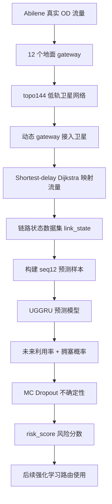
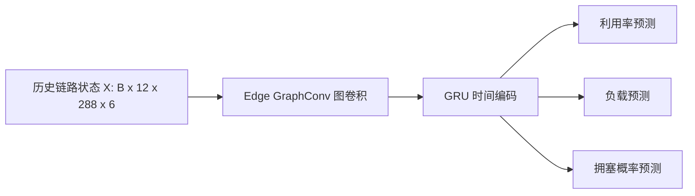

# 低轨卫星网络流量预测模块：快速看懂版（带图解与术语注释）

> 建议保存位置：`D:\llyc\leo_flow_prediction\docs\flow_prediction_quick_understanding_v2.md`  
> 用途：明天汇报前快速理解项目。  
> 阅读目标：用最短时间讲清楚 **研究在做什么、为什么这么做、现在做到哪、结果说明什么、下一步路由算法怎么接上去**。  
> 当前阶段结论：**流量预测模块已经基本完成，强化学习路由模块还没有开始。**

---

## 0. 先记住一句话

我们现在做的不是完整路由算法，而是完整路由算法前面的**流量预测模块**。

一句话概括：

> 我们先构建一个低轨卫星网络，把真实地面网络流量映射到星间链路上，然后训练模型预测每条星间链路下一时刻的负载、拥塞概率和不确定性，为后续强化学习路由提前避开拥塞链路做准备。

更口语一点：

> 就像导航软件要先预测哪条路会堵车，我们现在是在卫星网络里预测哪条星间链路未来会拥塞。

---

## 1. 本文常见英文缩写和术语

| 英文/缩写 | 中文含义 | 在本文中的意思 |
|---|---|---|
| LEO | Low Earth Orbit，低地球轨道 | 指低轨卫星网络 |
| ISL | Inter-Satellite Link，星间链路 | 卫星与卫星之间的通信链路 |
| OD | Origin-Destination，源-目的 | 地面节点之间的业务流量矩阵 |
| PoP | Point of Presence，网络接入点 | Abilene 数据中的 12 个地面节点 |
| Gateway | 地面网关 | 地面 PoP 接入卫星网络的入口 |
| Abilene | 美国科研骨干网数据集 | 当前使用的真实地面 OD 流量来源 |
| topo144 | 144 颗卫星拓扑 | 当前构建的低轨卫星网络场景名称 |
| 4-ISL | 每颗卫星 4 条星间链路 | 同轨前后 + 邻轨方向的固定连接方式 |
| Dijkstra | 迪杰斯特拉最短路径算法 | 当前用于生成训练数据的基线路由 |
| Shortest-delay Dijkstra | 最小时延 Dijkstra | 以传播时延为边权的最短路径算法 |
| link_state | 链路状态 | 每个时间片、每条 ISL 的负载/利用率/拥塞信息 |
| Edge graph | 链路图 | 把每条 ISL 当成图节点构建的图 |
| Seq12 | 长度为 12 的历史序列 | 用过去 12 个时间片预测下一时刻 |
| GNN | Graph Neural Network，图神经网络 | 用来学习链路之间空间关系 |
| GraphConv | Graph Convolution，图卷积 | 在 edge graph 上聚合相邻链路信息 |
| GRU | Gated Recurrent Unit，门控循环单元 | 用来学习时间序列变化 |
| LSTM | Long Short-Term Memory，长短期记忆网络 | baseline 中的经典时序模型 |
| UGGRU | Uncertainty-aware Graph GRU | 当前主模型，图结构 + GRU + 不确定性 |
| MC Dropout | Monte Carlo Dropout，蒙特卡洛 Dropout | 多次随机推理得到预测不确定性 |
| Risk score | 风险分数 | 利用率预测值 + 不确定性，用于衡量链路风险 |
| MLU | Maximum Link Utilization，最大链路利用率 | 某时间片所有链路中最高利用率 |
| MAE | Mean Absolute Error，平均绝对误差 | 回归预测误差指标，越小越好 |
| RMSE | Root Mean Squared Error，均方根误差 | 对大误差更敏感，越小越好 |
| Precision | 精确率 | 预测为拥塞的链路中，真正拥塞的比例 |
| Recall | 召回率 | 真实拥塞链路中，被模型找出来的比例 |
| F1 | F1 值 | Precision 和 Recall 的综合指标 |
| Baseline | 基线模型 | 用来和主模型对比的简单/常见方法 |
| PPO | Proximal Policy Optimization，近端策略优化 | 后续可用的强化学习算法 |
| Masked PPO | 带动作掩码的 PPO | 后续可屏蔽不可用/高风险路径的 PPO |

---

## 2. 当前完成了什么？

当前完成的是：**从地面流量数据到卫星链路未来拥塞风险预测的完整流程**。

| 模块 | 是否完成 | 简单解释 |
|---|---:|---|
| Abilene 流量数据解析 | 已完成 | 用真实地面 OD 流量作为业务输入 |
| topo144 低轨星座构建 | 已完成 | 构建 144 颗卫星和 288 条 4-ISL 链路 |
| gateway 动态接入 | 已完成 | 12 个地面 PoP 随时间接入不同卫星 |
| 链路状态数据集生成 | 已完成 | 得到每条 ISL 每个时间片的负载、利用率和拥塞标签 |
| 预测样本构建 | 已完成 | 用过去 12 个时间片预测下一时刻 |
| UGGRU 模型训练 | 已完成 | 预测下一时刻利用率、负载和拥塞概率 |
| 阈值校准 | 已完成 | validation 选 threshold=0.95，test 固定评估 |
| MC Dropout 不确定性 | 已完成 | 得到预测不确定性和 risk_score |
| baseline 对比 | 已完成 | 对比 Last、HA、GRU-only、LSTM-only |
| 强化学习路由 | 未开始 | 后续工作 |

一句话：

> 当前已经从“原始地面流量”做到“未来链路拥塞风险预测”，预测模块已经闭环。

---

## 3. 整体流程图



汇报时可以这样说：

> 我们从 Abilene 地面 OD 流量出发，映射到 topo144 低轨卫星网络中，得到星间链路状态序列。然后用 UGGRU 模型预测下一时刻每条链路的利用率和拥塞概率，再用 MC Dropout 得到不确定性，最终形成 risk_score，为后续路由决策提供输入。

---

## 4. 图片总导读：每张图看什么？

| 图片 | 主要含义 | 横坐标 | 纵坐标 |
|---|---|---|---|
| `abilene_total_traffic_curve.png` | Abilene 全网总流量随时间变化 | 时间片编号 / 时间顺序 | 总流量，通常为 Mbps 或换算后的流量规模 |
| `leo_topo144_snapshot.png` | topo144 卫星星座某一时刻的空间分布 | 空间坐标 / 投影坐标 | 空间坐标 / 投影坐标 |
| `gateway_access_example.png` | 地面 gateway 随时间接入不同卫星的变化 | 时间片编号 | 接入卫星编号或接入关系 |
| `leo_average_utilization_curve.png` | 全网平均链路利用率随时间变化 | 时间片编号 | 平均 utilization（链路利用率） |
| `leo_mlu_curve.png` | 最大链路利用率随时间变化 | 时间片编号 | MLU，即当前时间片最高链路利用率 |
| `sample_congestion_ratio_split.png` | train/val/test 中拥塞样本比例 | 数据划分名称 | 拥塞正样本比例 |
| `uggru_train_val_loss.png` | UGGRU 训练和验证 loss 曲线 | epoch（训练轮数） | loss（损失值） |
| `uggru_val_to_test_threshold_prf_curve.png` | 不同阈值下 Precision/Recall/F1 变化 | threshold（拥塞判定阈值） | Precision、Recall、F1 |
| `mc_dropout_uncertainty_bins.png` | 不确定性越高，误差是否越大 | 不确定性分箱 | 平均绝对误差 |
| `mc_dropout_risk_topk.png` | 高风险位置中的真实拥塞比例 | Top-k 风险比例 | 真实拥塞率 |
| `prediction_model_comparison_mae_rmse.png` | 不同模型 MAE/RMSE 对比 | 模型名称 | MAE_util / RMSE_util |
| `prediction_model_comparison_f1.png` | 不同模型 F1 对比 | 模型名称 | F1 值 |

---

## 5. 数据从哪里来？

当前使用 **Abilene（美国科研骨干网数据集）** 的真实 **OD（Origin-Destination，源-目的）流量矩阵**。

| 项目 | 数值 |
|---|---:|
| OD 矩阵 shape | `(48384, 12, 12)` |
| 时间片数量 | `48384` |
| PoP / gateway 数量 | `12` |
| Abilene 拓扑链路数量 | `30` |

`12 × 12` 表示 12 个地面 **PoP（Point of Presence，网络接入点）** 之间的业务流量矩阵。


**图 1：Abilene 总流量曲线。**  
这张图展示 Abilene 全网业务流量随时间的变化。横坐标是时间片编号，纵坐标是该时间片所有 OD 流量累加后的总流量。它说明输入业务流量本身是动态变化的，不是固定常数。

### 一个关键修正：单位换算

Abilene 的 raw value（原始数值）单位不是 bps，而是：

```text
100 bytes / 5 minutes
```

正确换算为 Mbps：

```text
Mbps = raw * 100 * 8 / 300 / 1e6
```

这个修正非常重要。单位如果错了，后面链路负载、拥塞比例和模型训练都会错。

---

## 6. 卫星网络怎么建的？

当前构建的是一个简化 **Walker-like（类似 Walker 星座）** 低轨星座，命名为 `topo144`。

| 项目 | 数值 |
|---|---:|
| 卫星数量 | `144` |
| 轨道面数量 | `8` |
| 每轨卫星数 | `18` |
| 轨道高度 | `550 km` |
| 轨道倾角 | `53°` |
| 星间链路模式 | `4-ISL` |
| 无向 ISL 边数 | `288` |
| 每颗卫星度数 | `4` |
| gateway 最小仰角 | `15°` |


**图 2：topo144 卫星星座快照。**  
这张图展示某一时刻 144 颗低轨卫星的空间分布及其 4-ISL 连接关系。横坐标和纵坐标表示卫星位置的空间投影坐标，用来直观看到当前星座覆盖和连接结构。

### gateway 接入是动态的

```text
gateway_access_topo144.npy shape = (48384, 12)
```

每个时间片，每个地面 **gateway（地面网关）** 会根据仰角选择一个接入卫星。


**图 3：gateway 接入卫星变化示例。**  
这张图展示部分 gateway 在不同时间片接入卫星编号的变化。横坐标是时间片编号，纵坐标是接入卫星编号或接入关系。它说明地面网关不是固定接入同一颗卫星，而是随卫星运动动态切换。

### 但 ISL 目前是固定边集合

| 部分 | 是否动态 |
|---|---:|
| 卫星位置 | 动态 |
| gateway 接入卫星 | 动态 |
| 星间链路 ISL 边集合 | 固定 |
| ISL 断开/重连 | 暂未模拟 |
| remain_visible_time | 9999 占位值 |

如果老师问“你的拓扑是不是动态的”，可以回答：

> 当前是半动态拓扑。卫星位置和 gateway 接入随时间变化，但星间链路边集合暂时固定。这样做是为了先验证流量预测模块，后续可以加入真实动态 ISL 和剩余可见时间。

---

## 7. 链路状态数据集怎么来的？

当前做法：

1. 源 PoP 找到当前接入卫星；
2. 目的 PoP 找到当前接入卫星；
3. 在卫星网络中用 **shortest-delay Dijkstra（最小时延迪杰斯特拉算法）** 找路径；
4. 把 OD 流量累加到路径经过的 ISL 上；
5. 得到每条星间链路的负载、利用率和拥塞标签。

注意：

> Dijkstra 只是生成训练数据的基线路由，不是最终算法。

最终生成：

```text
link_state_topo144_shortest_delay.csv
```

| 项目 | 数值 |
|---|---:|
| 文件大小 | `约 718 MB` |
| 行数 | `13,934,304` |
| time 数量 | `48,383` |
| edge_id 数量 | `288` |
| capacity | `1000 Mbps` |
| 拥塞阈值 | `utilization > 0.8` |
| 拥塞样本比例 | `1.3596%` |

主要字段：

```text
load_mbps
utilization
delay_ms
queue_len
remain_visible_time
congestion_label
next_load_mbps
next_utilization
next_congestion_label
```


**图 4：平均链路利用率曲线。**  
横坐标是时间片编号，纵坐标是该时间片 288 条星间链路的平均 utilization（链路利用率）。这张图用来观察全网平均负载是否随时间变化。


**图 5：最大链路利用率 MLU 曲线。**  
横坐标是时间片编号，纵坐标是 MLU（Maximum Link Utilization，最大链路利用率），即该时间片所有链路中的最高利用率。MLU 高说明存在局部链路拥塞或高负载，是负载均衡路由重点要降低的指标。

---

## 8. 预测样本怎么构建？

我们用过去 12 个时间片预测下一时刻。

样本文件：

```text
samples_topo144_seq12.npz
```

| 数组 | shape | 说明 |
|---|---|---|
| X | `(48372, 12, 288, 6)` | 输入样本 |
| y_utilization | `(48372, 288)` | 下一时刻链路利用率 |
| y_load_mbps_norm | `(48372, 288)` | 下一时刻归一化负载 |
| y_congestion | `(48372, 288)` | 下一时刻是否拥塞 |

其中：

```text
12 = 历史窗口长度
288 = 星间链路数量
6 = 每条链路特征数
```

训练、验证、测试集按时间顺序划分：

| Split | 范围 | 样本数 |
|---|---:|---:|
| train | `[0, 33860)` | `33860` |
| val | `[33860, 41115)` | `7255` |
| test | `[41115, 48372)` | `7257` |

为什么按时间划分？

> 因为这是时间序列预测，如果随机划分，会把未来信息泄露到训练集里。


**图 6：不同数据集划分中的拥塞样本比例。**  
横坐标是 train、val、test 三个数据划分，纵坐标是 `y_congestion` 中正样本比例，也就是未来发生拥塞的样本占比。它说明当前任务是明显不平衡分类任务。

---

## 9. UGGRU 是什么？

**UGGRU（Uncertainty-aware Graph GRU，不确定性感知图 GRU）** 可以这样拆开理解：

```text
U = Uncertainty-aware，不确定性感知
G = Graph，图结构
GRU = Gated Recurrent Unit，门控循环单元
```

它的作用：

> 同时利用“链路之间的空间关系”和“链路自身的时间变化”，预测下一时刻链路利用率和拥塞概率。

### 为什么要用图？

星间链路不是孤立的。一条链路拥塞，往往和附近链路、同一路径上的链路有关。

所以我们把每条 ISL 当成 **edge graph（链路图）** 中的节点：

> 如果两条 ISL 共享同一颗卫星，就认为它们在 edge graph 中相邻。

### 模型结构



训练配置：

| 项目 | 数值 |
|---|---:|
| batch_size | `16` |
| lr | `0.001` |
| gcn_hidden | `32` |
| gru_hidden | `64` |
| dropout | `0.2` |
| device | `cuda` |
| best_epoch | `43` |
| best_val_loss | `0.186405` |


**图 7：UGGRU 训练/验证 loss 曲线。**  
横坐标是 epoch（训练轮数），纵坐标是 loss（损失值）。一般来说，loss 下降说明模型在学习；validation loss 最低的位置对应 best epoch，本实验 best epoch 为 43。

---

## 10. 为什么还要做阈值校准？

拥塞样本很少：

```text
test true positive ratio ≈ 1.32%
```

如果直接用默认阈值 0.5，模型会误报较多。

所以我们做了更规范的处理：

1. 在 validation set 上扫描阈值；
2. 选出最佳阈值；
3. 固定这个阈值到 test set；
4. 不在 test set 上调参。

最终选择：

```text
threshold = 0.95
```

test set 结果：

| 指标 | 数值 |
|---|---:|
| Precision | `0.460489` |
| Recall | `0.625566` |
| F1 | `0.530482` |
| true_positive_ratio | `1.3198%` |
| predicted_positive_ratio | `1.7929%` |


**图 8：阈值校准曲线。**  
横坐标是 threshold（拥塞判定阈值），纵坐标是 Precision（精确率）、Recall（召回率）和 F1。该图用来选择一个更合适的拥塞判定阈值。当前使用 validation set 选择 threshold=0.95，再固定到 test set 上评估。

一句话解释：

> 阈值校准让模型从“过度报警”变成“更平衡地识别拥塞”。

---

## 11. MC Dropout 是干什么的？

普通模型只告诉你：

> 下一时刻这条链路利用率大概是多少。

但路由决策还需要知道：

> 这个预测靠不靠谱？

**MC Dropout（Monte Carlo Dropout，蒙特卡洛 Dropout）** 就是让模型在测试时保留 dropout，多次预测，得到：

| 输出 | 含义 |
|---|---|
| util_pred_mean | 利用率预测均值 |
| util_pred_std | 利用率预测不确定性 |
| cong_prob_mean | 拥塞概率均值 |
| cong_prob_std | 拥塞概率不确定性 |

然后构造风险分数：

```text
risk_score = util_pred_mean + lambda * util_pred_std
```

也就是说：

> 预测利用率高，而且模型还不确定，就认为这条链路风险更高。

MC Dropout 结果：

| 指标 | 数值 |
|---|---:|
| MAE_util | `0.033984` |
| RMSE_util | `0.161991` |
| coverage_1std | `76.46%` |
| coverage_2std | `89.95%` |
| uncertainty_error_corr | `0.555298` |
| F1 | `0.531142` |

最关键的指标是：

```text
uncertainty_error_corr = 0.555298
```

这说明：

> 模型越不确定的位置，确实越容易预测错。


**图 9：不确定性分箱与预测误差关系。**  
横坐标是不确定性分箱，也就是按照 `util_pred_std` 从低到高划分的区间；纵坐标是每个区间内的平均绝对误差。若曲线整体上升，说明模型不确定性越高，预测误差通常也越大。

---

## 12. 当前最亮眼的结果：risk_score

风险排序结果：

| 高风险位置 | 真实拥塞率 | 相对随机提升 |
|---|---:|---:|
| Top 1% | `57.46%` | `43.54x` |
| Top 5% | `22.27%` | `16.87x` |
| Top 10% | `12.30%` | `9.32x` |

整体 test set 中真实拥塞比例只有约：

```text
1.32%
```

但如果只看模型认为风险最高的 Top 1% 位置，真实拥塞比例变成：

```text
57.46%
```

所以可以这样汇报：

> risk_score 能把真正容易拥塞的链路筛出来。后续路由算法可以优先避开这些高风险链路。


**图 10：高风险 Top-k 位置中的真实拥塞率。**  
横坐标是 Top-k 比例，例如 Top 1%、Top 5%、Top 10%；纵坐标是这些高风险位置中真实发生拥塞的比例。该图用于证明 risk_score 能够有效筛选高风险链路。

---

## 13. baseline 对比说明了什么？

最终对比表：

| Model | 中文说明 | MAE_util | RMSE_util | F1 | 结论 |
|---|---|---:|---:|---:|---|
| Last | 最后一时刻预测法 | `0.031954` | `0.211180` | `0.447281` | 短时惯性强，但突变误差大 |
| HA | Historical Average，历史平均 | `0.057850` | `0.221878` | `0.000072` | 平均会抹平拥塞信号 |
| GRU-only | 只用 GRU 的时间模型 | `0.033540` | `0.170046` | `0.248991` | 只看时间，不看图结构 |
| LSTM-only | 只用 LSTM 的时间模型 | `0.035003` | `0.169367` | `0.257391` | 只看时间，不看图结构 |
| UGGRU | 图结构 + 时间序列 | `0.033072` | `0.160971` | `0.530482` | 图结构 + 时间序列 |
| UGGRU + MC Dropout | UGGRU + 不确定性估计 | `0.033984` | `0.161991` | `0.531142` | 增加不确定性和风险排序 |


**图 11：不同模型 MAE/RMSE 对比。**  
横坐标是模型名称，纵坐标是 MAE_util 和 RMSE_util。MAE 表示平均绝对误差，RMSE 对大误差更敏感。该图用于比较不同模型的链路利用率预测误差。


**图 12：不同模型拥塞预测 F1 对比。**  
横坐标是模型名称，纵坐标是 F1 值。F1 综合考虑 Precision 和 Recall，更适合评价拥塞这种不平衡分类任务。UGGRU 和 UGGRU + MC Dropout 的 F1 明显高于 GRU-only 和 LSTM-only，说明图结构对拥塞识别有帮助。

### 这个表怎么讲？

1. **Last 的 MAE 最低，不代表它最好。**  
   Last 适合平稳时刻，但 RMSE 高，说明遇到突变或高负载时误差大。

2. **HA 很差。**  
   历史平均会把突发拥塞抹平，所以 F1 几乎为 0。

3. **GRU/LSTM 不如 UGGRU。**  
   GRU/LSTM 只看时间，UGGRU 还看链路之间的图结构，所以拥塞 F1 更高。

4. **MC Dropout 的价值不是 MAE。**  
   它主要提供不确定性和 risk_score。

---

## 14. 明天汇报可以这样讲

### 第 1 分钟：研究目标

> 我的研究方向是基于流量预测的低轨卫星网络负载均衡路由。目前我先完成了前面的流量预测模块，目标是预测每条星间链路下一时刻的利用率、拥塞概率和不确定性，为后续强化学习路由提前避开高风险链路做准备。

### 第 2 分钟：数据和拓扑

> 数据上，我使用 Abilene 真实 OD 流量作为地面业务输入，共 48384 个时间片、12 个 PoP。拓扑上，我构建了 topo144 低轨星座，包括 144 颗卫星和 288 条 4-ISL 星间链路。gateway 接入关系随时间变化，但当前 ISL 边集合固定，是一个简化的半动态拓扑。

### 第 3 分钟：链路状态数据集

> 我把每个时间片的 OD 流量映射到对应接入卫星之间，再用 shortest-delay Dijkstra 生成基础路径，统计每条星间链路的负载、利用率和拥塞标签，最终生成约 1393 万行链路状态数据。

### 第 4 分钟：预测模型和不确定性

> 预测阶段，我构建了以星间链路为节点的 edge graph，使用 GraphConv 学习链路空间关系，再用 GRU 学习时间变化，形成 UGGRU 模型。模型同时预测下一时刻利用率、负载和拥塞概率。进一步用 MC Dropout 得到预测不确定性，并构造 risk_score。

### 第 5 分钟：结果和下一步

> 结果上，UGGRU 的 RMSE 和拥塞 F1 优于 GRU-only、LSTM-only 等 baseline。MC Dropout 得到的不确定性与误差相关系数为 0.555。更重要的是，Top 1% 高风险位置真实拥塞率达到 57.46%，约为随机基线的 43.54 倍。下一步我会把 risk_score 接入候选路径生成、动作掩码和强化学习路由模块。

---

## 15. 老师可能问什么？怎么回答？

### Q1：你现在已经做了路由算法吗？

回答：

> 还没有。目前完成的是流量预测模块，它为后续路由算法提供未来链路状态、拥塞概率和风险分数。下一步才是强化学习路由模块。

### Q2：为什么要先做预测？

回答：

> 因为负载均衡路由不能只看当前链路状态。有些链路当前不拥塞，但下一时刻可能拥塞。预测模块可以让路由算法提前避开潜在拥塞链路，实现主动负载均衡。

### Q3：为什么用 Abilene？它不是卫星数据吧？

回答：

> 是的，Abilene 是地面 backbone 网络数据。这里主要把它作为真实 OD 流量模式输入，用来模拟地面 gateway 之间的业务需求。它不是卫星实测流量，但比随机流量更有真实时间变化特征。后续可以叠加热点、周期和突发业务场景。

### Q4：你的拓扑是动态的吗？

回答：

> 当前是半动态。卫星位置和 gateway 接入关系是动态的，但 ISL 边集合固定为 4-ISL。也就是说目前先用简化拓扑验证预测模块，后续可以引入动态 ISL 和真实链路剩余可见时间。

### Q5：为什么用 Dijkstra？

回答：

> Dijkstra 目前只用于生成训练数据，是一个基线路由方式。它不是最终算法。最终目标是基于预测结果和强化学习实现负载均衡路由。

### Q6：UGGRU 比 GRU/LSTM 好在哪里？

回答：

> GRU/LSTM 只看时间变化，UGGRU 还利用 edge graph 建模链路之间的空间关系。因为链路拥塞有空间相关性，所以 UGGRU 的拥塞 F1 明显更高。

### Q7：MC Dropout 的意义是什么？

回答：

> 它主要用来估计预测不确定性。路由算法不仅要知道预测值是多少，还要知道预测是否可靠。risk_score 就是结合预测均值和不确定性得到的风险指标。

### Q8：你最重要的结果是什么？

回答：

> 我认为最重要的是 risk_score 的排序结果。Top 1% 高风险位置真实拥塞率达到 57.46%，约为随机基线的 43.54 倍，说明模型能有效找出真正容易拥塞的链路。

---

## 16. 必须主动说明的不足

| 不足 | 怎么说 |
|---|---|
| ISL 当前固定 | 当前先采用固定 4-ISL 验证预测模块，后续可扩展动态 ISL |
| remain_visible_time 是占位 | 当前为 9999，后续接入真实可见时间 |
| 业务场景还不丰富 | 当前使用 Abilene，后续可增加热点、周期、突发流量 |
| 还没做强化学习路由 | 当前完成预测模块，下一步接入路由决策 |
| Dijkstra 只是生成数据 | 它不是最终算法，只是基线数据生成方式 |

---

## 17. 后续路由算法怎么做？按技术路线继续接上

后续要从“预测模块”进入“路由决策模块”。核心思想是：

> 把 UGGRU 输出的未来利用率、拥塞概率、不确定性和 risk_score 接入强化学习路由，让智能体不只看当前最短路径，而是主动避开未来高风险链路。

### 17.1 第一步：构建候选路径集合

对每一对源宿 gateway 或源宿接入卫星，先生成若干条候选路径。

候选路径可以包括：

1. shortest-delay path：最小时延路径；
2. load-aware path：负载感知路径；
3. risk-aware path：风险感知路径；
4. K-shortest paths：K 条候选路径。

这样做的原因是：

> 强化学习不直接在全网任意选下一跳，而是在有限候选路径中选择，动作空间更小，训练更稳定。

### 17.2 第二步：把链路风险聚合成路径风险

UGGRU 输出的是链路级预测，因此需要把链路风险转成路径级指标。

例如对一条路径，可以计算：

```text
path_delay = 路径上所有链路 delay 之和
path_util_pred = 路径上链路预测利用率的最大值或平均值
path_cong_prob = 路径上链路拥塞概率的最大值
path_risk_score = 路径上 risk_score 的最大值或加权和
```

其中最重要的是：

```text
path_risk_score
```

它表示这条路径未来发生拥塞的风险。

### 17.3 第三步：设计动作掩码

动作掩码就是提前屏蔽不应该选择的路径。

可以屏蔽：

1. 当前不可达路径；
2. 预测拥塞概率太高的路径；
3. risk_score 太高的路径；
4. 时延超过阈值的路径；
5. 链路即将不可用的路径。

这样可以保证强化学习不会选择明显不安全或不合理的动作。

### 17.4 第四步：构建强化学习环境

强化学习环境需要定义四个东西：

| 元素 | 含义 | 当前可用信息 |
|---|---|---|
| State 状态 | 智能体看到的网络状态 | 当前利用率、时延、队列、预测利用率、拥塞概率、不确定性、risk_score |
| Action 动作 | 智能体选择的路由动作 | 候选路径编号或分流比例 |
| Reward 奖励 | 判断动作好坏 | 低时延、低拥塞、低 MLU、低风险 |
| Transition 状态转移 | 执行动作后网络如何变化 | 后续需通过仿真或动作影响模型实现 |

### 17.5 第五步：设计奖励函数

奖励函数可以这样设计：

```text
reward = - α * average_delay
         - β * MLU
         - γ * congestion_rate
         - δ * path_risk_score
         - η * path_switch_cost
```

含义：

| 项 | 作用 |
|---|---|
| average_delay | 惩罚平均时延 |
| MLU | 惩罚最大链路利用率，促进负载均衡 |
| congestion_rate | 惩罚拥塞链路比例 |
| path_risk_score | 惩罚未来高风险路径 |
| path_switch_cost | 惩罚频繁切换路径，保持路由稳定 |

### 17.6 第六步：实现 Masked PPO 或简化 PPO

后续可以优先实现简化版本：

1. 状态输入：当前链路状态 + UGGRU 预测结果；
2. 动作：从 K 条候选路径中选一条；
3. 动作掩码：屏蔽不可用或高风险路径；
4. 奖励：根据时延、MLU、拥塞率和 risk_score 计算；
5. 算法：先做 Masked PPO，复杂度太高时先做简化 PPO。

PPO 的优势是：

> 适合连续交互的策略优化问题，实现相对稳定；加入动作掩码后，可以避免智能体选择不可行动作。

### 17.7 第七步：和传统路由算法对比

后续路由模块至少需要和以下方法比较：

| 方法 | 中文说明 | 对比目的 |
|---|---|---|
| Dijkstra | 最短路径路由 | 基础最短时延对比 |
| Load-aware Dijkstra | 负载感知最短路 | 看是否能降低拥塞 |
| ECMP | Equal-Cost Multi-Path，等价多路径 | 看多路径分流效果 |
| DQN | Deep Q-Network，深度 Q 网络 | 对比常见强化学习路由 |
| Masked PPO | 带动作掩码的 PPO | 本研究后续方法 |

路由模块最终要证明：

> 引入流量预测和 risk_score 后，路由算法能够降低 MLU、降低拥塞率、降低平均时延，并提高网络负载均衡能力。

---

## 18. 一段可以直接照着说的总结

目前我已经完成了低轨卫星网络流量预测模块。数据方面，我使用 Abilene 真实 OD 流量作为地面业务输入，并将 12 个 Abilene PoP 映射为地面 gateway。拓扑方面，我构建了 topo144 低轨卫星网络，包括 144 颗卫星和 288 条固定 4-ISL 星间链路，gateway 接入关系随时间变化。随后，我使用 shortest-delay Dijkstra 将 OD 流量映射到星间链路，生成包含链路负载、利用率、时延、队列状态和拥塞标签的链路状态数据集。在预测模型方面，我构建了以星间链路为节点的 edge graph，并使用 GraphConv 加 GRU 的 UGGRU 模型预测下一时刻链路利用率、负载和拥塞概率。实验结果表明，UGGRU 在 RMSE 和拥塞 F1 上优于 GRU-only、LSTM-only 等 baseline。进一步地，我使用 MC Dropout 估计预测不确定性，并构造 risk_score 风险分数。结果显示，Top 1% 高风险位置中的真实拥塞比例达到 57.46%，约为随机基线的 43.54 倍，说明该风险分数可以为后续强化学习负载均衡路由提供有效输入。当前不足是 ISL 边集合仍为固定拓扑，remain_visible_time 还是占位值，且强化学习路由模块尚未实现。下一步将重点研究如何把预测结果接入候选路径生成、动作掩码和强化学习路由决策中。

---

## 19. 最后记住这 6 句话

1. **当前完成的是流量预测模块，不是完整路由算法。**
2. **数据来自 Abilene OD 流量，映射到 topo144 低轨卫星网络。**
3. **Dijkstra 只是生成训练数据的基线路由，不是最终算法。**
4. **UGGRU 的核心是 edge graph + GRU，同时看空间关系和时间变化。**
5. **MC Dropout 的核心价值是不确定性和 risk_score，不是单纯降低 MAE。**
6. **下一步是把 risk_score 接入强化学习负载均衡路由。**
