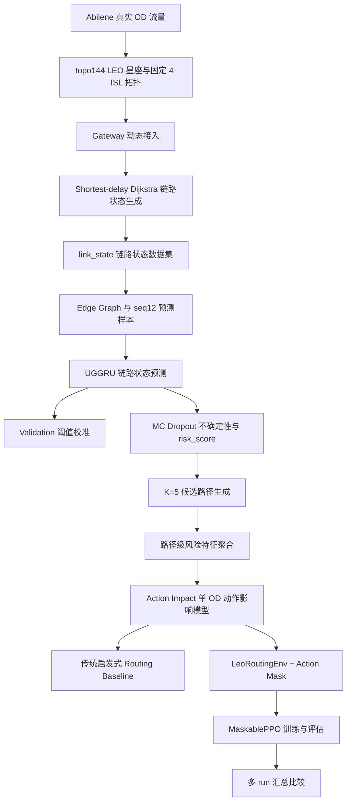

# 基于流量预测与动作影响评估的低轨卫星网络负载均衡路由研究总结

副标题：从 Abilene 流量建模、LEO 链路状态预测到 MaskedPPO 路由决策的完整实验闭环

> 本文档基于项目中已有脚本、配置、CSV、JSON、NPZ 元信息和 PNG 图像整理；没有重新训练模型，没有重新生成大规模数据，也没有改动既有实验结果。旧文档 `docs/flow_prediction_module_summary.md` 存在编码乱码，本详细版已用正常 UTF-8 中文重新组织并扩展。

## 1. 研究背景与总体目标

低地球轨道 LEO（Low Earth Orbit，低地球轨道）卫星网络具有拓扑时变、星地接入快速变化、星间链路 ISL（Inter-Satellite Link，星间链路）资源有限、业务流量时空分布不均衡等特点。传统最短路径或最小时延路由容易反复选择低跳数、低时延链路，导致局部链路拥塞。

本研究围绕“基于流量预测与强化学习的低轨卫星网络负载均衡路由算法研究”展开：先使用流量预测模型提前识别未来链路风险，再将预测风险聚合到候选路径层面，进一步通过动作影响评估和强化学习进行路径选择。当前强化学习环境是 **offline action-impact routing environment**，不是完整在线多流动态重路由仿真器；`min_raw_cost` 是基于已知动作代价的强启发式上界，不应表述为普通在线路由算法。

## 2. 技术路线与已完成模块总览

| 模块 | 输入 | 处理 | 输出 | 当前状态 | 局限 |
| --- | --- | --- | --- | --- | --- |
| Abilene 数据解析 | Abilene traffic matrix 与拓扑文件 | 解析 OD 矩阵、PoP/gateway、链路 | `od_matrices_full.npy` 等 | 完成 | 尚未扩展多场景业务流量 |
| LEO topo144 星座 | `configs/base.yaml` | 生成 144 星、8 轨道面、固定 4-ISL | 卫星位置、ISL edge CSV | 完成 | ISL 边集合固定 |
| Gateway 动态接入 | gateway 经纬度、卫星位置 | 按 15° 最小仰角选择接入卫星 | `gateway_access_topo144.npy` | 完成 | fallback 是工程近似 |
| link_state 仿真 | OD、gateway 接入、LEO edge | shortest-delay Dijkstra 映射流量 | `link_state` CSV | 完成 | Dijkstra 是数据生成基线 |
| edge graph 与 seq12 样本 | link_state、edge CSV | 构建链路图与监督样本 | samples NPZ、splits JSON | 完成 | 固定窗口 seq_len=12 |
| UGGRU 预测 | seq12 样本、edge graph | GraphConv + GRU 多任务预测 | best_model、metrics | 完成 | 主要是单 seed |
| MC Dropout | UGGRU best model | 多次随机推理，计算均值/方差/risk | 不确定性指标与图 | 完成 | 主要提供风险排序 |
| baseline 对比 | samples、训练结果 | Last/HA/GRU/LSTM/UGGRU 对比 | 模型对比表与图 | 完成 | 未做复杂调参 |
| candidate paths | topo144 graph | hop-based K-shortest paths | K=5 候选路径 | 完成 | 只按跳数生成 |
| path risk features | MC 预测、candidate paths | 链路风险聚合到路径 | 路径风险 NPZ/CSV | 完成 | 只处理 test split |
| action impact | path risk、link_state | 单 OD 增量加载 | 动作影响特征 | 完成 | proxy，非全网重路由 |
| routing baseline | action impact | 启发式策略汇总 | baseline 报告 | 完成 | min_action_cost 是强启发式 |
| LeoRoutingEnv | action impact features | Gymnasium 环境与 mask | 环境检查、heuristic eval | 完成 | 离线环境 |
| MaskedPPO | LeoRoutingEnv | smoke/mid/continue/lr1e4 训练 | PPO run comparison | 阶段性完成 | 仍低于 min_raw_cost 上界 |

## 3. 数据与 LEO 网络建模

本研究使用 Abilene 真实骨干网 OD（Origin-Destination，源宿）流量作为业务流量来源。`od_matrices_full.npy` 的 shape 为 `(48384, 12, 12)`，表示 48384 个时间片、12 个 PoP/gateway、12×12 有序 OD 流量矩阵。Abilene raw 值的单位已经修正为 `100 bytes / 5 minutes`，换算公式为 `Mbps = raw * 100 * 8 / 300 / 1e6`。

| 项目 | 数值/说明 |
| --- | --- |
| OD shape | (48384, 12, 12) |
| sat_positions shape | (48384, 144, 3) |
| gateway_access shape | (48384, 12) |
| topo_name | topo144 |
| 卫星数量 | 144 |
| 轨道面数量 | 8 |
| 每轨卫星数量 | 18 |
| 轨道高度 | 550 km |
| 轨道倾角 | 53° |
| ISL 无向边数量 | 288 |
| 每颗卫星度数 | 4 |
| 最小仰角阈值 | 15° |
| fallback_rate 平均值 | 0.005232 |
| fallback_rate 最大值 | 0.062789 |

> 图注：展示 Abilene 总流量随时间变化，用于说明输入业务流量具有真实时序波动。横坐标为time，纵坐标为total traffic。

> 图注：展示 topo144 星座某一时刻的空间分布和链路结构。横坐标为空间位置/经纬度，纵坐标为卫星与链路位置。

> 图注：展示地面 gateway 到可见卫星的动态接入示例。横坐标为time 或 gateway，纵坐标为接入卫星/可见关系。

当前卫星位置和 gateway 接入是动态的，但 ISL 边集合固定，因此当前星间拓扑是“固定 4-ISL 边集合 + 动态节点位置”的简化实验拓扑。`remain_visible_time` 目前仍是 9999 占位特征。

## 4. 链路状态仿真与诊断

链路状态数据集使用 shortest-delay Dijkstra 将 Abilene OD 流量映射到 LEO 星间链路。这里的 Dijkstra 只是数据生成阶段基线，用于形成可学习的链路状态样本，不是最终提出的负载均衡路由算法。

| 项目 | 数值 |
| --- | --- |
| link_state 文件大小 | 718.35 MB |
| 总行数 | 13934304 |
| time 数量 | 48383 |
| edge_id 数量 | 288 |
| 总拥塞样本数 | 189456 |
| Top 10 拥塞边占比 | 0.161298666 |
| 有拥塞 time 占比 | 0.844490834 |
| 最大同时拥塞链路数 | 15 |
| 平均每 time 拥塞链路数 | 3.91575553 |
| utilization 公式误差 | 1.7763568394e-15 |
| next 标签抽样检查 | True |

MLU（Maximum Link Utilization，最大链路利用率）表示同一时刻所有链路中最高的 utilization。p95/p99 反映尾部高负载风险。当前有拥塞 time 占比较高，但总体正样本比例低，是因为每个 time 有 288 条链路，通常只有少数链路拥塞。

> 图注：展示全网平均链路利用率随时间变化。横坐标为time，纵坐标为average utilization。

> 图注：展示每个时间片的最大链路利用率。横坐标为time，纵坐标为maximum link utilization。

> 图注：展示拥塞次数最多的链路。横坐标为edge_id，纵坐标为congestion count。

> 图注：展示每个时间片同时拥塞链路数量。横坐标为time，纵坐标为congested edge count。

## 5. 预测样本构建与 UGGRU 模型

预测对象是链路 edge，而不是卫星节点。edge graph 的节点对应 288 条 ISL；如果两条 ISL 共享同一颗卫星，则它们在 edge graph 中相邻。GCN（Graph Convolutional Network，图卷积网络）提取链路空间相关性，GRU（Gated Recurrent Unit，门控循环单元）提取时间依赖。

| 项目 | 数值/说明 |
| --- | --- |
| edge adjacency shape | (288, 288) |
| edge graph 平均度 | 6.000000 |
| X shape | [48372, 12, 288, 6] |
| y_utilization shape | [48372, 288] |
| y_load_mbps_norm shape | [48372, 288] |
| y_congestion shape | [48372, 288] |
| feature_names | utilization, load_mbps_norm, delay_ms_norm, queue_len_norm, remain_visible_time_norm, congestion_label |
| train/val/test | [0,33860) / [33860,41115) / [41115,48372) |
| 样本文件大小 | 487.62 MB |
| scaler | 基于 train split；remain_visible_time raw_std=0 时安全处理 |
| y_congestion dtype | int8 |

UGGRU 输入为 `X=[B,12,288,6]`，输出下一时间片 utilization、load_mbps_norm 和 congestion logit。损失为 `1.0*MSE(util)+0.3*MSE(load)+0.5*BCE(congestion)`，并用训练集 `pos_weight` 缓解拥塞类别不平衡。

| 训练配置 | 数值 |
| --- | --- |
| model | uggru |
| seq_len | 12 |
| batch_size | 16 |
| lr | 0.001000 |
| gcn_hidden | 32 |
| gru_hidden | 64 |
| dropout | 0.200000 |
| pos_weight | 66.294270 |
| device | cuda |
| best_epoch | 43 |
| best_val_loss | 0.186405 |

> 图注：展示标签 utilization 分布。横坐标为utilization，纵坐标为frequency。

> 图注：展示 train/val/test 拥塞正样本比例。横坐标为split，纵坐标为positive ratio。

> 图注：展示 UGGRU 训练和验证损失曲线。横坐标为epoch，纵坐标为loss。

## 6. 阈值校准、MC Dropout 与预测模型对比

由于拥塞标签高度不平衡，默认阈值 0.5 并不适合直接用于拥塞分类。当前在 validation set 上选择阈值 `0.95`，再固定应用到 test set，避免 test set 调参。

| 指标 | UGGRU test/val-to-test | MC Dropout |
| --- | --- | --- |
| MAE_util | 0.033072 | 0.033984 |
| RMSE_util | 0.160971 | 0.161991 |
| Precision | 0.460489 | 0.477283 |
| Recall | 0.625566 | 0.598702 |
| F1 | 0.530482 | 0.531142 |
| coverage_1std | - | 0.764586 |
| coverage_2std | - | 0.899498 |
| uncertainty_error_corr | - | 0.555298 |

MC Dropout（Monte Carlo Dropout，蒙特卡洛 Dropout）不是为了显著降低 MAE/RMSE，而是提供不确定性和风险排序。当前 `risk_score = util_pred_mean + lambda * util_pred_std`；Top 1%/5%/10% 高风险位置真实拥塞率分别为 0.574614、0.222687、0.123023，lift 分别为 43.54、16.87、9.32。

| Model | MAE_util | RMSE_util | Precision | Recall | F1 | 说明 |
| --- | --- | --- | --- | --- | --- | --- |
| Last | 0.031954 | 0.211180 | 0.447329 | 0.447232 | 0.447281 | No-training persistence baseline |
| HA | 0.057850 | 0.221878 | 0.002793 | 0.000036 | 0.000072 | No-training historical average baseline |
| GRU-only | 0.033540 | 0.170046 | 0.145799 | 0.852047 | 0.248991 | Temporal baseline without edge graph |
| LSTM-only | 0.035003 | 0.169367 | 0.151694 | 0.848856 | 0.257391 | Temporal baseline without edge graph |
| UGGRU | 0.033072 | 0.160971 | 0.460489 | 0.625566 | 0.530482 | Graph and temporal model, threshold selected on validation |
| UGGRU + MC Dropout | 0.033984 | 0.161991 | 0.477283 | 0.598702 | 0.531142 | UGGRU with MC Dropout uncertainty |

Last baseline 的 MAE_util 最低但 RMSE 高，说明短时惯性强而峰值/突变预测弱；HA 平滑短时变化，拥塞识别几乎失效；GRU-only 与 LSTM-only 能建模时间序列但缺少链路图结构；UGGRU 引入 edge graph 后在 RMSE 和拥塞 F1 上更优。

> 图注：展示不同阈值下 Precision、Recall、F1 的变化。横坐标为threshold，纵坐标为precision/recall/F1。

> 图注：展示 validation 阈值选择及 test 应用逻辑。横坐标为threshold，纵坐标为precision/recall/F1。

> 图注：展示预测标准差与绝对误差关系。横坐标为util_pred_std，纵坐标为absolute error。

> 图注：展示高风险 Top-k 位置真实拥塞率。横坐标为top-k ratio，纵坐标为true congestion rate。

> 图注：比较不同预测模型 MAE/RMSE。横坐标为model，纵坐标为MAE/RMSE。

> 图注：比较不同预测模型拥塞 F1。横坐标为model，纵坐标为F1。

## 7. 候选路径生成

第 8 阶段为 topo144 所有有序卫星对生成 K=5 候选路径，作为后续动作空间基础。候选路径生成只使用拓扑和 hop-based K-shortest paths，不使用 risk_score。

| 项目 | 数值 |
| --- | --- |
| K | 5 |
| 有序卫星 pair 数量 | 20592 |
| 总路径数 | 102960 |
| 平均每对候选路径数 | 5.000000 |
| hop_count mean | 6.931469 |
| hop_count p50 | 7.000000 |
| hop_count p95 | 11.000000 |
| hop_count max | 13 |
| 无路径 pair | False |
| 重复路径 | False |
| 路径连续性检查 | True |

> 图注：展示 K=5 候选路径跳数分布。横坐标为hop count，纵坐标为path count。

## 8. 路径风险特征构建

路径风险特征将链路级预测结果聚合到候选路径级别。每个 test sample 有 12 个 gateway 的 132 个有序 OD pair，每个 OD pair 有 K=5 条候选路径。

| 项目 | 数值 |
| --- | --- |
| features shape | [7257, 132, 5, 32] |
| N_test | 7257 |
| 每 sample OD pair 数 | 132 |
| K | 5 |
| 特征数 F | 32 |
| CSV 行数 | 4789620 |
| valid_mask 全 True | True |
| NaN/Inf | False / False |
| 抽样聚合检查 | True |
| rank_by_risk 1~K | True |
| shortest 与 min_risk 不同比例 | 0.494511 |
| min_risk 风险降低 | 0.196659 |
| min_risk hop_count 增加 | 0.389626 |
| 策略 | hop_count | delay_sum | current_util_max | pred_util_max | cong_prob_max | risk_score_max |
| --- | --- | --- | --- | --- | --- | --- |
| shortest_path | 3.474900 | 35.560780 | 0.587009 | 0.417917 | 0.652342 | 0.504526 |
| min_risk_path | 3.864526 | 40.023478 | 0.372471 | 0.245551 | 0.527992 | 0.307867 |
| min_cong_prob_path | 3.870629 | 39.830225 | 0.380285 | 0.251241 | 0.522778 | 0.316059 |
| min_delay_path | 3.474900 | 32.945477 | 0.670434 | 0.485564 | 0.675506 | 0.584401 |

zero-hop 场景表示源 gateway 和目的 gateway 同时接入同一颗卫星，此时 `edge_path=[]`，路径不经过 ISL。后续 RL 环境通过 action mask 将等价 zero-hop 动作压缩为只允许 path_id=0。

> 图注：展示候选路径风险分数分布。横坐标为risk score，纵坐标为frequency。

> 图注：展示路径最大拥塞概率分布。横坐标为congestion probability，纵坐标为frequency。

> 图注：展示路径时延与风险之间的关系。横坐标为path_delay_ms_sum，纵坐标为path_risk_score_max。

> 图注：比较 shortest_path 与 min_risk_path。横坐标为strategy，纵坐标为metric。

> 图注：展示最低风险路径对应 path_id 分布。横坐标为path_id，纵坐标为count。

## 9. 动作影响模型 Action Impact

Action Impact 是规则/仿真型单 OD 增量加载模型。给定当前网络状态、某个 gateway OD demand 和一条候选路径，模型将该 demand 增量加载到路径上的每条 ISL，计算 post-action 的局部与全网 proxy 指标。它不从 link_state 中移除原有流量，也不做全网多 OD 重新分配。

| 项目 | 数值 |
| --- | --- |
| impact_features shape | [7257, 132, 5, 49] |
| N_test | 7257 |
| gw_pair_count | 132 |
| K | 5 |
| F_impact | 49 |
| NaN/Inf | False / False |
| zero-hop action count | 830290 |
| zero-hop ratio | 0.173352 |
| post_mlu >= pre_mlu | True |
| delta_total_load 校验 | True |
| 抽样重算检查 | True |
| 策略 | post_mlu | delta_mlu | delta_congestion_count | action_cost | path_delay_ms_sum | path_risk_score_max |
| --- | --- | --- | --- | --- | --- | --- |
| shortest_path | 1.406086 | 0.005090 | 0.027019 | 181.484869 | 35.560780 | 0.504526 |
| min_delay_path | 1.406568 | 0.005571 | 0.026159 | 179.707853 | 32.945477 | 0.584401 |
| min_risk_path | 1.403249 | 0.002253 | 0.014972 | 183.576781 | 40.023478 | 0.307867 |
| min_cong_prob_path | 1.403328 | 0.002331 | 0.015762 | 183.481210 | 39.830225 | 0.316059 |
| min_action_cost_path | 1.402751 | 0.001755 | 0.009029 | 177.890029 | 33.623256 | 0.390138 |

`min_risk_path` 能明显降低预测风险和新增拥塞，但平均 delay 更高；`min_delay_path` 虽然时延最低，但风险与 post_mlu 较高；`min_action_cost_path` 综合 delay、MLU、拥塞增量和预测风险后 action_cost 最低。

> 图注：比较不同策略执行后的平均 post_mlu。横坐标为strategy，纵坐标为post_mlu。

> 图注：比较不同策略造成的 MLU 增量。横坐标为strategy，纵坐标为delta_mlu。

> 图注：比较不同策略造成的新增拥塞数量。横坐标为strategy，纵坐标为delta_congestion_count。

> 图注：比较不同策略的 action_cost。横坐标为strategy，纵坐标为action_cost。

> 图注：比较 shortest_path 和 min_risk_path 的 action_cost 关系。横坐标为shortest action_cost，纵坐标为min_risk action_cost。

> 图注：展示 min_action_cost_path 选择 path_id 分布。横坐标为path_id，纵坐标为count。

## 10. 传统启发式路由 Baseline 汇总

第 11 阶段不训练新模型，而是基于 action impact 汇总五种传统/启发式策略：shortest_path、min_delay_path、min_risk_path、min_cong_prob_path 和 min_action_cost_path。

| 最优维度 | 策略 |
| --- | --- |
| best_post_mlu_strategy | min_action_cost_path |
| best_delta_mlu_strategy | min_action_cost_path |
| best_delta_congestion_count_strategy | min_action_cost_path |
| best_action_cost_strategy | min_action_cost_path |
| best_risk_score_strategy | min_risk_path |
| best_delay_strategy | min_delay_path |
| 策略 | post_mlu | delta_mlu | delta_congestion_count | action_cost | risk_score | delay | final_comment |
| --- | --- | --- | --- | --- | --- | --- | --- |
| shortest_path | 1.406086 | 0.005090 | 0.027019 | 181.484869 | 0.504526 | 35.560780 | 基础最短路径 baseline，时延和风险均未显式优化。 |
| min_delay_path | 1.406568 | 0.005571 | 0.026159 | 179.707853 | 0.584401 | 32.945477 | 时延最低，但风险和 post_mlu 相对较高，说明纯时延优先不等于负载均衡最优。 |
| min_risk_path | 1.403249 | 0.002253 | 0.014972 | 183.576781 | 0.307867 | 40.023478 | 显著降低预测风险、delta_mlu 和新增拥塞，但平均路径更长，综合 action_cost 上升。 |
| min_cong_prob_path | 1.403328 | 0.002331 | 0.015762 | 183.481210 | 0.316059 | 39.830225 | 与最低风险路径类似，降低拥塞概率和新增拥塞，但牺牲一定时延。 |
| min_action_cost_path | 1.402751 | 0.001755 | 0.009029 | 177.890029 | 0.390138 | 33.623256 | 综合 delay、MLU、拥塞增量和风险后 action_cost 最低，是当前最强启发式 baseline。 |
| 相对 shortest_path | delta_mlu 改善 | 新增拥塞改善 | risk_score 改善 | action_cost 改善 | delay change |
| --- | --- | --- | --- | --- | --- |
| min_risk_path | 55.742142 | 44.586972 | 38.978936 | -1.152665 | -12.549494 |
| min_action_cost_path | 65.528223 | 66.582953 | 22.672318 | 1.980793 | 5.448486 |

`min_risk_path` 相比 shortest_path 显著降低 delta_mlu、新增拥塞和 risk_score，但 action_cost 上升；`min_action_cost_path` 在综合代价上最优，是当前最强启发式 baseline。

> 图注：比较五种启发式策略的 post_mlu。横坐标为strategy，纵坐标为post_mlu。

> 图注：比较五种策略对 MLU 的增量影响。横坐标为strategy，纵坐标为delta_mlu。

> 图注：比较五种策略新增拥塞数量。横坐标为strategy，纵坐标为delta_congestion_count。

> 图注：比较五种策略综合 action_cost。横坐标为strategy，纵坐标为action_cost。

> 图注：展示策略在 delay 与 risk_score 之间的权衡。横坐标为path_delay_ms_sum，纵坐标为path_risk_score_max。

> 图注：展示各策略相对 shortest_path 的改善百分比。横坐标为strategy，纵坐标为improvement percentage。

## 11. 强化学习环境 LeoRoutingEnv

LeoRoutingEnv 是 Gymnasium 风格的离线 action-impact 路由环境。每一步决策对应一个 `sample_idx + gateway OD pair`，动作是从 K=5 条候选路径中选择一个 path_id。

| 项目 | 数值/说明 |
| --- | --- |
| observation shape | [140] |
| action_space | Discrete(5) |
| observation 构成 | 5 × 27 selected features + 5 action mask = 140 |
| action_masks shape | (5,) bool |
| zero-hop mask | zero-hop 时只允许 path_id=0 |
| invalid action penalty | invalid 动作不崩溃，返回惩罚并推进 |
| reward_mode | relative_to_shortest |
| reward 公式 | shortest_path_raw_cost - selected_action_raw_cost |
| rollout 检查 | True |
| invalid action 测试 | True |

需要 action mask 的原因有两点：过滤无效动作，以及在 zero-hop 场景下屏蔽 path_id=1~4 的等价动作。当前环境可被 MaskablePPO 调用，但仍是离线环境。

| Policy | mean_reward | mean_raw_cost | mean_post_mlu | mean_delta_congestion_count | mean_risk_score | invalid_action_count |
| --- | --- | --- | --- | --- | --- | --- |
| random_valid | -6.249836 | 191.505412 | 1.405960 | 0.026508 | 0.548193 | 0 |
| shortest | 0.000000 | 185.255577 | 1.406086 | 0.027019 | 0.504526 | 0 |
| min_raw_cost | 4.256782 | 180.998794 | 1.402522 | 0.009177 | 0.379573 | 0 |
| min_risk | -1.186437 | 186.442014 | 1.403249 | 0.014972 | 0.307867 | 0 |
| min_cong_prob | -1.072660 | 186.328236 | 1.403328 | 0.015762 | 0.316059 | 0 |

> 图注：比较环境中 heuristic policy 的平均 reward。横坐标为policy，纵坐标为mean_reward。

> 图注：比较 heuristic policy 的 raw_cost。横坐标为policy，纵坐标为mean_raw_cost。

> 图注：展示不同策略选择 action_id 的分布。横坐标为action_id，纵坐标为count。

## 12. MaskablePPO 训练过程与调参

PPO（Proximal Policy Optimization，近端策略优化）训练使用 sb3-contrib 的 MaskablePPO，使策略在采样和评估时都能读取 `action_masks()`。本阶段只训练路由策略，不重新训练流量预测模型。

### 12.1 Smoke training
smoke training 使用约 10000 timesteps、max_samples=500，目标是验证 Gymnasium 环境、action mask、模型保存/加载和评估流程。结果优于 random_valid 和 shortest，invalid_action_count=0，但不追求最优性能。

### 12.2 masked_ppo_mid
`masked_ppo_mid` 使用 timesteps=50000、max_samples=2000，实际训练步数 51200。全量 test mean_reward=2.852388，优于 random_valid 和 shortest，但低于 min_raw_cost。

### 12.3 masked_ppo_continue100k
`masked_ppo_continue100k` 从 mid best_model 继续训练 additional 50000，实际累计步数 101200。全量 test mean_reward=2.994414，相比 mid 提升 +0.142026。

### 12.4 masked_ppo_ent002
`masked_ppo_ent002` 将 ent_coef 提高到 0.02 并从头训练 50000。quick2000 mean_reward=2.458092，低于继续评估阈值，因此未做全量评估。

### 12.5 masked_ppo_lr1e4
`masked_ppo_lr1e4` 从 continue100k best_model 继续训练，learning_rate=1e-4，additional 50000，实际累计步数 151201。全量 test mean_reward=3.135387，是当前最优 PPO run。

| Run | resume/设置 | actual timesteps | wall_time_seconds | best_eval_mean_reward | full/quick 结果 |
| --- | --- | --- | --- | --- | --- |
| masked_ppo_mid | from scratch, lr=3e-4, ent=0.01 | 51200 | 1276.199473 | 2.390852 | full mean_reward=2.852388 |
| masked_ppo_continue100k | resume mid, lr=3e-4, ent=0.01 | 101200 | 1282.100000 | 2.524202 | full mean_reward=2.994414 |
| masked_ppo_ent002 | from scratch, lr=3e-4, ent=0.02 | 51200 | 1644.484630 | 2.366886 | quick2000 mean_reward=2.458092，未全量 |
| masked_ppo_lr1e4 | resume continue100k, lr=1e-4, ent=0.01 | 151201 | 2289.006529 | 2.639668 | full mean_reward=3.135387 |

> 图注：展示 mid run 与 heuristic policies 的 reward 对比。横坐标为policy，纵坐标为mean_reward。

> 图注：展示 continue100k run 的 reward 对比。横坐标为policy，纵坐标为mean_reward。

> 图注：展示 lr1e4 run 的 reward 对比。横坐标为policy，纵坐标为mean_reward。

> 图注：比较多个 PPO run 的平均 reward。横坐标为run/policy，纵坐标为mean_reward。

> 图注：比较多个 PPO run 的 raw_cost。横坐标为run/policy，纵坐标为mean_raw_cost。

> 图注：比较多个 PPO run 的新增拥塞指标。横坐标为run/policy，纵坐标为mean_delta_congestion_count。

> 图注：展示各 run 到 min_raw_cost 上界的差距。横坐标为run，纵坐标为gap。

## 13. 最终 PPO 与 Baseline 对比

| policy | mean_reward | mean_raw_cost | mean_post_mlu | mean_delta_mlu | mean_delta_congestion_count | mean_risk_score | mean_cong_prob | invalid_action_count |
| --- | --- | --- | --- | --- | --- | --- | --- | --- |
| random_valid | -6.249836 | 191.505412 | 1.405960 | 0.004964 | 0.026508 | 0.548193 | 0.677753 | 0 |
| shortest | 0.000000 | 185.255577 | 1.406086 | 0.005090 | 0.027019 | 0.504526 | 0.652342 | 0 |
| masked_ppo_mid | 2.852388 | 182.403188 | 1.403941 | 0.002944 | 0.014061 | 0.420950 | 0.608047 | 0 |
| masked_ppo_continue100k | 2.994414 | 182.261162 | 1.403640 | 0.002643 | 0.013183 | 0.410776 | 0.595185 | 0 |
| masked_ppo_lr1e4 | 3.135387 | 182.120189 | 1.403644 | 0.002648 | 0.012428 | 0.403261 | 0.594860 | 0 |
| min_raw_cost | 4.256782 | 180.998794 | 1.402522 | 0.001525 | 0.009177 | 0.379573 | 0.582809 | 0 |

当前最终链条可以概括为：`random_valid << shortest_path << MaskedPPO(lr1e4) < min_raw_cost`。`masked_ppo_lr1e4` 相比 shortest_path 将 mean_raw_cost 从 185.255577 降至 182.120189，将 mean_delta_congestion_count 从 0.027019 降至 0.012428，invalid_action_count=0。它仍低于 min_raw_cost，reward_gap=1.121395。

## 14. 关于 min_raw_cost 为什么这么强，以及为什么仍需要强化学习

`min_raw_cost` 直接读取每个候选动作的 raw_cost，并在当前 step 选择 raw_cost 最小路径。由于当前 reward_mode 是 `relative_to_shortest`，它等价于每一步直接选择当前 reward 最大动作。在离线 action-impact 环境中，它天然很强，应定义为 **oracle-like greedy upper-bound baseline**，而不是普通在线路由算法。

答辩可用表述：虽然 `min_raw_cost` 的单步指标最好，但它依赖已知每个候选动作的完整动作影响代价，等价于访问了动作后果表，因此更适合作为上界参考而不是可部署的在线路由策略。PPO 的意义在于学习从状态到动作的映射；在后续更接近真实的在线多步环境中，完整动作影响不是免费可得，单步贪心也未必长期最优。当前 MaskablePPO 已经显著优于 shortest_path 和 random_valid，说明状态特征与 action mask 能够支持策略学习。

## 15. 当前成果是否支撑硕士论文

从工作量看，项目已经覆盖数据解析、星座建模、链路状态生成、预测模型、不确定性评估、路径风险聚合、动作影响模型、传统 routing baseline、Gymnasium 环境和 MaskablePPO 训练评估，整体闭环较完整，足以支撑硕士论文实验部分。创新性更偏系统集成型和方法应用改进型：将 UGGRU 预测、不确定性风险分数、动作影响 proxy 和 action mask 强化学习串联到 LEO 路由问题中。理论创新中等偏弱，因此正式论文中应加强问题定义、指标设计、消融实验和局限性表述。

建议题目：1）基于流量预测与动作影响评估的低轨卫星网络负载均衡路由方法研究；2）面向低轨卫星网络的预测感知负载均衡路由方法研究；3）基于流量预测和动作掩码强化学习的低轨卫星网络路由优化研究。

## 16. 当前简化假设与不足

| 不足/假设 | 说明 |
| --- | --- |
| 固定 ISL 边集合 | 当前不是完整动态断链/重连星间拓扑。 |
| remain_visible_time 占位 | 当前为 9999，占位而非真实链路剩余可见时间。 |
| 业务流量单一 | 主要使用 Abilene OD，尚未构造均匀/人口/周期/突发多场景。 |
| link_state 生成基线 | 使用 shortest-delay Dijkstra，不代表最终路由策略。 |
| action impact proxy | 只做单 OD 增量加载，不做多 OD 全局重路由。 |
| RL 离线环境 | 读取预计算 action impact，不是在线动态仿真器。 |
| PPO 单 seed 为主 | 论文阶段需要补充多随机种子统计。 |
| min_raw_cost 优于 PPO | 需要明确其 oracle-like upper-bound 定位。 |
| 无真实 TLE/SGP4 | 当前星座运动是简化建模。 |
| 无故障/断链场景 | 尚未评估链路故障、卫星故障或业务突发扰动。 |

## 17. 后续工作计划

| 阶段 | 计划 |
| --- | --- |
| 短期 | 整理最终图表；补充随机种子；输出论文材料包；生成最终实验表；明确 min_raw_cost 和 offline environment 定位。 |
| 中期 | 引入动态 ISL；计算真实 remain_visible_time；扩展多场景流量；补充多随机种子统计和消融实验。 |
| 长期 | 构建在线多步动态路由环境；支持多流联合重路由；探索分布式多智能体；接入 TLE/SGP4；加入故障和业务突发场景。 |

## 18. 可直接用于论文/汇报的阶段性结论

- 已经形成从 Abilene 真实 OD 流量到 LEO 链路状态预测、路径风险聚合和路由决策的完整实验闭环。
- UGGRU 同时利用 edge graph 空间结构和 GRU 时间依赖，相比纯时间序列 baseline 在 RMSE 和拥塞 F1 上表现更优。
- MC Dropout 提供了有意义的不确定性估计，risk_score 能显著富集真实拥塞链路。
- 路径风险特征表明最低风险路径与最短路径约 49.45% 情况下不同，说明预测风险会改变路径选择。
- Action impact 模型能够量化候选路径动作对 MLU、新增拥塞、delay 和综合 cost 的影响。
- min_action_cost 是强启发式 baseline，MaskedPPO(lr1e4) 则学习状态到动作的映射。
- MaskedPPO(lr1e4) 显著优于 shortest_path，但仍低于 min_raw_cost 上界。
- 当前系统是完整实验闭环，但不是最终真实在线多流动态系统。

## 19. 图表索引

| 图编号 | 路径 | 含义 | 横坐标 | 纵坐标 |
| --- | --- | --- | --- | --- |
| 图1 | ../data/results/abilene_total_traffic_curve.png | Abilene total traffic curve | time | total traffic |
| 图2 | ../data/results/leo_topo144_snapshot.png | LEO topo144 snapshot | 空间位置/经纬度 | 卫星与链路位置 |
| 图3 | ../data/results/gateway_access_example.png | Gateway access example | time 或 gateway | 接入卫星/可见关系 |
| 图4 | ../data/results/leo_average_utilization_curve.png | Average utilization curve | time | average utilization |
| 图5 | ../data/results/leo_mlu_curve.png | MLU curve | time | maximum link utilization |
| 图6 | ../data/results/top_congested_edges.png | Top congested edges | edge_id | congestion count |
| 图7 | ../data/results/congestion_count_by_time.png | Congestion count by time | time | congested edge count |
| 图8 | ../data/results/sample_y_utilization_distribution.png | Sample utilization distribution | utilization | frequency |
| 图9 | ../data/results/sample_y_congestion_ratio_split.png | Sample congestion ratio split | split | positive ratio |
| 图10 | ../data/results/uggru_train_val_loss.png | UGGRU train val loss | epoch | loss |
| 图11 | ../data/results/uggru_threshold_prf_curve.png | UGGRU threshold PRF curve | threshold | precision/recall/F1 |
| 图12 | ../data/results/uggru_val_to_test_threshold_prf_curve.png | Val-to-test threshold PRF curve | threshold | precision/recall/F1 |
| 图13 | ../data/results/mc_dropout_uncertainty_error_scatter.png | MC uncertainty error scatter | util_pred_std | absolute error |
| 图14 | ../data/results/mc_dropout_risk_topk.png | MC risk top-k | top-k ratio | true congestion rate |
| 图15 | ../data/results/prediction_model_comparison_mae_rmse.png | Prediction model comparison MAE RMSE | model | MAE/RMSE |
| 图16 | ../data/results/prediction_model_comparison_f1.png | Prediction model comparison F1 | model | F1 |
| 图17 | ../data/results/candidate_path_hop_count_distribution.png | Candidate path hop count distribution | hop count | path count |
| 图18 | ../data/results/path_risk_score_distribution.png | Path risk score distribution | risk score | frequency |
| 图19 | ../data/results/path_cong_prob_distribution.png | Path congestion probability distribution | congestion probability | frequency |
| 图20 | ../data/results/path_delay_vs_risk_scatter.png | Path delay vs risk scatter | path_delay_ms_sum | path_risk_score_max |
| 图21 | ../data/results/shortest_vs_min_risk_comparison.png | Shortest vs min risk comparison | strategy | metric |
| 图22 | ../data/results/min_risk_path_id_distribution.png | Min risk path id distribution | path_id | count |
| 图23 | ../data/results/action_impact_strategy_post_mlu.png | Action impact strategy post MLU | strategy | post_mlu |
| 图24 | ../data/results/action_impact_strategy_delta_mlu.png | Action impact strategy delta MLU | strategy | delta_mlu |
| 图25 | ../data/results/action_impact_strategy_congestion_delta.png | Action impact strategy congestion delta | strategy | delta_congestion_count |
| 图26 | ../data/results/action_impact_strategy_cost.png | Action impact strategy cost | strategy | action_cost |
| 图27 | ../data/results/action_impact_shortest_vs_min_risk_scatter.png | Action impact shortest vs min risk scatter | shortest action_cost | min_risk action_cost |
| 图28 | ../data/results/action_impact_selected_path_id_distribution.png | Action impact selected path id distribution | path_id | count |
| 图29 | ../data/results/routing_baseline_post_mlu_comparison.png | Routing baseline post MLU comparison | strategy | post_mlu |
| 图30 | ../data/results/routing_baseline_delta_mlu_comparison.png | Routing baseline delta MLU comparison | strategy | delta_mlu |
| 图31 | ../data/results/routing_baseline_delta_congestion_comparison.png | Routing baseline delta congestion comparison | strategy | delta_congestion_count |
| 图32 | ../data/results/routing_baseline_action_cost_comparison.png | Routing baseline action cost comparison | strategy | action_cost |
| 图33 | ../data/results/routing_baseline_risk_delay_tradeoff.png | Routing baseline risk delay tradeoff | path_delay_ms_sum | path_risk_score_max |
| 图34 | ../data/results/routing_baseline_improvement_vs_shortest.png | Routing baseline improvement vs shortest | strategy | improvement percentage |
| 图35 | ../data/results/routing_env_policy_reward_comparison.png | Routing env policy reward comparison | policy | mean_reward |
| 图36 | ../data/results/routing_env_policy_cost_comparison.png | Routing env policy cost comparison | policy | mean_raw_cost |
| 图37 | ../data/results/routing_env_policy_action_distribution.png | Routing env policy action distribution | action_id | count |
| 图38 | ../data/results/masked_ppo_mid_policy_reward_comparison.png | MaskedPPO mid policy reward comparison | policy | mean_reward |
| 图39 | ../data/results/masked_ppo_continue100k_policy_reward_comparison.png | MaskedPPO continue100k policy reward comparison | policy | mean_reward |
| 图40 | ../data/results/masked_ppo_lr1e4_policy_reward_comparison.png | MaskedPPO lr1e4 policy reward comparison | policy | mean_reward |
| 图41 | ../data/results/masked_ppo_run_reward_comparison.png | MaskedPPO run reward comparison | run/policy | mean_reward |
| 图42 | ../data/results/masked_ppo_run_cost_comparison.png | MaskedPPO run cost comparison | run/policy | mean_raw_cost |
| 图43 | ../data/results/masked_ppo_run_congestion_comparison.png | MaskedPPO run congestion comparison | run/policy | mean_delta_congestion_count |
| 图44 | ../data/results/masked_ppo_run_gap_to_min_raw_cost.png | MaskedPPO gap to min raw cost | run | gap |

## 20. 结果文件索引

| 文件 | 作用 |
| --- | --- |
| data/results/prediction_model_comparison.csv | 预测模型对比表 |
| data/results/prediction_summary_metrics.json | UGGRU 与 MC Dropout 汇总指标 |
| data/results/mc_dropout_metrics.json | MC Dropout 不确定性与风险排序指标 |
| data/processed/candidate_paths_topo144_k5.pkl | K=5 候选路径主文件 |
| data/processed/candidate_paths_topo144_k5_stats.json | 候选路径生成统计 |
| data/processed/path_risk_features_test_topo144_k5.npz | 路径级风险特征 |
| data/results/path_risk_feature_stats_topo144_k5.json | 路径风险特征统计 |
| data/processed/action_impact_features_test_topo144_k5.npz | 动作影响特征 |
| data/results/action_impact_strategy_comparison_topo144_k5.csv | 动作影响策略平均指标 |
| data/results/routing_baseline_comparison_topo144_k5.csv | 传统路由 baseline 汇总 |
| data/results/routing_env_heuristic_policy_eval_topo144_k5.csv | RL 环境 heuristic policy 评估 |
| data/results/masked_ppo_run_comparison_topo144_k5.csv | 多个 MaskedPPO run 与 baseline 对比 |

## 21. 脚本索引

| 阶段 | 关键脚本 |
| --- | --- |
| 数据处理 | `src/download_abilene.py`, `src/parse_abilene.py`, `src/parse_abilene_topology.py`, `src/check_abilene_data.py` |
| 星座与接入 | `src/build_leo_constellation.py`, `src/ground_sat_access.py`, `src/check_leo_access.py` |
| link_state | `src/simulate_link_state.py`, `src/check_link_state.py`, `src/diagnose_link_state.py` |
| prediction samples | `src/build_edge_graph.py`, `src/build_prediction_samples.py`, `src/check_prediction_samples.py` |
| UGGRU | `src/dataset.py`, `src/models.py`, `src/train_predictor.py`, `src/evaluate_predictor.py` |
| MC Dropout | `src/evaluate_uncertainty_mc_dropout.py`, `src/check_uncertainty_outputs.py` |
| prediction baseline | `src/evaluate_simple_baselines.py`, `src/baseline_models.py`, `src/train_rnn_baseline.py`, `src/evaluate_rnn_baseline.py`, `src/compare_prediction_models.py` |
| candidate paths | `src/build_candidate_paths.py`, `src/check_candidate_paths.py` |
| path risk | `src/build_path_risk_features.py`, `src/check_path_risk_features.py` |
| action impact | `src/simulate_action_impact.py`, `src/check_action_impact.py` |
| routing baseline | `src/summarize_routing_baselines.py`, `src/check_routing_baseline_summary.py` |
| RL env | `src/leo_routing_env.py`, `src/check_routing_env.py`, `src/evaluate_env_heuristic_policies.py` |
| MaskedPPO | `src/train_masked_ppo_smoke.py`, `src/train_masked_ppo.py`, `src/evaluate_masked_ppo_full.py`, `src/plot_masked_ppo_training.py` |
| run comparison | `src/compare_masked_ppo_runs.py`, `src/check_masked_ppo_run_comparison.py` |

## 22. 缺失文件列表

以下推荐文件或图片未找到。注意：`data/results/candidate_paths_topo144_k5_stats.json` 未找到，但实际候选路径统计文件存在于 `data/processed/candidate_paths_topo144_k5_stats.json`。
- `data/results/candidate_paths_topo144_k5_stats.json`

## 当前最重要的结论

1. 预测模块、路径风险模块、动作影响模块和 MaskedPPO 路由模块已经形成完整实验闭环。
2. `masked_ppo_lr1e4` 是当前最优 PPO run，显著优于 shortest_path，但仍低于 min_raw_cost 上界。
3. risk_score 与 action impact 将预测结果转化为路由决策可用的风险/代价特征，是当前系统最关键的连接环节。

## 最需要谨慎表述的地方

1. `min_raw_cost` 必须表述为 oracle-like greedy upper-bound baseline，不能写成普通在线路由算法或最终算法。
2. LeoRoutingEnv 是 offline action-impact routing environment，不是完整在线多流动态重路由仿真器。
3. 当前 ISL 边集合固定，`remain_visible_time` 仍为占位，正式论文中必须作为简化假设说明。
