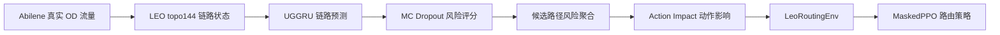

# 快速看懂：基于流量预测与动作影响评估的低轨卫星网络负载均衡路由研究

副标题：从链路状态预测到 MaskedPPO 路由决策的完整实验闭环

> 本文档是快速看懂版，但不是极简索引。它面向第一次接触本项目的老师、同学或答辩评委，目标是在较短时间内讲清楚：研究要解决什么问题、为什么需要预测、为什么需要动作影响评估、PPO 到底学到了什么、当前结果能说明什么和不能说明什么。本文只整理已有实验结果，没有重新训练模型、没有重新生成数据、没有修改代码。

---

## 1. 一句话看懂本研究

这个研究想解决的是：**低轨卫星网络中，传统最短路径路由容易把流量压到少数热点链路上，能不能先预测未来链路风险，再选择更安全、更负载均衡的路径？**

所以它不是单纯做一个流量预测模型，也不是单纯训练一个 PPO，而是构建了一条完整链路：

```text
Abilene 真实 OD 流量
→ topo144 低轨卫星网络链路状态
→ UGGRU 预测未来链路利用率和拥塞
→ MC Dropout 估计不确定性并形成 risk_score
→ 候选路径风险聚合
→ Action Impact 评估某条 OD 流走某条路径后的影响
→ LeoRoutingEnv 封装强化学习环境
→ MaskedPPO 学习路径选择策略
```

最终结果可以用一句话概括：

```text
random_valid << shortest_path << MaskedPPO(lr1e4) < min_raw_cost
```

也就是说，MaskedPPO 已经明显优于随机选择和传统最短路径，但仍低于 `min_raw_cost` 这个直接访问完整动作代价的 oracle-like 贪心上界。

---

## 2. 研究要解决的问题：为什么最短路径不够

低轨卫星 LEO（Low Earth Orbit，低地球轨道）网络和地面骨干网很不一样。卫星高速运动，gateway 接入卫星会随时间变化，星间链路 ISL（Inter-Satellite Link，星间链路）容量有限，业务流量也不是均匀分布的。某些区域、某些时间段会形成热点链路。

传统 shortest path 或最小时延路由的优点是简单、直观、容易实现。但它有一个明显问题：它只关心当前路径短不短、时延低不低，不关心这条路径上的链路未来会不会拥塞。结果就是很多 OD 流可能反复走同一批低跳数链路，导致局部链路利用率升高，甚至形成拥塞。

本研究的核心想法是：如果能提前预测哪些链路未来会拥塞，那么路由策略就不应该只看“当前最短”，还应该看“未来风险”和“动作后果”。这也是为什么整个项目从流量预测开始，但最终走到了候选路径、动作影响评估和 MaskedPPO 路由决策。

---

## 3. 总体技术路线



| 阶段 | 做什么 | 为什么需要 |
|---|---|---|
| Abilene OD 流量 | 使用真实骨干网 OD traffic matrix | 避免随机流量过于理想化 |
| LEO topo144 | 构建 144 星、288 条 ISL 的实验网络 | 提供卫星链路拓扑和 gateway 接入关系 |
| link_state | 生成每条链路的负载、利用率、拥塞标签 | 给预测模型提供训练数据 |
| UGGRU | 预测下一时刻链路状态 | 提前知道未来哪些链路有风险 |
| MC Dropout | 给出预测不确定性和 risk_score | 不只看预测均值，也看模型是否不确定 |
| Path Risk | 把链路风险聚合成路径风险 | 路由动作选择的是路径，不是单条链路 |
| Action Impact | 模拟 OD demand 走某条路径后的影响 | 把候选路径变成可比较的候选动作 |
| LeoRoutingEnv | 定义 state/action/reward/mask | 把动作影响表封装成 RL 问题 |
| MaskedPPO | 学习从状态到 path_id 的选择策略 | 获得优于 shortest_path 的路由策略 |

---

## 4. 数据和 LEO 网络怎么来的

第一步要回答的是：实验里的流量和网络从哪里来？

本项目使用 Abilene 真实 OD 流量。Abilene 有 12 个 PoP，在项目中被当作 12 个地面 gateway。OD 矩阵 shape 为：

```text
od_matrices_full.npy: (48384, 12, 12)
```

这里特别重要的一点是，Abilene raw value 的单位不是 bps，而是：

```text
100 bytes / 5 minutes
Mbps = raw * 100 * 8 / 300 / 1e6
```

卫星网络使用 topo144：

| 项目 | 数值 |
|---|---:|
| 卫星数量 | 144 |
| 轨道面数量 | 8 |
| 每轨卫星数量 | 18 |
| ISL 无向边数量 | 288 |
| 每颗卫星度数 | 4 |
| gateway 数量 | 12 |
| gateway 接入仰角阈值 | 15° |
| gateway_access shape | (48384, 12) |

需要谨慎说明的是：当前卫星位置和 gateway 接入是动态的，但 ISL 边集合是固定 4-ISL。也就是说，当前不是完整动态断链/重连星间拓扑，而是一个“固定边集合 + 动态节点位置”的简化实验网络。


> 这张图展示 Abilene 总流量随时间变化。它说明输入业务不是随机生成的，而是具有真实时序波动的地面骨干网流量。


> 这张图展示 topo144 星座和星间链路快照。它说明后续链路状态、候选路径和路由动作都建立在这个 LEO 拓扑上。


> 这张图展示 gateway 动态接入卫星的过程。它说明即使 ISL 边集合固定，星地接入关系仍随时间变化。

---

## 5. 为什么先做 link_state 和链路预测

有了 OD 流量和 LEO 拓扑后，还不能直接训练路由智能体。因为路由策略需要知道每条链路当前和未来是否拥塞，而原始 OD 矩阵并不直接告诉我们链路状态。因此项目先用 shortest-delay Dijkstra 把 Abilene OD 流量映射到 LEO 星间链路上，生成 link_state 数据集。

这里的 Dijkstra 只是**数据生成基线**，不是最终路由算法。它的作用是生成可学习的链路状态样本。

关键数据规模：

| 项目 | 数值 |
|---|---:|
| link_state 行数 | 13,934,304 |
| time 数量 | 48,383 |
| edge 数量 | 288 |
| 样本数 | 48,372 |
| X.shape | (48372, 12, 288, 6) |
| y_congestion.shape | (48372, 288) |

`X` 使用过去 12 个时间片的所有链路特征，预测下一时间片的链路状态。特征包括 utilization、load_mbps_norm、delay_ms_norm、queue_len_norm、remain_visible_time_norm 和 congestion_label。


> MLU 是 Maximum Link Utilization，即最大链路利用率。这张图说明网络中确实存在明显的峰值链路压力。


> 这张图展示 train/val/test 中拥塞正样本比例。它说明拥塞分类是明显不平衡任务，所以后续需要阈值校准和 pos_weight。

---

## 6. UGGRU 预测模型：为什么用图结构加时间序列

预测对象是链路，而不是卫星。因此本项目构建的是 edge graph：每条 ISL 是图中的一个节点；如果两条 ISL 共享同一颗卫星，就认为这两条链路相邻。

UGGRU 的结构可以通俗理解为：

1. GraphConv 学习相邻链路之间的空间关系；
2. GRU 学习历史 12 个时间片的时间变化；
3. 三个输出头同时预测 utilization、load 和 congestion。

对比结果如下：

| Model | MAE_util | RMSE_util | F1 |
|---|---:|---:|---:|
| Last | 0.031954 | 0.211180 | 0.447281 |
| GRU-only | 0.033540 | 0.170046 | 0.248991 |
| LSTM-only | 0.035003 | 0.169367 | 0.257391 |
| UGGRU | 0.033072 | 0.160971 | 0.530482 |
| UGGRU + MC Dropout | 0.033984 | 0.161991 | 0.531142 |

这张表可以这样理解：

- Last 的 MAE 最低，说明普通时刻链路状态有短时惯性；
- 但 Last 的 RMSE 高，说明它遇到峰值和突变时预测差；
- GRU/LSTM 能学时间变化，但缺少链路拓扑；
- UGGRU 的 RMSE 和 F1 更好，说明链路图结构对拥塞识别有帮助。


> 这张图比较不同预测模型的 MAE/RMSE。它说明 UGGRU 在误差指标上优于纯时间序列模型。


> 这张图比较拥塞分类 F1。UGGRU 和 MC Dropout 版本明显优于 GRU-only、LSTM-only，说明拓扑信息有价值。

---

## 7. MC Dropout 和 risk_score：为什么不只看预测均值

普通预测只能给一个点估计，例如“这条链路下一时刻 utilization 可能是多少”。但路由更关心的是风险：如果模型对某条链路预测不确定，或者预测均值已经偏高，那么这条链路在路由时应该被谨慎对待。

因此本项目使用 MC Dropout 多次推理，得到预测均值和标准差，并定义：

```text
risk_score = util_pred_mean + lambda * util_pred_std
```

MC Dropout 的价值不是显著降低 MAE，而是提供不确定性和风险排序能力。关键结果：

| 指标 | 数值 |
|---|---:|
| uncertainty_error_corr | 0.555298 |
| Top 1% 风险位置真实拥塞率 | 57.46% |
| Top 1% lift | 43.54x |
| Top 5% lift | 16.87x |
| Top 10% lift | 9.32x |

这说明 risk_score 能把最危险的链路筛出来。它不是最终路由动作，但它是后续路径风险聚合的基础。


> 这张图说明 risk_score 能显著富集真实拥塞链路。Top-k 风险排序越有效，后续路由越有可能提前避开危险区域。

---

## 8. 为什么要从链路风险变成路径风险

UGGRU/MC Dropout 输出的是链路级风险，但路由动作选择的是路径。一条路径由多条链路组成，所以必须沿着候选路径的 edge_path，把链路级风险聚合成路径级风险。

聚合方式有不同含义：

| 聚合方式 | 含义 |
|---|---|
| max | 路径上的瓶颈风险 |
| mean | 路径平均风险 |
| sum | 路径累计代价 |

候选路径生成结果：

| 项目 | 数值 |
|---|---:|
| 有序卫星 pair 数 | 20,592 |
| 每对候选路径数 K | 5 |
| 总路径数 | 102,960 |
| path_risk_features shape | (7257, 132, 5, 32) |
| shortest 与 min_risk 不同比例 | 49.4511% |
| min_risk 平均 risk 降低 | 0.196659 |
| min_risk 平均 hop_count 增加 | 0.389626 |

这个结果很关键：近一半情况下，最低风险路径不是最短路径。也就是说，预测风险确实会改变路径选择。但低风险路径往往需要绕路，所以后续必须继续权衡 delay 和 risk。


> 这张图说明最低风险路径经常不是最短路径，预测风险会真实改变路由选择。


> 这张图说明低风险和低时延之间存在权衡，路由不能只看单一指标。

---

## 9. Action Impact：为什么路径风险还不够

有了路径风险后，我们已经知道“这条路径看起来危险不危险”。但路由真正关心的是：**当前这个 OD demand 如果走这条路径，会不会让网络更拥塞？**

两条路径风险可能相近，但由于以下因素不同，动作后果可能完全不同：

- 当前 OD demand 大小不同；
- 路径长度不同；
- 路径上的链路当前负载不同；
- 路径是否经过瓶颈链路不同。

因此需要 Action Impact。它的作用是把“候选路径”变成“可比较的候选动作”：模拟把某个 OD demand 加到路径上的链路，然后计算动作后的网络变化。

核心指标：

| 指标 | 含义 |
|---|---|
| post_mlu | 执行动作后的最大链路利用率 |
| delta_mlu | 动作导致 MLU 增加多少 |
| delta_congestion_count | 动作新增多少拥塞链路 |
| action_cost | 综合 delay、MLU、拥塞增量和风险的启发式代价 |

关键结果：

| 项目 | 数值 |
|---|---:|
| action_impact_features shape | (7257, 132, 5, 49) |
| zero-hop ratio | 17.3352% |
| shortest_path delta_congestion_count | 0.027019 |
| min_action_cost_path delta_congestion_count | 0.009029 |

Action Impact 是单 OD 增量加载 proxy，不是完整在线多流仿真器。但它已经足够把路径转成动作后果，为启发式 baseline 和 LeoRoutingEnv 提供基础。


> 这张图说明 min_action_cost_path 相比 shortest_path 能显著减少新增拥塞。


> 这张图说明综合 action_cost 下，min_action_cost_path 是当前最强启发式 baseline。

---

## 10. 启发式路由 baseline 说明了什么

有了 action impact 表后，可以先不训练模型，直接用规则选路径。这一步的目的不是替代 PPO，而是验证预测风险和动作代价是否真的能改善最短路径。

| Strategy | 主要思想 | 优点 | 问题 |
|---|---|---|---|
| shortest_path | 最短/低跳数 | 简单、传统基线 | 容易压到热点链路 |
| min_delay_path | 最小时延 | 时延低 | 风险可能高 |
| min_risk_path | 避开高风险路径 | 拥塞风险低 | 可能绕路，action_cost 可能更高 |
| min_action_cost_path | 综合代价最低 | 当前最强规则 baseline | 依赖完整动作代价 |

结论是：

- min_risk 可以降低风险和新增拥塞，但可能绕路；
- min_action_cost 综合 delay、MLU、拥塞和风险，因此表现最强；
- 这些启发式策略为 PPO 提供了对照组和上界参照。


> 这张图说明 min_action_cost_path 相比 shortest_path 在 MLU 增量、新增拥塞和 action_cost 上都有改善。

---

## 11. LeoRoutingEnv 和 MaskedPPO 在做什么

Action Impact 只是静态表格，还不是强化学习。要训练智能体，必须定义 State、Action、Reward、Transition。

LeoRoutingEnv 的定义是：

| 元素 | 定义 |
|---|---|
| State | 当前 OD pair 的 5 条候选路径动作影响特征 |
| Action | 从 5 条候选路径中选择 path_id |
| Reward | 相对 shortest_path 的 raw_cost 改善 |
| Transition | 推进到下一个 gateway OD pair |
| Action mask | 屏蔽无效动作和 zero-hop 等价动作 |

关键设置：

| 项目 | 数值/说明 |
|---|---|
| observation shape | 140 |
| observation 构成 | 5 条路径 × 27 个特征 + 5 维 mask |
| action_space | Discrete(5) |
| zero-hop mask | 只允许 path_id=0 |
| invalid_action_count | 0 |

为什么用 MaskablePPO？因为普通 PPO 不知道哪些动作当前不可选，也不能自动处理 zero-hop 等价动作。MaskablePPO 可以读取 action mask，保证训练和评估时只选择合法动作。

---

## 12. PPO 最终结果怎么看

最终 PPO 与 baseline 对比如下：

| Policy | mean_reward | mean_raw_cost | mean_delta_congestion_count |
|---|---:|---:|---:|
| random_valid | -6.249836 | 191.505412 | 0.026508 |
| shortest | 0.000000 | 185.255577 | 0.027019 |
| masked_ppo_mid | 2.852388 | 182.403188 | 0.014061 |
| masked_ppo_continue100k | 2.994414 | 182.261162 | 0.013183 |
| masked_ppo_lr1e4 | 3.135387 | 182.120189 | 0.012428 |
| min_raw_cost | 4.256782 | 180.998794 | 0.009177 |

最终链条是：

```text
random_valid << shortest_path << MaskedPPO(lr1e4) < min_raw_cost
```

解释：

- shortest 的 mean_reward = 0，因为 reward 是相对 shortest 的改善；
- masked_ppo_lr1e4 的 mean_reward = 3.135387；
- masked_ppo_lr1e4 把新增拥塞从 shortest 的 0.027019 降到 0.012428；
- PPO 明显优于 shortest；
- PPO 仍低于 min_raw_cost，reward gap = 1.121395；
- min_raw_cost 是强启发式上界，不是普通在线路由算法。


> 这张图说明 lr1e4 是当前最优 PPO run，明显优于 shortest，但低于 min_raw_cost。


> 这张图说明 PPO 与 min_raw_cost 上界仍有差距，这个差距需要诚实报告。

---

## 13. 为什么 min_raw_cost 最强，还要 PPO

`min_raw_cost` 在当前离线环境里强，是因为它直接访问了每个动作的完整代价。当前 reward 是相对 shortest 的改善，所以 `min_raw_cost` 相当于每一步直接选择 reward 最大的动作。它是 oracle-like greedy upper-bound。

但真实在线路由中，完整动作影响不是免费可得，单步最优也不一定长期最优。PPO 的意义是学习从状态到动作的映射。当前 PPO 的目标不是超过这个上界，而是证明：在不直接读取 oracle 动作代价的情况下，策略也能显著优于 shortest，并尽量接近上界。

如果老师问“既然 min_raw_cost 最强，为什么不用它”，可以这样回答：

> min_raw_cost 是在离线 action-impact 表中直接查看每个候选动作真实代价后的贪心选择，相当于一个 oracle-like 上界。它适合衡量 PPO 离理论单步最优还有多远，但不能代表真实在线路由，因为在线系统未必能免费得到每个动作的完整后果，而且单步最优不一定长期最优。PPO 的价值在于学习状态到动作的决策规律，为后续在线多步环境做准备。

---

## 14. 当前成果能说明什么，不能说明什么

| 能说明 | 不能说明 |
|---|---|
| 预测风险能影响路径选择 | PPO 已经是最终最优路由 |
| UGGRU 比纯时间模型更适合当前链路预测 | 当前环境已经是真实在线网络 |
| MC Dropout risk_score 有风险排序价值 | min_raw_cost 可以被忽略 |
| Action Impact 能把路径转成可评估动作 | 当前结果已经完成多随机种子验证 |
| MaskedPPO 能学到优于 shortest 的策略 | 当前系统已经处理真实动态 ISL 和故障 |

---

## 15. 硕士论文价值和不足

当前工作量是比较完整的：数据、拓扑、预测、不确定性、路径风险、Action Impact、RL 环境和 PPO 实验都已经形成闭环。

可以凝练的创新点：

1. 不确定性感知链路预测；
2. 链路风险到路径风险的转换；
3. 动作影响评估 + MaskedPPO 路由闭环。

但也要诚实说明不足：

1. 理论创新不是最强项，工程系统和实验闭环是强项；
2. 当前仍是固定 ISL 边集合；
3. `remain_visible_time` 还是占位；
4. RL 环境是 offline action-impact environment；
5. PPO 结果主要是单 seed；
6. 还需要补多场景流量、动态 ISL、消融实验和论文级图表。

---

## 16. 一页讲清楚这个研究

这个研究解决的是低轨卫星网络中的负载均衡路由问题。低轨卫星网络中，卫星在动，gateway 接入在变，链路容量有限，传统最短路径容易反复走低跳数、低时延链路，导致局部拥塞。因此，我的思路不是只看当前最短，而是先预测未来哪些链路可能拥塞，再把预测风险用于路径选择。

技术路线是：用 Abilene 真实 OD 流量和 topo144 星座生成链路状态；训练 UGGRU 预测下一时刻链路 utilization、load 和 congestion；用 MC Dropout 得到不确定性和 risk_score；再把链路风险沿候选路径聚合成路径风险。结果显示 shortest 和 min_risk 约 49.45% 情况下不同，说明预测风险确实会改变路径选择。

然后我做 Action Impact，模拟某个 OD demand 走某条候选路径后对 post_mlu、新增拥塞和 action_cost 的影响，把候选路径变成可比较动作。最后把这些动作影响封装成 LeoRoutingEnv，状态是 5 条候选路径特征，动作是选 path_id，reward 是相对 shortest 的改善，并用 action mask 屏蔽无效动作。MaskedPPO 最好的 lr1e4 run 的 mean_reward=3.135387，明显优于 shortest，并把新增拥塞从 0.027019 降到 0.012428。但它仍低于 min_raw_cost。

min_raw_cost 是直接访问完整动作代价的 oracle-like 上界，不是普通在线算法。当前成果说明，从预测风险到路径风险、动作影响和 MaskedPPO 路由决策的闭环是可行的；下一步要补多随机种子、动态 ISL、多场景流量和更真实的在线多步仿真。

---

## 缺失图片或文件

未发现本快速版引用的图片或结果文件缺失。
