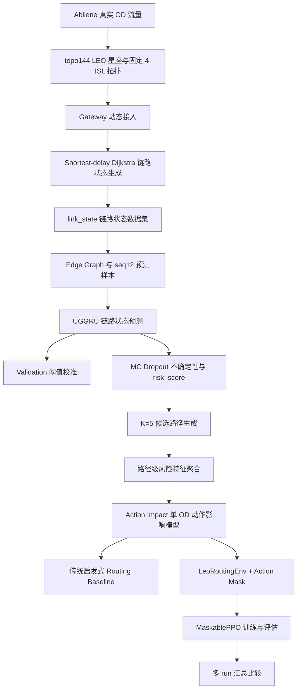

# 基于流量预测与动作影响评估的低轨卫星网络负载均衡路由研究总结

副标题：从 Abilene 流量建模、LEO 链路状态预测到 MaskedPPO 路由决策的完整实验闭环

> 本文档基于项目中已有脚本、配置、CSV、JSON、NPZ 元信息和 PNG 图像整理；没有重新训练模型，没有重新生成大规模数据，也没有改动既有实验结果。此前总结文档在部分环境中曾出现中文编码显示问题，本详细版已用正常 UTF-8 中文重新组织并扩展。

## 1. 研究背景与总体目标

低地球轨道 LEO（Low Earth Orbit，低地球轨道）卫星网络具有拓扑时变、星地接入快速变化、星间链路 ISL（Inter-Satellite Link，星间链路）资源有限、业务流量时空分布不均衡等特点。传统最短路径或最小时延路由容易反复选择低跳数、低时延链路，导致局部链路拥塞。

本研究围绕“基于流量预测与强化学习的低轨卫星网络负载均衡路由算法研究”展开：先使用流量预测模型提前识别未来链路风险，再将预测风险聚合到候选路径层面，进一步通过动作影响评估和强化学习进行路径选择。当前强化学习环境是 **offline action-impact routing environment**，不是完整在线多流动态重路由仿真器；`min_raw_cost` 是基于已知动作代价的强启发式上界，不应表述为普通在线路由算法。

### 1.1 研究问题分解与技术闭环逻辑

本项目真正要解决的问题不是单纯“预测下一时刻链路负载”，也不是单纯“训练一个强化学习智能体”。在低轨卫星网络中，路由决策面对的是一个连续变化的资源分配问题：地面业务流量在时间和空间上不断变化，卫星相对地面高速运动，gateway 接入卫星随时间切换，星间链路容量有限且局部区域容易出现热点。如果只在当前时刻基于最短跳数或最小时延做路径选择，算法往往会忽略未来几分钟内即将发生的拥塞风险，因此可能把流量继续压到已经接近瓶颈的链路上。

因此，本研究首先把问题拆成“看见未来”和“做出动作”两个层面。UGGRU 预测模块负责从历史链路状态中估计下一时刻链路利用率、链路负载和拥塞概率；MC Dropout 进一步给出预测不确定性，使系统不仅知道“哪里可能拥塞”，也知道“这个判断有多不确定”。这一步输出的是链路级信息，即每条 ISL 的 `util_pred_mean`、`util_pred_std`、`cong_prob_mean`、`risk_score` 等。

但是路由动作不是选择一条链路，而是为某个 OD demand 选择一条端到端候选路径。因此，链路级预测不能直接作为路由动作，需要进一步沿着候选路径的 `edge_path` 聚合为路径级特征。路径风险特征回答的问题是：“如果候选路径由若干条链路组成，那么这条路径整体风险有多高？”其中 max 聚合关注路径瓶颈链路，mean 聚合关注路径平均状态，sum 聚合关注路径累计代价。这一步把预测模块的输出转化为路由可理解的候选动作属性。

仅有路径风险仍然不够，因为选择一条路径会对当前网络状态产生影响。两个路径即使预测风险相近，也可能因为承载的 OD demand 大小、路径长度、当前链路剩余容量不同，导致完全不同的后果。因此本研究设计了 action impact 动作影响模型：在当前 link_state 基础上，模拟将某个 OD demand 增量加载到候选路径上，计算 post_mlu、delta_mlu、delta_congestion_count、action_cost 等指标。它回答的问题是：“如果现在选择这条路径，会让网络状态发生什么变化？”

最后，强化学习环境 LeoRoutingEnv 将上述 action impact 特征封装成 State / Action / Reward / Transition。智能体每一步面对一个 gateway OD pair，从 K=5 条候选路径中选择一个动作。action mask 保证无效动作和 zero-hop 等价动作不会被错误选择。MaskedPPO 则学习一个从状态到动作的策略，目标是在不直接手写每种策略规则的情况下，学习在 delay、MLU、拥塞增量和风险之间做权衡。至此，系统形成了从“历史流量与链路状态”到“未来风险预测”，再到“路径级风险”，再到“动作影响”，最后到“路由决策”的闭环。

需要注意的是，这个闭环当前仍是离线实验闭环：action impact 是预计算 proxy，LeoRoutingEnv 读取这些预计算结果，而不是在线重新仿真每一步全网多流重路由。这个限制并不削弱当前阶段的意义，因为它先验证了预测信息能否被转化为可操作的路由决策信号；后续若扩展到在线多步动态仿真器，可以沿用当前的状态设计、动作空间、风险特征和 reward 设计经验。

## 2. 技术路线与已完成模块总览

| 模块 | 输入 | 处理 | 输出 | 当前状态 | 局限 |
| --- | --- | --- | --- | --- | --- |
| Abilene 数据解析 | Abilene traffic matrix 与拓扑文件 | 解析 OD 矩阵、PoP/gateway、链路 | `od_matrices_full.npy` 等 | 完成 | 尚未扩展多场景业务流量 |
| LEO topo144 星座 | `configs/base.yaml` | 生成 144 星、8 轨道面、固定 4-ISL | 卫星位置、ISL edge CSV | 完成 | ISL 边集合固定 |
| Gateway 动态接入 | gateway 经纬度、卫星位置 | 按 15° 最小仰角选择接入卫星 | `gateway_access_topo144.npy` | 完成 | fallback 是工程近似 |
| link_state 仿真 | OD、gateway 接入、LEO edge | shortest-delay Dijkstra 映射流量 | `link_state` CSV | 完成 | Dijkstra 是数据生成基线 |
| edge graph 与 seq12 样本 | link_state、edge CSV | 构建链路图与监督样本 | samples NPZ、splits JSON | 完成 | 固定窗口 seq_len=12 |
| UGGRU 预测 | seq12 样本、edge graph | GraphConv + GRU 多任务预测 | best_model、metrics | 完成 | 主要是单 seed |
| MC Dropout | UGGRU best model | 多次随机推理，计算均值/方差/risk | 不确定性指标与图 | 完成 | 主要提供风险排序 |
| baseline 对比 | samples、训练结果 | Last/HA/GRU/LSTM/UGGRU 对比 | 模型对比表与图 | 完成 | 未做复杂调参 |
| candidate paths | topo144 graph | hop-based K-shortest paths | K=5 候选路径 | 完成 | 只按跳数生成 |
| path risk features | MC 预测、candidate paths | 链路风险聚合到路径 | 路径风险 NPZ/CSV | 完成 | 只处理 test split |
| action impact | path risk、link_state | 单 OD 增量加载 | 动作影响特征 | 完成 | proxy，非全网重路由 |
| routing baseline | action impact | 启发式策略汇总 | baseline 报告 | 完成 | min_action_cost 是强启发式 |
| LeoRoutingEnv | action impact features | Gymnasium 环境与 mask | 环境检查、heuristic eval | 完成 | 离线环境 |
| MaskedPPO | LeoRoutingEnv | smoke/mid/continue/lr1e4 训练 | PPO run comparison | 阶段性完成 | 仍低于 min_raw_cost 上界 |

## 3. 数据与 LEO 网络建模

**本节为什么需要。**所有后续预测和路由实验都依赖一个可信的数据与网络基础。上一节只是给出了总体技术路线，但还没有说明业务流量从哪里来、卫星网络如何构造、gateway 如何接入卫星。如果没有真实或相对可信的 OD 流量输入，后续链路状态和拥塞标签就会失去研究意义；如果没有明确的 LEO 拓扑与接入模型，路由动作空间也无法定义。本节解决的是“实验对象和基础数据是什么”的问题。

本研究使用 Abilene 真实骨干网 OD（Origin-Destination，源宿）流量作为业务流量来源。`od_matrices_full.npy` 的 shape 为 `(48384, 12, 12)`，表示 48384 个时间片、12 个 PoP/gateway、12×12 有序 OD 流量矩阵。Abilene raw 值的单位已经修正为 `100 bytes / 5 minutes`，换算公式为 `Mbps = raw * 100 * 8 / 300 / 1e6`。

| 项目 | 数值/说明 |
| --- | --- |
| OD shape | (48384, 12, 12) |
| sat_positions shape | (48384, 144, 3) |
| gateway_access shape | (48384, 12) |
| topo_name | topo144 |
| 卫星数量 | 144 |
| 轨道面数量 | 8 |
| 每轨卫星数量 | 18 |
| 轨道高度 | 550 km |
| 轨道倾角 | 53° |
| ISL 无向边数量 | 288 |
| 每颗卫星度数 | 4 |
| 最小仰角阈值 | 15° |
| fallback_rate 平均值 | 0.005232 |
| fallback_rate 最大值 | 0.062789 |

> 图注：展示 Abilene 总流量随时间变化，用于说明输入业务流量具有真实时序波动。横坐标为time，纵坐标为total traffic。

> 图注：展示 topo144 星座某一时刻的空间分布和链路结构。横坐标为空间位置/经纬度，纵坐标为卫星与链路位置。

> 图注：展示地面 gateway 到可见卫星的动态接入示例。横坐标为time 或 gateway，纵坐标为接入卫星/可见关系。

当前卫星位置和 gateway 接入是动态的，但 ISL 边集合固定，因此当前星间拓扑是“固定 4-ISL 边集合 + 动态节点位置”的简化实验拓扑。`remain_visible_time` 目前仍是 9999 占位特征。

**本节如何连接下一阶段。**本节输出了 OD 流量、卫星位置、ISL 边集合和 gateway 接入关系。下一阶段会把这些输入组合起来：每个时间片根据 gateway 接入确定 OD 流量的源/目的接入卫星，再通过基线路由映射到 ISL，从而生成 link_state 链路状态数据集。

## 4. 链路状态仿真与诊断

**本节为什么需要。**上一节给出了业务流量和 LEO 网络结构，但预测模型不能直接从 OD 矩阵学习路由效果；它需要监督学习标签，例如每条链路在每个时间片的负载、利用率、时延和拥塞状态。因此，本节要解决的是“如何把地面 OD 流量变成链路级训练数据”的问题。只有生成 link_state，后续 UGGRU 才有可学习的输入与标签。

链路状态数据集使用 shortest-delay Dijkstra 将 Abilene OD 流量映射到 LEO 星间链路。这里的 Dijkstra 只是数据生成阶段基线，用于形成可学习的链路状态样本，不是最终提出的负载均衡路由算法。

| 项目 | 数值 |
| --- | --- |
| link_state 文件大小 | 718.35 MB |
| 总行数 | 13934304 |
| time 数量 | 48383 |
| edge_id 数量 | 288 |
| 总拥塞样本数 | 189456 |
| Top 10 拥塞边占比 | 0.161298666 |
| 有拥塞 time 占比 | 0.844490834 |
| 最大同时拥塞链路数 | 15 |
| 平均每 time 拥塞链路数 | 3.91575553 |
| utilization 公式误差 | 1.7763568394e-15 |
| next 标签抽样检查 | True |

MLU（Maximum Link Utilization，最大链路利用率）表示同一时刻所有链路中最高的 utilization。p95/p99 反映尾部高负载风险。当前有拥塞 time 占比较高，但总体正样本比例低，是因为每个 time 有 288 条链路，通常只有少数链路拥塞。

> 图注：展示全网平均链路利用率随时间变化。横坐标为time，纵坐标为average utilization。

> 图注：展示每个时间片的最大链路利用率。横坐标为time，纵坐标为maximum link utilization。

> 图注：展示拥塞次数最多的链路。横坐标为edge_id，纵坐标为congestion count。

> 图注：展示每个时间片同时拥塞链路数量。横坐标为time，纵坐标为congested edge count。

**本节如何连接下一阶段。**link_state 数据集把“OD 流量 + LEO 拓扑”转化为了“链路状态时序”。下一阶段会从 link_state 中提取过去 12 个时间片的链路特征，并构建 edge graph 邻接矩阵，形成 UGGRU 可直接训练的监督学习样本。

## 5. 预测样本构建与 UGGRU 模型

**本节为什么需要。**上一节已经得到逐时间片、逐链路的 link_state，但它仍是扁平 CSV 数据，不适合直接输入图时序模型。预测任务需要固定长度历史窗口、固定 edge 顺序、统一归一化方式和 train/val/test 时间划分。因此，本节要解决的是“如何把链路状态数据集转成模型训练样本”，并设计能够利用链路拓扑和时间序列的 UGGRU 模型。

预测对象是链路 edge，而不是卫星节点。edge graph 的节点对应 288 条 ISL；如果两条 ISL 共享同一颗卫星，则它们在 edge graph 中相邻。GCN（Graph Convolutional Network，图卷积网络）提取链路空间相关性，GRU（Gated Recurrent Unit，门控循环单元）提取时间依赖。

| 项目 | 数值/说明 |
| --- | --- |
| edge adjacency shape | (288, 288) |
| edge graph 平均度 | 6.000000 |
| X shape | [48372, 12, 288, 6] |
| y_utilization shape | [48372, 288] |
| y_load_mbps_norm shape | [48372, 288] |
| y_congestion shape | [48372, 288] |
| feature_names | utilization, load_mbps_norm, delay_ms_norm, queue_len_norm, remain_visible_time_norm, congestion_label |
| train/val/test | [0,33860) / [33860,41115) / [41115,48372) |
| 样本文件大小 | 487.62 MB |
| scaler | 基于 train split；remain_visible_time raw_std=0 时安全处理 |
| y_congestion dtype | int8 |

UGGRU 输入为 `X=[B,12,288,6]`，输出下一时间片 utilization、load_mbps_norm 和 congestion logit。损失为 `1.0*MSE(util)+0.3*MSE(load)+0.5*BCE(congestion)`，并用训练集 `pos_weight` 缓解拥塞类别不平衡。

| 训练配置 | 数值 |
| --- | --- |
| model | uggru |
| seq_len | 12 |
| batch_size | 16 |
| lr | 0.001000 |
| gcn_hidden | 32 |
| gru_hidden | 64 |
| dropout | 0.200000 |
| pos_weight | 66.294270 |
| device | cuda |
| best_epoch | 43 |
| best_val_loss | 0.186405 |

> 图注：展示标签 utilization 分布。横坐标为utilization，纵坐标为frequency。

> 图注：展示 train/val/test 拥塞正样本比例。横坐标为split，纵坐标为positive ratio。

> 图注：展示 UGGRU 训练和验证损失曲线。横坐标为epoch，纵坐标为loss。

### 5.1 为什么 edge graph 的节点是链路而不是卫星

本项目的预测目标是每一条星间链路的下一时刻状态，包括 utilization、load 和 congestion_label。若直接把卫星作为图节点，则模型天然更适合预测“卫星节点状态”；但本研究真正关心的是链路是否拥塞、链路负载是否升高，以及后续路由路径是否会经过高风险链路。因此，第 4 阶段构建的是 edge-to-edge graph：每条 ISL 是一个 edge-node，两条 ISL 如果共享同一颗卫星，就认为它们相邻。

这种建模方式的好处是，空间依赖关系直接发生在“被预测对象”之间。例如某颗卫星连接的 4 条 ISL 会共享转发压力，某条链路负载升高可能意味着相邻链路也承受相近方向的流量变化。edge graph 可以让 GraphConvLayer 在链路之间传播局部拓扑上下文，而不是先预测卫星状态再间接推断链路状态。对于后续路径风险聚合来说，这种链路级预测结果也更自然，因为候选路径本身就是 edge_path 的序列。

### 5.2 为什么 GraphConv + GRU 适合链路状态预测

链路状态预测同时包含空间依赖和时间依赖。空间依赖来自 LEO 网络拓扑：共享卫星的 ISL 之间存在转发耦合，某些拓扑位置更容易成为 Abilene OD 流量映射后的瓶颈。时间依赖来自业务流量本身：Abilene OD 矩阵具有连续时序变化，短时间内链路负载存在惯性，同时也会在高峰期或接入变化时出现突变。UGGRU 的结构正是对这两类依赖的组合建模。

GraphConvLayer 先在每个时间片上用 edge adjacency 聚合相邻链路特征，得到包含局部拓扑上下文的链路表示；随后 GRU 对每条链路的 12 个历史时间片序列建模，提取时间趋势。这样，模型既不会退化为完全独立地预测每条链路，也不会只依赖当前时刻的静态拓扑，而是把“链路邻域”和“历史趋势”合在一起用于下一时刻预测。

### 5.3 从 baseline 对比看 UGGRU 的作用

Last baseline 的 MAE_util 最低，表明链路利用率具有很强的短时惯性：很多普通链路在相邻时间片变化很小，直接复制最后一个历史值就能在平均绝对误差上取得不错结果。但 Last 的 RMSE_util 明显较高，说明它在峰值、突变和拥塞附近的误差更大；RMSE 对大误差更敏感，因此能暴露短时复制策略对异常变化的不足。

HA baseline 使用历史平均，会进一步平滑掉短时变化，因此拥塞识别几乎失效。GRU-only 和 LSTM-only 能学习时间序列，因此 recall 较高，但 Precision 和 F1 较低，说明它们在不使用链路图结构的情况下容易产生较多误报。UGGRU 的 F1 明显高于 GRU-only 和 LSTM-only，说明 edge graph 提供的空间结构信息确实有助于区分真实拥塞链路和仅有时间趋势相似的普通链路。

从论文写作角度看，这一部分可以作为“预测模型有效性验证”小节：Last 证明问题存在强时序惯性，GRU/LSTM 证明时间模型有价值，UGGRU 进一步证明链路拓扑结构能提升拥塞识别能力。

**本节如何连接下一阶段。**UGGRU 产生的是下一时间片的链路级预测，包括 utilization、load 和 congestion logit。下一阶段会先对拥塞概率进行阈值校准，再通过 MC Dropout 获得预测不确定性，把普通点预测扩展为带风险意识的链路级预测结果。

## 6. 阈值校准、MC Dropout 与预测模型对比

**本节为什么需要。**UGGRU 已经能输出链路级预测，但路由决策需要的不只是“一个预测值”，还需要知道预测是否可靠，以及哪些链路未来更值得避开。特别是在拥塞样本稀少的情况下，分类阈值会显著影响 Precision、Recall 和 F1。因此，本节解决两个问题：第一，如何用 validation set 选择更合理的拥塞阈值；第二，如何用 MC Dropout 为链路预测补充不确定性和风险排序能力。

由于拥塞标签高度不平衡，默认阈值 0.5 并不适合直接用于拥塞分类。当前在 validation set 上选择阈值 `0.95`，再固定应用到 test set，避免 test set 调参。

| 指标 | UGGRU test/val-to-test | MC Dropout |
| --- | --- | --- |
| MAE_util | 0.033072 | 0.033984 |
| RMSE_util | 0.160971 | 0.161991 |
| Precision | 0.460489 | 0.477283 |
| Recall | 0.625566 | 0.598702 |
| F1 | 0.530482 | 0.531142 |
| coverage_1std | - | 0.764586 |
| coverage_2std | - | 0.899498 |
| uncertainty_error_corr | - | 0.555298 |

MC Dropout（Monte Carlo Dropout，蒙特卡洛 Dropout）不是为了显著降低 MAE/RMSE，而是提供不确定性和风险排序。当前 `risk_score = util_pred_mean + lambda * util_pred_std`；Top 1%/5%/10% 高风险位置真实拥塞率分别为 0.574614、0.222687、0.123023，lift 分别为 43.54、16.87、9.32。

| Model | MAE_util | RMSE_util | Precision | Recall | F1 | 说明 |
| --- | --- | --- | --- | --- | --- | --- |
| Last | 0.031954 | 0.211180 | 0.447329 | 0.447232 | 0.447281 | No-training persistence baseline |
| HA | 0.057850 | 0.221878 | 0.002793 | 0.000036 | 0.000072 | No-training historical average baseline |
| GRU-only | 0.033540 | 0.170046 | 0.145799 | 0.852047 | 0.248991 | Temporal baseline without edge graph |
| LSTM-only | 0.035003 | 0.169367 | 0.151694 | 0.848856 | 0.257391 | Temporal baseline without edge graph |
| UGGRU | 0.033072 | 0.160971 | 0.460489 | 0.625566 | 0.530482 | Graph and temporal model, threshold selected on validation |
| UGGRU + MC Dropout | 0.033984 | 0.161991 | 0.477283 | 0.598702 | 0.531142 | UGGRU with MC Dropout uncertainty |

Last baseline 的 MAE_util 最低但 RMSE 高，说明短时惯性强而峰值/突变预测弱；HA 平滑短时变化，拥塞识别几乎失效；GRU-only 与 LSTM-only 能建模时间序列但缺少链路图结构；UGGRU 引入 edge graph 后在 RMSE 和拥塞 F1 上更优。

> 图注：展示不同阈值下 Precision、Recall、F1 的变化。横坐标为threshold，纵坐标为precision/recall/F1。

> 图注：展示 validation 阈值选择及 test 应用逻辑。横坐标为threshold，纵坐标为precision/recall/F1。

> 图注：展示预测标准差与绝对误差关系。横坐标为util_pred_std，纵坐标为absolute error。

> 图注：展示高风险 Top-k 位置真实拥塞率。横坐标为top-k ratio，纵坐标为true congestion rate。

> 图注：比较不同预测模型 MAE/RMSE。横坐标为model，纵坐标为MAE/RMSE。

> 图注：比较不同预测模型拥塞 F1。横坐标为model，纵坐标为F1。

### 6.1 MC Dropout 的研究意义

如果只看 MAE/RMSE，MC Dropout 相比普通 UGGRU 并没有带来明显提升，甚至会因为随机采样平均而略有差异。但这不是 MC Dropout 在本项目中的主要价值。本项目需要的不只是一个点估计，而是一个能服务于路由决策的风险信号。对于路由而言，一条链路预测利用率较高但模型非常确定，与一条链路预测利用率中等但不确定性很高，可能都应被视为需要谨慎避开的对象。

因此，本研究将 `util_pred_mean` 和 `util_pred_std` 组合为 `risk_score = mean + lambda * std`。这个定义并不试图替代 utilization 预测，而是把预测均值和不确定性共同转化为保守风险估计。`coverage_2std=0.899498` 表明 mean ± 2std 对真实 utilization 有较高覆盖率；`uncertainty_error_corr=0.555298` 表明不确定性与预测误差存在中等正相关。换句话说，模型“不确定”的地方确实更容易出错，这使不确定性可以作为路由风险的一部分。

Top-k 风险排序结果对后续路由尤其关键。真实拥塞样本整体比例约为 1.32%，但按 risk_score 排序的 Top 1% 位置真实拥塞率达到 57.46%，lift 达到 43.54 倍。这说明 risk_score 能把少量最危险的链路位置显著富集出来。对于路由模块而言，这意味着不需要把所有链路都同等看待，而可以优先避开路径中包含高 risk_score 的链路，从而把预测模块的输出真正转化为动作选择依据。

### 6.2 阈值校准为什么必须在 validation set 上完成

拥塞分类是高度不平衡任务，默认 0.5 阈值通常会偏向高 recall 或高误报，无法满足后续路由评估需要。第 5 阶段先在 validation set 上扫描阈值，选择 best F1 threshold=0.95，再固定应用到 test set。这样做的关键不是让 test 指标最大化，而是避免把测试集用于调参，保证评估流程严谨。

从结果看，threshold=0.95 在 test set 上取得 Precision=0.460489、Recall=0.625566、F1=0.530482。这个 F1 不应孤立理解为“分类任务最终完美完成”，而应理解为“预测模块能够提供有可用精度的拥塞风险信号”。后续路径风险、action impact 和 RL 环境并不只依赖二值拥塞标签，而是更多使用连续的 utilization、cong_prob 和 risk_score，因此阈值校准只是预测模块输出体系中的一部分。

**本节如何连接下一阶段。**本节最终输出的是链路级风险：每条 edge 在每个 test sample 下的预测均值、预测标准差、拥塞概率和 risk_score。下一阶段不会直接把这些链路分数当作动作，而是先生成端到端候选路径，再把路径上的链路风险聚合成 path-level features。

## 7. 候选路径生成

**本节为什么需要。**上一节已经知道每条链路的预测风险，但路由必须在源卫星到目的卫星之间选择一条可行路径。如果没有候选路径集合，后续既无法聚合路径风险，也无法定义强化学习动作空间。因此，本节要解决“智能体有哪些可选动作”的问题：为每个有序卫星对生成固定数量 K=5 的候选路径。

第 8 阶段为 topo144 所有有序卫星对生成 K=5 候选路径，作为后续动作空间基础。候选路径生成只使用拓扑和 hop-based K-shortest paths，不使用 risk_score。

| 项目 | 数值 |
| --- | --- |
| K | 5 |
| 有序卫星 pair 数量 | 20592 |
| 总路径数 | 102960 |
| 平均每对候选路径数 | 5.000000 |
| hop_count mean | 6.931469 |
| hop_count p50 | 7.000000 |
| hop_count p95 | 11.000000 |
| hop_count max | 13 |
| 无路径 pair | False |
| 重复路径 | False |
| 路径连续性检查 | True |

> 图注：展示 K=5 候选路径跳数分布。横坐标为hop count，纵坐标为path count。

**本节如何连接下一阶段。**候选路径生成后，每个 OD 决策都有 K=5 个 path_id，每个 path_id 都有对应的 sat_path 和 edge_path。下一阶段会沿着这些 edge_path 读取链路级 risk_score、cong_prob 和 utilization 预测，并聚合为路径级风险特征。

## 8. 路径风险特征构建

**本节为什么需要。**上一阶段 UGGRU 与 MC Dropout 已经解决了“如何预测每条星间链路未来风险”的问题，输出的是链路级结果，例如 `util_pred_mean`、`util_pred_std`、`cong_prob_mean` 和 `risk_score`。但是路由决策不是选择单条链路，而是为一个 gateway OD 流选择一整条候选路径。也就是说，上一阶段已经知道“哪些链路危险”，但还不知道“哪条端到端路径危险”。本节出现的原因正是填补这个缺口：把链路级预测结果沿着候选路径的 `edge_path` 聚合为路径级风险特征，使预测结果能够被后续路由动作直接使用。

路径风险特征将链路级预测结果聚合到候选路径级别。每个 test sample 有 12 个 gateway 的 132 个有序 OD pair，每个 OD pair 有 K=5 条候选路径。

| 项目 | 数值 |
| --- | --- |
| features shape | [7257, 132, 5, 32] |
| N_test | 7257 |
| 每 sample OD pair 数 | 132 |
| K | 5 |
| 特征数 F | 32 |
| CSV 行数 | 4789620 |
| valid_mask 全 True | True |
| NaN/Inf | False / False |
| 抽样聚合检查 | True |
| rank_by_risk 1~K | True |
| shortest 与 min_risk 不同比例 | 0.494511 |
| min_risk 风险降低 | 0.196659 |
| min_risk hop_count 增加 | 0.389626 |
| 策略 | hop_count | delay_sum | current_util_max | pred_util_max | cong_prob_max | risk_score_max |
| --- | --- | --- | --- | --- | --- | --- |
| shortest_path | 3.474900 | 35.560780 | 0.587009 | 0.417917 | 0.652342 | 0.504526 |
| min_risk_path | 3.864526 | 40.023478 | 0.372471 | 0.245551 | 0.527992 | 0.307867 |
| min_cong_prob_path | 3.870629 | 39.830225 | 0.380285 | 0.251241 | 0.522778 | 0.316059 |
| min_delay_path | 3.474900 | 32.945477 | 0.670434 | 0.485564 | 0.675506 | 0.584401 |

zero-hop 场景表示源 gateway 和目的 gateway 同时接入同一颗卫星，此时 `edge_path=[]`，路径不经过 ISL。后续 RL 环境通过 action mask 将等价 zero-hop 动作压缩为只允许 path_id=0。

> 图注：展示候选路径风险分数分布。横坐标为risk score，纵坐标为frequency。

> 图注：展示路径最大拥塞概率分布。横坐标为congestion probability，纵坐标为frequency。

> 图注：展示路径时延与风险之间的关系。横坐标为path_delay_ms_sum，纵坐标为path_risk_score_max。

> 图注：比较 shortest_path 与 min_risk_path。横坐标为strategy，纵坐标为metric。

> 图注：展示最低风险路径对应 path_id 分布。横坐标为path_id，纵坐标为count。

### 8.1 为什么链路级 risk_score 不能直接作为路由动作

UGGRU 和 MC Dropout 输出的是链路级风险，即每条 edge 在某个 test sample 下的风险状态。但路由动作选择的是一条从源接入卫星到目的接入卫星的路径，这条路径由多个 edge 组成。只看单条链路的 risk_score 无法判断整条路径是否安全：一条路径可能大部分链路很安全，但包含一条极高风险瓶颈链路；另一条路径可能每条链路风险都中等，但路径很长，累计风险和时延都较高。因此，链路级预测必须通过候选路径的 edge_path 聚合为路径级特征。

路径级聚合的关键是保留不同风险视角。max 聚合表示瓶颈风险，例如 `path_risk_score_max` 表示路径上最危险链路的风险；mean 聚合表示路径平均风险或平均负载状态；sum 聚合表示累计代价，适合描述长路径带来的总风险和总资源占用。对于 delay，sum 更符合端到端路径时延；对于 congestion probability，max 更适合表示“路径是否包含高拥塞概率链路”；对于 uncertainty，mean 和 max 分别表示整体不确定性和最不确定瓶颈。

### 8.2 shortest 与 min_risk 近半数不同的意义

结果显示，`shortest_path` 与 `min_risk_path` 的不同比例为 49.4511%。这说明在近一半的真实 gateway OD 决策中，按照跳数最短选择的路径并不是预测风险最低的路径。这个结果非常重要，因为它证明预测模块并不是只给出一个“附属指标”，而是真正会改变路径选择。

`min_risk_path` 相比 shortest_path 平均 `path_risk_score_max` 降低 0.196659，但平均 hop_count 增加 0.389626。这一现象符合路由直觉：为了避开高风险瓶颈链路，路径可能需要绕行，因此 hop_count 或 delay 会有所增加。也就是说，预测感知路由本质上不是追求最短，而是在“路径长度/时延”和“未来拥塞风险”之间做权衡。

这一步把流量预测模块和路由模块第一次真正连接起来。没有 path risk features，预测结果只能停留在链路层；有了路径级风险，后续 action impact 和 RL 环境才能把每条候选路径作为一个可评估、可比较、可选择的动作。

**本节如何连接下一阶段。**路径风险特征解决了“路径本身风险如何表示”的问题，但仍然没有回答“如果把当前 OD demand 真正加载到这条路径上，会让网络状态变成什么样”。例如两条路径的 `path_risk_score_max` 可能接近，但其中一条路径承载的 OD demand 更大、当前链路利用率更高，执行后可能造成更大的 MLU 增量。因此，本节输出的 path-level features 会进入下一阶段 Action Impact，进一步被转化为动作执行后的 post_mlu、delta_mlu、delta_congestion_count 和 action_cost。

## 9. 动作影响模型 Action Impact

**本节为什么需要。**上一节 path risk features 已经把链路级风险聚合到了路径级，能够说明“这条候选路径看起来有多危险”。但是这仍然只是路径静态属性，不能说明当前 OD demand 一旦选择这条路径后，会如何改变网络状态。两条路径的风险可能相近，但如果路径长度、当前链路负载、OD demand 大小不同，动作后果就可能完全不同。因此，仅有 path risk 还不足以支持路由决策，必须进一步评估“选择某条路径这个动作”会造成什么影响。

Action Impact 的本质是把“候选路径”变成“可比较的候选动作”。它不仅看路径自身的 delay 和风险，还模拟将当前 OD demand 增量加载到路径上的链路，计算执行动作后的 post_mlu、delta_mlu、delta_congestion_count、path_post_util_max 和 action_cost 等指标。这样，后续模块比较的不再只是路径属性，而是动作后果。

需要强调的是，Action Impact 是规则/仿真型单 OD 增量加载 proxy。给定当前网络状态、某个 gateway OD demand 和一条候选路径，模型将该 demand 增量加载到路径上的每条 ISL，计算 post-action 的局部与全网 proxy 指标。它不从 link_state 中移除原有流量，也不做全网多 OD 重新分配。因此它不是完整在线多流重路由仿真器，而是为后续 routing baseline 和 LeoRoutingEnv 提供动作后果表。

| 项目 | 数值 |
| --- | --- |
| impact_features shape | [7257, 132, 5, 49] |
| N_test | 7257 |
| gw_pair_count | 132 |
| K | 5 |
| F_impact | 49 |
| NaN/Inf | False / False |
| zero-hop action count | 830290 |
| zero-hop ratio | 0.173352 |
| post_mlu >= pre_mlu | True |
| delta_total_load 校验 | True |
| 抽样重算检查 | True |
| 策略 | post_mlu | delta_mlu | delta_congestion_count | action_cost | path_delay_ms_sum | path_risk_score_max |
| --- | --- | --- | --- | --- | --- | --- |
| shortest_path | 1.406086 | 0.005090 | 0.027019 | 181.484869 | 35.560780 | 0.504526 |
| min_delay_path | 1.406568 | 0.005571 | 0.026159 | 179.707853 | 32.945477 | 0.584401 |
| min_risk_path | 1.403249 | 0.002253 | 0.014972 | 183.576781 | 40.023478 | 0.307867 |
| min_cong_prob_path | 1.403328 | 0.002331 | 0.015762 | 183.481210 | 39.830225 | 0.316059 |
| min_action_cost_path | 1.402751 | 0.001755 | 0.009029 | 177.890029 | 33.623256 | 0.390138 |

`min_risk_path` 能明显降低预测风险和新增拥塞，但平均 delay 更高；`min_delay_path` 虽然时延最低，但风险与 post_mlu 较高；`min_action_cost_path` 综合 delay、MLU、拥塞增量和预测风险后 action_cost 最低。

> 图注：比较不同策略执行后的平均 post_mlu。横坐标为strategy，纵坐标为post_mlu。

> 图注：比较不同策略造成的 MLU 增量。横坐标为strategy，纵坐标为delta_mlu。

> 图注：比较不同策略造成的新增拥塞数量。横坐标为strategy，纵坐标为delta_congestion_count。

> 图注：比较不同策略的 action_cost。横坐标为strategy，纵坐标为action_cost。

> 图注：比较 shortest_path 和 min_risk_path 的 action_cost 关系。横坐标为shortest action_cost，纵坐标为min_risk action_cost。

> 图注：展示 min_action_cost_path 选择 path_id 分布。横坐标为path_id，纵坐标为count。

### 9.1 Action Impact 的特征体系

Action Impact 特征可以大致分为五类。第一类是基础标识特征，包括 sample_idx、time_t、src_gateway、dst_gateway、src_sat、dst_sat、path_id、hop_count、od_demand_mbps、is_zero_hop 和 is_valid，用于定位当前动作对应的时刻、业务流和候选路径。第二类是 pre-action 全网状态，包括 pre_mlu、pre_congestion_count、pre_avg_utilization、pre_total_load_mbps，用于描述动作执行前网络是否已经接近拥塞。

第三类是路径局部状态与动作增量，包括 path_pre_load_sum、path_pre_util_max、affected_edge_count、added_load_edge_sum 等。这些特征刻画“该 OD demand 加到哪些链路上、会加多少负载”。第四类是 post-action 指标，包括 path_post_util_max、post_mlu、delta_mlu、delta_congestion_count、delta_total_load_mbps 等，用于衡量动作造成的即时后果。第五类是预测风险相关特征，包括 path_pred_util_max、path_cong_prob_max、path_risk_score_max、path_util_uncertainty_mean 等，用于把预测模块的风险感知能力注入动作评估。

在这些指标中，post_mlu 表示执行动作后的全网最大链路利用率，越低越有利于负载均衡；delta_mlu 表示动作使全网 MLU 增加了多少；delta_congestion_count 表示动作新增了多少拥塞链路；action_cost 是启发式综合代价，由 delay、post_mlu、delta_congestion_count 和 path_risk_score_max 等分项组成。它不是最终 RL reward 的唯一形式，但为 routing baseline 和 RL reward 设计提供了直接参考。

### 9.2 为什么 Action Impact 是单 OD 增量加载 proxy

真实在线路由系统中，当某条 OD 流改变路径后，全网多个 OD 流可能同时重分配，链路状态会随时间滚动演化，后续时刻的 gateway 接入和卫星位置也会改变。当前 Action Impact 没有模拟这些复杂反馈，而是在已有 link_state 基础上，把单个 OD demand 增量加载到候选路径上，观察局部和全网 proxy 指标如何变化。

这种设计的局限是显然的：它不是完整全局 post-routing state，也不能直接表示长期多步效果。但它的优势是可控、可解释、可大规模预计算。对于每个 test sample、每个 gateway OD pair、每条候选路径，系统都能得到一组一致的动作后果特征。这使得后续 LeoRoutingEnv 可以快速读取这些结果进行 RL 训练，而不必在每个 step 中重新跑昂贵的网络仿真。

### 9.3 min_risk 与 min_action_cost 的差异

`min_risk_path` 选择 path_risk_score_max 最低的路径，因此它显著降低风险、delta_mlu 和新增拥塞。但它不直接优化 delay，也不直接优化 action_cost 的所有分项。结果中 min_risk_path 的 path_delay_ms_sum 高于 shortest_path，action_cost 反而比 shortest_path 更差。这说明“最低预测风险”并不等于“综合路由代价最低”，它更像是一个保守避险策略。

`min_action_cost_path` 则把 delay、post_mlu、delta_congestion_count 和 path_risk_score_max 放在同一个启发式代价中综合考虑，因此在 routing baseline 中表现最强：它既降低 delta_mlu 和新增拥塞，又降低 action_cost，delay 也没有明显恶化。后续强化学习的 reward 设计正是从这个思想出发，让策略学习在多个目标之间自动权衡，而不是固定使用某一个单指标规则。

因此，Action Impact 在研究链条中的位置非常关键：它把“预测风险”转化为“动作后果”，再把“动作后果”转化为“reward 和 observation”。没有这一步，RL 环境只能看到静态路径属性；有了这一步，智能体才能学习不同路径选择对 MLU、拥塞和风险的实际影响。

**本节如何连接下一阶段。**Action Impact 输出后，系统已经拥有每个 `sample_idx + gateway OD pair + path_id` 的动作后果。下一步可以有两种使用方式：第一，不训练模型，直接根据这些动作后果设计传统启发式策略，例如选择最低风险、最低拥塞概率或最低综合代价路径；第二，把这些动作后果封装为强化学习环境的 observation 和 reward，让智能体学习状态到动作的映射。因此，第 10 阶段会先基于 Action Impact 做传统 routing baseline，第 11 阶段再把它封装进 LeoRoutingEnv。

## 10. 传统启发式路由 Baseline 汇总

**本节为什么需要。**上一节 Action Impact 已经为每条候选路径计算了执行后的代价和影响。既然每个动作的后果已经可比较，就可以先不训练任何模型，而是用一组简单规则直接选路径。这一步的目的不是替代强化学习，而是回答一个更基础的问题：预测风险和动作代价是否真的能改善传统最短路径？如果基于风险或综合代价的简单规则都无法优于 shortest_path，那么后续训练 PPO 的意义就会不足。

第 11 阶段不训练新模型，而是基于 action impact 汇总五种传统/启发式策略：shortest_path、min_delay_path、min_risk_path、min_cong_prob_path 和 min_action_cost_path。

| 最优维度 | 策略 |
| --- | --- |
| best_post_mlu_strategy | min_action_cost_path |
| best_delta_mlu_strategy | min_action_cost_path |
| best_delta_congestion_count_strategy | min_action_cost_path |
| best_action_cost_strategy | min_action_cost_path |
| best_risk_score_strategy | min_risk_path |
| best_delay_strategy | min_delay_path |
| 策略 | post_mlu | delta_mlu | delta_congestion_count | action_cost | risk_score | delay | final_comment |
| --- | --- | --- | --- | --- | --- | --- | --- |
| shortest_path | 1.406086 | 0.005090 | 0.027019 | 181.484869 | 0.504526 | 35.560780 | 基础最短路径 baseline，时延和风险均未显式优化。 |
| min_delay_path | 1.406568 | 0.005571 | 0.026159 | 179.707853 | 0.584401 | 32.945477 | 时延最低，但风险和 post_mlu 相对较高，说明纯时延优先不等于负载均衡最优。 |
| min_risk_path | 1.403249 | 0.002253 | 0.014972 | 183.576781 | 0.307867 | 40.023478 | 显著降低预测风险、delta_mlu 和新增拥塞，但平均路径更长，综合 action_cost 上升。 |
| min_cong_prob_path | 1.403328 | 0.002331 | 0.015762 | 183.481210 | 0.316059 | 39.830225 | 与最低风险路径类似，降低拥塞概率和新增拥塞，但牺牲一定时延。 |
| min_action_cost_path | 1.402751 | 0.001755 | 0.009029 | 177.890029 | 0.390138 | 33.623256 | 综合 delay、MLU、拥塞增量和风险后 action_cost 最低，是当前最强启发式 baseline。 |
| 相对 shortest_path | delta_mlu 改善 | 新增拥塞改善 | risk_score 改善 | action_cost 改善 | delay change |
| --- | --- | --- | --- | --- | --- |
| min_risk_path | 55.742142 | 44.586972 | 38.978936 | -1.152665 | -12.549494 |
| min_action_cost_path | 65.528223 | 66.582953 | 22.672318 | 1.980793 | 5.448486 |

`min_risk_path` 相比 shortest_path 显著降低 delta_mlu、新增拥塞和 risk_score，但 action_cost 上升；`min_action_cost_path` 在综合代价上最优，是当前最强启发式 baseline。

这些启发式策略分别代表不同决策偏好：`min_delay_path` 代表纯时延优先，`min_risk_path` 代表预测风险优先，`min_cong_prob_path` 代表拥塞概率优先，`min_action_cost_path` 代表综合 delay、MLU、拥塞增量和风险后的代价优先。它们共同构成 PPO 的对照组：PPO 至少应该优于 random_valid 和 shortest，并尽量接近 min_action_cost 或 min_raw_cost 这类强启发式策略。

> 图注：比较五种启发式策略的 post_mlu。横坐标为strategy，纵坐标为post_mlu。

> 图注：比较五种策略对 MLU 的增量影响。横坐标为strategy，纵坐标为delta_mlu。

> 图注：比较五种策略新增拥塞数量。横坐标为strategy，纵坐标为delta_congestion_count。

> 图注：比较五种策略综合 action_cost。横坐标为strategy，纵坐标为action_cost。

> 图注：展示策略在 delay 与 risk_score 之间的权衡。横坐标为path_delay_ms_sum，纵坐标为path_risk_score_max。

> 图注：展示各策略相对 shortest_path 的改善百分比。横坐标为strategy，纵坐标为improvement percentage。

**本节如何连接下一阶段。**传统 routing baseline 证明了 action impact 表确实包含有用决策信息：不同规则选出的路径在 post_mlu、delta_mlu、delta_congestion_count 和 action_cost 上差异明显。下一阶段要做的是把这种“规则选路径”升级为“智能体学策略”：不再固定写死某一个规则，而是定义 RL 环境，让 PPO 根据 observation 学习在不同状态下应该偏向 delay、risk、congestion 还是综合 cost。

## 11. 强化学习环境 LeoRoutingEnv

**本节为什么需要。**Action Impact 生成的是一个静态动作后果表，routing baseline 则是在这个表上手写规则选路径。要训练强化学习智能体，仅有表格还不够，必须把问题形式化为 State / Action / Reward / Transition：智能体在什么状态下观察什么信息、可以选择哪些动作、选择后得到什么 reward、环境如何推进到下一步。LeoRoutingEnv 的作用就是把 action impact 表封装成 Gymnasium 风格环境，使后续 MaskedPPO 可以直接训练。

LeoRoutingEnv 是 Gymnasium 风格的离线 action-impact 路由环境。每一步决策对应一个 `sample_idx + gateway OD pair`，动作是从 K=5 条候选路径中选择一个 path_id。它读取预计算的 action impact features，而不是在线重新计算全网链路状态。

| 项目 | 数值/说明 |
| --- | --- |
| observation shape | [140] |
| action_space | Discrete(5) |
| observation 构成 | 5 × 27 selected features + 5 action mask = 140 |
| action_masks shape | (5,) bool |
| zero-hop mask | zero-hop 时只允许 path_id=0 |
| invalid action penalty | invalid 动作不崩溃，返回惩罚并推进 |
| reward_mode | relative_to_shortest |
| reward 公式 | shortest_path_raw_cost - selected_action_raw_cost |
| rollout 检查 | True |
| invalid action 测试 | True |

需要 action mask 的原因有两点：过滤无效动作，以及在 zero-hop 场景下屏蔽 path_id=1~4 的等价动作。当前环境可被 MaskablePPO 调用，但仍是离线环境。

| Policy | mean_reward | mean_raw_cost | mean_post_mlu | mean_delta_congestion_count | mean_risk_score | invalid_action_count |
| --- | --- | --- | --- | --- | --- | --- |
| random_valid | -6.249836 | 191.505412 | 1.405960 | 0.026508 | 0.548193 | 0 |
| shortest | 0.000000 | 185.255577 | 1.406086 | 0.027019 | 0.504526 | 0 |
| min_raw_cost | 4.256782 | 180.998794 | 1.402522 | 0.009177 | 0.379573 | 0 |
| min_risk | -1.186437 | 186.442014 | 1.403249 | 0.014972 | 0.307867 | 0 |
| min_cong_prob | -1.072660 | 186.328236 | 1.403328 | 0.015762 | 0.316059 | 0 |

> 图注：比较环境中 heuristic policy 的平均 reward。横坐标为policy，纵坐标为mean_reward。

> 图注：比较 heuristic policy 的 raw_cost。横坐标为policy，纵坐标为mean_raw_cost。

> 图注：展示不同策略选择 action_id 的分布。横坐标为action_id，纵坐标为count。

### 11.1 State / Action / Reward / Transition 设计

LeoRoutingEnv 的 state 不是原始链路状态矩阵，而是当前 OD 决策对应的 K=5 条候选路径动作影响特征。对于当前 `sample_pos` 和 `gw_pair_pos`，环境读取 `impact_features[sample_pos, gw_pair_pos, :, :]`，从 49 个 action impact 特征中选择 27 个与路由决策最相关的特征，再将 5 条路径的特征 flatten 成一维向量，最后拼接 5 维 action mask。因此 observation shape 为 `5×27+5=140`。

这种 flatten 设计是为了兼容 Stable-Baselines3 / sb3-contrib 中常用的 MlpPolicy。虽然从结构上看候选路径集合更适合用 set encoder 或 attention 处理，但第一版环境优先保证稳定、可训练和可检查。每个 observation 中同时包含所有候选动作的信息，因此 MLP 仍然可以学习不同 path_id 之间的相对优劣。

Action 是 `Discrete(5)`，表示选择当前 OD pair 的第几条候选路径。Reward 默认使用 `relative_to_shortest`：`reward = shortest_path_raw_cost - selected_action_raw_cost`。如果选择的动作比 shortest_path 代价低，reward 为正；如果更差，reward 为负。这样 reward 具有清晰基准含义：智能体不是直接追求绝对 cost，而是在学习相对最短路径能改善多少。

Transition 在当前环境中是离线顺序推进：每一步从当前 gateway OD pair 推进到下一个 OD pair；132 个 OD pair 结束后进入下一个 test sample。环境并不根据智能体动作更新未来 link_state，因此它不是在线动态仿真器。这一点必须在论文中明确说明，否则容易让读者误以为 PPO 已经在完整动态网络中闭环运行。

### 11.2 Action mask 的必要性

action mask 在本环境中不是可选装饰，而是保证动作空间语义正确的关键机制。首先，候选路径生成和后续处理虽然大多数情况下 valid_mask 全 True，但环境仍保留基础 valid mask，以便未来扩展到断链、不可见链路或候选路径不足时使用。其次，zero-hop 场景下源 gateway 和目的 gateway 接入同一颗卫星，5 条候选路径在 ISL 层面都是空路径或等价动作。如果不 mask，PPO 会在这些无意义 path_id 之间学习随机差异，增加训练噪声。

zero-hop 时只允许 path_id=0，可以把等价动作压缩为唯一合法动作。检查结果中 zero-hop mask 生效，invalid action 测试通过。后续 MaskedPPO 训练和评估中 invalid_action_count=0，说明模型确实通过 mask 避免了非法动作。这也是选择 MaskablePPO 而不是普通 PPO 的直接原因之一。

### 11.3 环境结果如何理解

heuristic policy 评估表明，random_valid 明显差于 shortest，说明动作空间中不同候选路径质量差异显著，随机选择不可取。shortest 的 reward 为 0，因为 reward 定义就是相对 shortest 的改善。min_raw_cost reward 最高，因为它每一步都直接选择 raw_cost 最小动作。min_risk 和 min_cong_prob 在 risk 或 cong_prob 上更低，但 mean_reward 为负，说明单纯避险可能牺牲 delay 或其他 cost 分项。

这些结果为 PPO 训练提供了三类参照：random_valid 是下界，shortest 是传统基线，min_raw_cost 是 oracle-like greedy upper-bound。PPO 的合理目标不是超过 min_raw_cost，而是显著优于 random_valid 和 shortest，并尽量缩小与 min_raw_cost 的差距。

**本节如何连接下一阶段。**LeoRoutingEnv 给出了标准化的 observation、action_space、reward 和 action_masks。下一阶段 MaskablePPO 将直接使用这个环境进行训练：每一步读取 observation，结合 action mask 选择一个 path_id，并根据 relative_to_shortest reward 更新策略。换句话说，本节把“可比较的动作后果表”正式变成了“可训练的强化学习问题”。

## 12. MaskablePPO 训练过程与调参

**本节为什么需要。**上一节已经把路由问题封装成 LeoRoutingEnv，但普通 PPO（Proximal Policy Optimization，近端策略优化）并不知道哪些动作在当前状态下不可选，也不能自动处理 zero-hop 场景中的等价动作。由于当前动作空间虽然固定为 K=5，但不同状态下有效动作语义可能不同，因此需要使用能够读取 `action_masks()` 的 MaskablePPO。MaskablePPO 学习的不是直接读取 `min_raw_cost`，而是从 140 维 observation 中学习“当前状态下应该选择哪个 path_id”。

PPO 训练使用 sb3-contrib 的 MaskablePPO，使策略在采样和评估时都能读取 `action_masks()`。本阶段只训练路由策略，不重新训练流量预测模型。

### 12.1 Smoke training
smoke training 使用约 10000 timesteps、max_samples=500，目标是验证 Gymnasium 环境、action mask、模型保存/加载和评估流程。结果优于 random_valid 和 shortest，invalid_action_count=0，但不追求最优性能。

### 12.2 masked_ppo_mid
`masked_ppo_mid` 使用 timesteps=50000、max_samples=2000，实际训练步数 51200。全量 test mean_reward=2.852388，优于 random_valid 和 shortest，但低于 min_raw_cost。

### 12.3 masked_ppo_continue100k
`masked_ppo_continue100k` 从 mid best_model 继续训练 additional 50000，实际累计步数 101200。全量 test mean_reward=2.994414，相比 mid 提升 +0.142026。

### 12.4 masked_ppo_ent002
`masked_ppo_ent002` 将 ent_coef 提高到 0.02 并从头训练 50000。quick2000 mean_reward=2.458092，低于继续评估阈值，因此未做全量评估。

### 12.5 masked_ppo_lr1e4
`masked_ppo_lr1e4` 从 continue100k best_model 继续训练，learning_rate=1e-4，additional 50000，实际累计步数 151201。全量 test mean_reward=3.135387，是当前最优 PPO run。

| Run | resume/设置 | actual timesteps | wall_time_seconds | best_eval_mean_reward | full/quick 结果 |
| --- | --- | --- | --- | --- | --- |
| masked_ppo_mid | from scratch, lr=3e-4, ent=0.01 | 51200 | 1276.199473 | 2.390852 | full mean_reward=2.852388 |
| masked_ppo_continue100k | resume mid, lr=3e-4, ent=0.01 | 101200 | 1282.100000 | 2.524202 | full mean_reward=2.994414 |
| masked_ppo_ent002 | from scratch, lr=3e-4, ent=0.02 | 51200 | 1644.484630 | 2.366886 | quick2000 mean_reward=2.458092，未全量 |
| masked_ppo_lr1e4 | resume continue100k, lr=1e-4, ent=0.01 | 151201 | 2289.006529 | 2.639668 | full mean_reward=3.135387 |

> 图注：展示 mid run 与 heuristic policies 的 reward 对比。横坐标为policy，纵坐标为mean_reward。

> 图注：展示 continue100k run 的 reward 对比。横坐标为policy，纵坐标为mean_reward。

> 图注：展示 lr1e4 run 的 reward 对比。横坐标为policy，纵坐标为mean_reward。

> 图注：比较多个 PPO run 的平均 reward。横坐标为run/policy，纵坐标为mean_reward。

> 图注：比较多个 PPO run 的 raw_cost。横坐标为run/policy，纵坐标为mean_raw_cost。

> 图注：比较多个 PPO run 的新增拥塞指标。横坐标为run/policy，纵坐标为mean_delta_congestion_count。

> 图注：展示各 run 到 min_raw_cost 上界的差距。横坐标为run，纵坐标为gap。

### 12.6 为什么使用 MaskablePPO 而不是普通 PPO

普通 PPO 只能在固定离散动作空间中采样动作，无法天然理解某些动作在当前状态下不可选。LeoRoutingEnv 中虽然 action_space 固定为 Discrete(5)，但不同 OD pair 的合法动作集合可能不同，尤其 zero-hop 场景下 path_id=1~4 是等价无意义动作，应当被屏蔽。如果使用普通 PPO，模型仍可能采样这些动作，导致 invalid penalty、训练噪声和策略解释混乱。

MaskablePPO 在采样和评估时都读取 `action_masks()`，使策略概率分布只定义在合法动作上。这不仅提高训练稳定性，也让评估结果更可信：最终多个 PPO run 的 invalid_action_count 均为 0，说明动作掩码在训练和测试中都生效。对于后续扩展动态 ISL 或链路故障场景，action mask 会更重要，因为候选路径可能因为链路断开或可见性不足而临时不可用。

### 12.7 各个 PPO run 的实验目的

smoke training 的目的不是追求性能，而是验证工程链条：环境能否被 MaskablePPO 接收、action mask 是否能传入模型、模型能否保存和加载、评估脚本能否统计所有指标。smoke 成功后，才进入中等规模训练。

`masked_ppo_mid` 是第一轮中等规模正式训练，用于确认 PPO 在 50000 timesteps、max_samples=2000 下能否超过 random_valid 和 shortest。结果显示 mean_reward=2.852388，证明 PPO 可以利用 observation 中的动作影响特征学习到优于传统最短路径的策略。

`masked_ppo_continue100k` 从 mid 的 best model 延续训练，目的是观察训练曲线是否仍有提升空间。它将 full test mean_reward 提升到 2.994414，说明原 mid run 尚未完全收敛，继续训练有效。但提升幅度约 +0.142，属于中等偏小，因此不宜盲目直接扩大到 200k。

`masked_ppo_ent002` 提高 ent_coef 到 0.02，意图增强探索，观察是否能跳出已有策略模式。但 quick2000 mean_reward=2.458092，明显低于 continue100k 和后续评估阈值，说明在当前环境中更高探索强度没有收益，可能导致策略在已经较明确的 action_cost 结构中探索过度，降低稳定性。

`masked_ppo_lr1e4` 从 continue100k best model 继续训练，同时把 learning_rate 降到 1e-4，目的是在已有策略基础上做更细粒度微调。它最终 full test mean_reward=3.135387，成为当前最优 PPO run。这个结果说明在策略已经具备基本能力后，较低学习率有利于继续细化决策边界，而不是像高探索设置那样破坏已有策略。

### 12.8 PPO 结果能说明什么，不能说明什么

PPO 结果说明：当前 observation 设计、reward 设计和 action mask 是有效的，智能体能够从 action impact 特征中学习到优于 shortest_path 的动作选择规律。`masked_ppo_lr1e4` 相比 shortest_path 显著降低 mean_raw_cost 和 mean_delta_congestion_count，且 invalid_action_count=0，证明它不是靠非法动作或评估漏洞取得提升。

PPO 结果不能说明：当前策略已经是最终最优在线路由算法。首先，训练和评估都在离线 action-impact 环境中进行；其次，min_raw_cost 仍然更强，说明 PPO 还没有完全逼近单步 oracle-like 上界；再次，当前主要是单 seed 结果，正式论文应补充多随机种子和方差。更重要的是，在线多步动态环境中，策略动作会改变未来状态，这种长期反馈目前还没有被建模。

因此，当前更稳妥的结论是：MaskedPPO 已经验证了“动作影响特征 + action mask + 相对最短路径 reward”这一路由学习框架可行，并在离线环境中显著优于 shortest_path；但它仍处于从离线 proxy 环境向真实在线路由系统过渡的阶段。

**本节如何连接下一阶段。**MaskedPPO 训练结果提供了最终路由策略评估对象：`masked_ppo_mid`、`masked_ppo_continue100k`、`masked_ppo_ent002` 和 `masked_ppo_lr1e4`。下一节将把这些 PPO run 与 random_valid、shortest 和 min_raw_cost 放在同一张表中比较，回答“最终 PPO 到底处在什么水平”这一核心问题。

## 13. 最终 PPO 与 Baseline 对比

表中各字段含义如下。`mean_reward` 是强化学习 reward 的平均值，当前 reward 定义为相对 shortest path 的 raw cost 改善，因此越高越好；`mean_raw_cost` 是 delay、post MLU、delta MLU、新增拥塞、预测风险和拥塞概率加权后的综合代价，越低越好；`mean_post_mlu` 是执行动作后的平均最大链路利用率，越低越好；`mean_delta_mlu` 是动作导致的 MLU 增量，越低越好；`mean_delta_congestion_count` 是动作新增拥塞链路数量，越低越好；`mean_risk_score` 是所选路径上的预测风险分数均值，越低越好；`mean_cong_prob` 是所选路径上的预测拥塞概率均值，越低越好；`invalid_action_count` 是非法动作次数，越低越好，理想值为 0。

| 字段 | 含义 | 趋势 |
| --- | --- | --- |
| mean_reward | 平均奖励；当前为 `shortest_raw_cost - selected_raw_cost`，表示相对 shortest 的综合代价改善 | 越高越好 |
| mean_raw_cost | 被选动作的综合原始代价，由 delay、post MLU、delta MLU、新增拥塞、风险和拥塞概率加权得到 | 越低越好 |
| mean_post_mlu | 选择路径后全网最大链路利用率的平均值 | 越低越好 |
| mean_delta_mlu | 选择路径使全网 MLU 增加的平均幅度 | 越低越好 |
| mean_delta_congestion_count | 选择路径导致的新增拥塞链路数量平均值 | 越低越好 |
| mean_risk_score | 被选路径的预测风险分数平均值 | 越低越好 |
| mean_cong_prob | 被选路径的预测拥塞概率平均值 | 越低越好 |
| invalid_action_count | 非法动作次数；用于检查 action mask 是否生效 | 越低越好，理想为 0 |

| policy | mean_reward | mean_raw_cost | mean_post_mlu | mean_delta_mlu | mean_delta_congestion_count | mean_risk_score | mean_cong_prob | invalid_action_count |
| --- | --- | --- | --- | --- | --- | --- | --- | --- |
| random_valid | -6.249836 | 191.505412 | 1.405960 | 0.004964 | 0.026508 | 0.548193 | 0.677753 | 0 |
| shortest | 0.000000 | 185.255577 | 1.406086 | 0.005090 | 0.027019 | 0.504526 | 0.652342 | 0 |
| masked_ppo_mid | 2.852388 | 182.403188 | 1.403941 | 0.002944 | 0.014061 | 0.420950 | 0.608047 | 0 |
| masked_ppo_continue100k | 2.994414 | 182.261162 | 1.403640 | 0.002643 | 0.013183 | 0.410776 | 0.595185 | 0 |
| masked_ppo_lr1e4 | 3.135387 | 182.120189 | 1.403644 | 0.002648 | 0.012428 | 0.403261 | 0.594860 | 0 |
| no_leak_masked_ppo | 3.207048 | 182.048529 | 1.403420 | 0.002424 | 0.017282 | 0.396003 | 0.594364 | 0 |
| min_raw_cost | 4.256782 | 180.998794 | 1.402522 | 0.001525 | 0.009177 | 0.379573 | 0.582809 | 0 |

当前最终链条可以概括为：`random_valid << shortest_path << no_leak_masked_ppo < min_raw_cost`。`no_leak_masked_ppo` 是移除 `action_cost`、`post_*`、`delta_*` 和 `path_post_*` 等动作后果字段后的主结果。它相比 shortest path 将 mean_raw_cost 从 185.255577 降至 182.048529，将 mean_reward 提升到 3.207048，invalid_action_count=0；但 mean_delta_congestion_count 为 0.017282，高于旧版 `masked_ppo_lr1e4` 的 0.012428，说明去掉泄漏字段后策略在综合代价上仍有提升，但新增拥塞控制没有旧版直接读取动作后果时那么强。它仍低于 min_raw_cost，reward_gap=1.049734。

8. 
