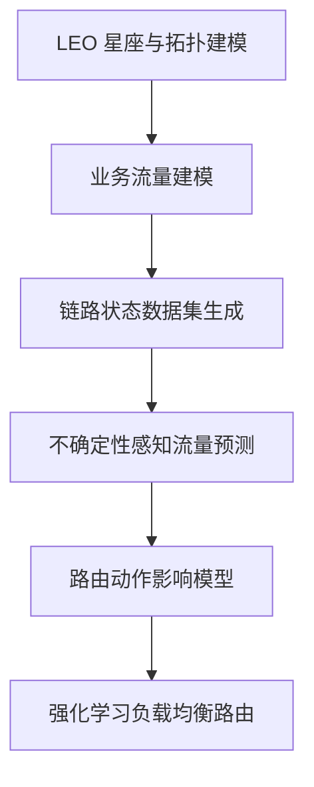
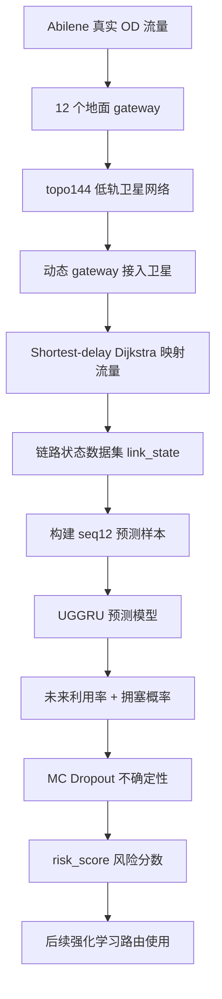
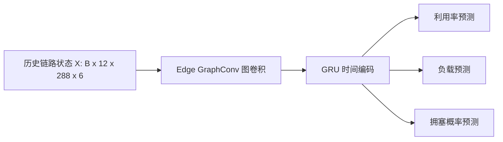

# 低轨卫星网络流量预测模块研究总结：

---

## 1. 研究题目

当前研究可以概括为：

> **面向流量预测的低轨卫星网络负载均衡路由算法研究。**
>
> **即先预测未来链路负载和拥塞风险，再利用强化学习进行负载均衡路由决策。**

| 关键词 | 含义 | 在本研究中的作用 |
|---|---|---|
| 低轨卫星网络 | 由大量低轨卫星和星间链路组成的网络 | 研究对象 |
| 流量预测 | 预测未来链路负载、拥塞概率和不确定性 | 为路由提供前瞻信息 |
| 负载均衡路由 | 避免部分链路过载，使流量更均匀分布 | 最终目标 |
| 强化学习 | 引入一个智能体，设置奖励和惩罚，通过试错学习路由策略 | 后续核心算法 |

一句话总结：

> 希望路由算法不只是找“现在最短的路”，而是能根据预测结果避开“未来可能拥塞的路”。

---

## 2. 完整研究路线

完整研究路线可以分成 6 个阶段：

| 阶段 | 模块 | 要解决的问题 | 当前状态 |
|---|---|---|---|
| 1 | LEO 星座与拓扑建模 | 构建低轨卫星、星间链路和 gateway 接入关系 | 已构建 144星的Walker星座 |
| 2 | 业务流量建模 | 构造或引入地面业务流量 | 已采用 Abilene 真实 OD 流量 |
| 3 | 链路状态数据集生成 | 得到每条星间链路的负载、利用率和拥塞标签 | 已完成 |
| 4 | 不确定性感知流量预测 | 预测未来链路利用率、拥塞概率和不确定性 | 已完成 |
| 5 | 路由动作影响模型 | 估计不同路由动作对未来负载的影响 | 未开始 |
| 6 | 强化学习负载均衡路由 | 根据预测结果选择路径，实现负载均衡 | 未开始 |

这条技术路线的核心逻辑如下：



---

## 3.本文档常见英文缩写和术语

| 英文/缩写 | 中文含义 | 在本文档中的意思 |
|---|---|---|
| LEO | Low Earth Orbit，低地球轨道 | 指低轨卫星网络 |
| ISL | Inter-Satellite Link，星间链路 | 卫星与卫星之间的通信链路 |
| OD | Origin-Destination，源-目的 | 地面节点之间的业务流量矩阵 |
| PoP | Point of Presence，网络接入点 | Abilene 数据中的 12 个地面节点 |
| Gateway | 地面网关 | 地面 PoP 接入卫星网络的入口 |
| Abilene | 美国科研骨干网数据集 | 当前使用的真实地面 OD 流量来源 |
| topo144 | 144 颗卫星拓扑 | 当前构建的低轨卫星网络场景名称 |
| 4-ISL | 每颗卫星 4 条星间链路 | 同轨前后 + 邻轨方向的固定连接方式 |
| Dijkstra | 迪杰斯特拉最短路径算法 | 当前用于生成训练数据的基线路由 |
| Shortest-delay Dijkstra | 最小时延 Dijkstra | 以传播时延为边权的最短路径算法 |
| link_state | 链路状态 | 每个时间片、每条 ISL 的负载/利用率/拥塞信息 |
| Edge graph | 链路图 | 把每条 ISL 当成图节点构建的图 |
| Seq12 | 长度为 12 的历史序列 | 用过去 12 个时间片预测下一时刻 |
| GNN | Graph Neural Network，图神经网络 | 用来学习链路之间空间关系 |
| GraphConv | Graph Convolution，图卷积 | 在 edge graph 上聚合相邻链路信息 |
| GRU | Gated Recurrent Unit，门控循环单元 | 用来学习时间序列变化 |
| LSTM | Long Short-Term Memory，长短期记忆网络 | baseline 中的经典时序模型 |
| UGGRU | Uncertainty-aware Graph GRU | 当前主模型，图结构 + GRU + 不确定性 |
| MC Dropout | Monte Carlo Dropout，蒙特卡洛 Dropout | 多次随机推理得到预测不确定性 |
| Risk score | 风险分数 | 利用率预测值 + 不确定性，用于衡量链路风险 |
| MLU | Maximum Link Utilization，最大链路利用率 | 某时间片所有链路中最高利用率 |
| MAE | Mean Absolute Error，平均绝对误差 | 回归预测误差指标，越小越好 |
| RMSE | Root Mean Squared Error，均方根误差 | 对大误差更敏感，越小越好 |
| Precision | 精确率 | 预测为拥塞的链路中，真正拥塞的比例 |
| Recall | 召回率 | 真实拥塞链路中，被模型找出来的比例 |
| F1 | F1 值 | Precision 和 Recall 的综合指标 |
| Baseline | 基线模型 | 用来和主模型对比的简单/常见方法 |
| PPO | Proximal Policy Optimization，近端策略优化 | 后续可用的强化学习算法 |
| Masked PPO | 带动作掩码的 PPO | 后续可屏蔽不可用/高风险路径的 PPO |

---

## 4. 当前已完成工作

当前完成的是：流量预测与拥塞风险预测。

| 模块 | 是否完成 | 简单解释 |
|---|---:|---|
| Abilene 流量数据解析 | 已完成 | 用真实地面 OD 流量作为业务输入 |
| topo144 低轨星座构建 | 已完成 | 构建 144 颗卫星和 288 条 4-ISL 链路 |
| gateway 动态接入 | 已完成 | 12 个地面 PoP 随时间接入不同卫星 |
| 链路状态数据集生成 | 已完成 | 得到每条 ISL 每个时间片的负载、利用率和拥塞标签 |
| 预测样本构建 | 已完成 | 用过去 12 个时间片预测下一时刻 |
| UGGRU 模型训练 | 已完成 | 预测下一时刻利用率、负载和拥塞概率 |
| 阈值校准 | 已完成 | validation 选 threshold=0.95，test 固定评估 |
| MC Dropout 不确定性 | 已完成 | 得到预测不确定性和 risk_score |
| baseline 对比 | 已完成 | 对比 Last、HA、GRU-only、LSTM-only |
| 强化学习路由 | 未开始 | 后续工作 |

一句话总结：

> 当前流量预测模块已经闭环，但是后续强化路由算法还没开始做

---

## 5. 整体流程图



---

## 6. 数据来源

当前使用 **Abilene（美国科研骨干网数据集）** 的真实 **OD（Origin-Destination，源-目的）流量矩阵**。

| 项目 | 数值 |
|---|---:|
| OD 矩阵 shape | `(48384, 12, 12)` |
| 时间片数量 | `48384` |
| PoP / gateway 数量 | `12` |
| Abilene 拓扑链路数量 | `30` |

`12 × 12` 表示 12 个地面 **PoP（Point of Presence，网络接入点）** 之间的业务流量矩阵。


**图 1：Abilene 总流量曲线。**  
这张图展示 Abilene 全网业务流量随时间的变化。横坐标是时间片编号，纵坐标是该时间片所有 OD 流量累加后的总流量。它说明输入业务流量本身是动态变化的，不是固定常数。

## 7. 卫星网络构建

当前构建的是一个简化 **Walker-like（类似 Walker 星座）** 低轨星座，命名为 `topo144`。

| 项目 | 数值 |
|---|---:|
| 卫星数量 | `144` |
| 轨道面数量 | `8` |
| 每轨卫星数 | `18` |
| 轨道高度 | `550 km` |
| 轨道倾角 | `53°` |
| 星间链路模式 | `4-ISL` |
| 无向 ISL 边数 | `288` |
| 每颗卫星度数 | `4` |
| gateway 最小仰角 | `15°` |


**图 2：topo144 卫星星座快照。**  
这张图展示某一时刻 144 颗低轨卫星的空间分布及其 4-ISL 连接关系。横坐标和纵坐标表示卫星位置的空间投影坐标，用来直观看到当前星座覆盖和连接结构。

### gateway 接入是动态的

```text
gateway_access_topo144.npy shape = (48384, 12)
```

每个时间片，每个地面 **gateway（地面网关）** 会根据仰角选择一个接入卫星。


**图 3：gateway 接入卫星变化示例。**  
这张图展示部分 gateway 在不同时间片接入卫星编号的变化。横坐标是时间片编号，纵坐标是接入卫星编号或接入关系。它说明地面网关不是固定接入同一颗卫星，而是随卫星运动动态切换。

### 但 ISL 目前是固定边集合

| 部分 | 是否动态 |
|---|---:|
| 卫星位置 | 动态 |
| gateway 接入卫星 | 动态 |
| 星间链路 ISL 边集合 | 固定 |
| ISL 断开/重连 | 暂未模拟 |
| remain_visible_time | 9999 占位值 |

> 当前是半动态拓扑。卫星位置和 gateway 接入随时间变化，但星间链路边集合暂时固定。这样做是为了先验证流量预测模块，后续可以加入真实动态 ISL 和剩余可见时间。

---

## 8. 链路状态数据集构建

当前做法：

1. 源 PoP 找到当前接入卫星；
2. 目的 PoP 找到当前接入卫星；
3. 在卫星网络中用 **shortest-delay Dijkstra（最小时延迪杰斯特拉算法）** 找路径；
4. 把 OD 流量累加到路径经过的 ISL 上；
5. 得到每条星间链路的负载、利用率和拥塞标签。

注意：

> Dijkstra 只是生成训练数据的基线路由，不是最终算法。

最终生成：

```text
link_state_topo144_shortest_delay.csv
```

| 项目 | 数值 |
|---|---:|
| 文件大小 | `约 718 MB` |
| 行数 | `13,934,304` |
| time 数量 | `48,383` |
| edge_id 数量 | `288` |
| capacity | `1000 Mbps` |
| 拥塞阈值 | `utilization > 0.8` |
| 拥塞样本比例 | `1.3596%` |

主要字段：

```text
load_mbps
utilization
delay_ms
queue_len
remain_visible_time
congestion_label
next_load_mbps
next_utilization
next_congestion_label
```


**图 4：平均链路利用率曲线。**  
横坐标是时间片编号，纵坐标是该时间片 288 条星间链路的平均 utilization（链路利用率）。这张图用来观察全网平均负载是否随时间变化。


**图 5：最大链路利用率 MLU 曲线。**  
横坐标是时间片编号，纵坐标是 MLU（Maximum Link Utilization，最大链路利用率），即该时间片所有链路中的最高利用率。MLU 高说明存在局部链路拥塞或高负载，是负载均衡路由重点要降低的指标。

---

## 9. 预测样本构建

用过去 12 个时间片预测下一时刻。

样本文件：

```text
samples_topo144_seq12.npz
```

| 数组 | shape | 说明 |
|---|---|---|
| X | `(48372, 12, 288, 6)` | 输入样本 |
| y_utilization | `(48372, 288)` | 下一时刻链路利用率 |
| y_load_mbps_norm | `(48372, 288)` | 下一时刻归一化负载 |
| y_congestion | `(48372, 288)` | 下一时刻是否拥塞 |

其中：

```text
12 = 历史窗口长度
288 = 星间链路数量
6 = 每条链路特征数
```

训练、验证、测试集按时间顺序划分：

| Split | 范围 | 样本数 |
|---|---:|---:|
| train | `[0, 33860)` | `33860` |
| val | `[33860, 41115)` | `7255` |
| test | `[41115, 48372)` | `7257` |

为什么按时间划分？

> 因为这是时间序列预测，如果随机划分，会把未来信息泄露到训练集里。


**图 6：不同数据集划分中的拥塞样本比例。**  
横坐标是 train、val、test 三个数据划分，纵坐标是 `y_congestion` 中正样本比例，也就是未来发生拥塞的样本占比。它说明当前任务是明显不平衡分类任务。

---

## 10. UGGRU 流量预测

**UGGRU（Uncertainty-aware Graph GRU，不确定性感知图 GRU）** 可以这样拆开理解：

```text
U = Uncertainty-aware，不确定性感知
G = Graph，图结构
GRU = Gated Recurrent Unit，门控循环单元
```

UGGRU 的输入为：

```text
X = [B, 12, 288, 6]
```

其中 12 是历史时间窗口长度，288 是 ISL edge 数量，6 个特征分别为 `utilization`、`load_mbps_norm`、`delay_ms_norm`、`queue_len_norm`、`remain_visible_time_norm`、`congestion_label`。

模型结构包括：GraphConvLayer 在 edge graph 上聚合相邻链路状态，提取空间关联；GRU 对每条链路的历史序列建模，提取时间依赖；三个输出 head 分别预测 `next_utilization`、`next_load_mbps_norm` 和 `next_congestion` logit。

```text
loss = 1.0 * MSE(util) + 0.3 * MSE(load) + 0.5 * BCE(congestion)
```

其中 BCE 使用训练集拥塞正负样本比例计算的 `pos_weight`，以缓解拥塞样本严重不平衡问题。

它的作用：

> 同时利用“链路之间的空间关系”和“链路自身的时间变化”，预测下一时刻链路利用率和拥塞概率。

### 使用图结构的原因：

星间链路不是孤立的。一条链路拥塞，往往和附近链路、同一路径上的链路有关。

所以把每条 ISL 当成 **edge graph（链路图）** 中的节点：

> 如果两条 ISL 共享同一颗卫星，就认为它们在 edge graph 中相邻。

### 模型结构



训练配置：

| 项目 | 数值 |
|---|---:|
| batch_size | `16` |
| lr | `0.001` |
| gcn_hidden | `32` |
| gru_hidden | `64` |
| dropout | `0.2` |
| device | `cuda` |
| best_epoch | `43` |
| best_val_loss | `0.186405` |


**图 7：UGGRU 训练/验证 loss 曲线。**  
横坐标是 epoch（训练轮数），纵坐标是 loss（损失值）。一般来说，loss 下降说明模型在学习；validation loss 最低的位置对应 best epoch，本实验 best epoch 为 43。

---

## 11. 阈值校准

普通二分类默认 threshold=0.5（即把预测拥塞概率大于0.5的样本判定为拥塞） 并不适合当前拥塞检测任务，因为真实拥塞样本比例只有 `1.32%` 左右，类别极不平衡。若直接使用 0.5，模型倾向于高召回但低精度，不利于后续路由系统中的风险控制。

所以更规范的处理是：

1. 在 validation set 上扫描阈值；
2. 选出最佳阈值；
3. 固定这个阈值到 test set；
4. 不在 test set 上调参。

最终选择：

```text
threshold = 0.95
```

test set 结果：

| 指标 | 数值 |
|---|---:|
| Precision | `0.460489` |
| Recall | `0.625566` |
| F1 | `0.530482` |
| true_positive_ratio | `1.3198%` |
| predicted_positive_ratio | `1.7929%` |


**图 8：阈值校准曲线。**  
横坐标是 threshold（拥塞判定阈值），纵坐标是 Precision（精确率）、Recall（召回率）和 F1。该图用来选择一个更合适的拥塞判定阈值。当前使用 validation set 选择 threshold=0.95，再固定到 test set 上评估。

一句话解释：

> 阈值校准让模型从“过度报警”变成“更平衡地识别拥塞”。

---

## 12. MC Dropout 不确定性评估

普通模型只能输出：

> 下一时刻这条链路利用率大概是多少。

但路由决策还需要知道：

> 这个预测靠不靠谱？

**MC Dropout（Monte Carlo Dropout，蒙特卡洛 Dropout）** 就是让模型在测试时保留 dropout（即每次推理时随机关闭一部分神经元），多次预测，得到：

| 输出 | 含义 |
|---|---|
| util_pred_mean | 利用率预测均值 |
| util_pred_std | 利用率预测不确定性 |
| cong_prob_mean | 拥塞概率均值 |
| cong_prob_std | 拥塞概率不确定性 |

然后构造风险分数：

```text
risk_score = util_pred_mean + lambda * util_pred_std
```

也就是说：

> 预测利用率高，而且模型还不确定，就认为这条链路风险更高。

MC Dropout 结果：

| 指标 | 数值 |
|---|---:|
| MAE_util | `0.033984` |
| RMSE_util | `0.161991` |
| coverage_1std | `76.46%` |
| coverage_2std | `89.95%` |
| uncertainty_error_corr | `0.555298` |
| F1 | `0.531142` |

最关键的指标是：

```text
uncertainty_error_corr = 0.555298，核心：衡量 “不确定性越大的样本，是否预测误差也越大”—— 数值＞0 且越高越好。
```

这说明：

> 模型越不确定的位置，确实越容易预测错。


**图 9：不确定性分箱与预测误差关系。**  
横坐标是不确定性分箱，也就是按照 `util_pred_std` 从低到高划分的区间；纵坐标是每个区间内的平均绝对误差。若曲线整体上升，说明模型不确定性越高，预测误差通常也越大。

---

## 13. risk_score的重要意义

风险排序结果：

| 高风险位置 | 真实拥塞率 | 相对随机提升 |
|---|---:|---:|
| Top 1% | `57.46%` | `43.54x` |
| Top 5% | `22.27%` | `16.87x` |
| Top 10% | `12.30%` | `9.32x` |

整体 test set 中真实拥塞比例只有约：

```text
1.32%
```

但如果只看模型认为风险最高的 Top 1% 位置，真实拥塞比例变成：

```text
57.46%
```

所以：

> risk_score 能把真正容易拥塞的链路筛出来。后续路由算法可以优先避开这些高风险链路。


**图 10：高风险 Top-k 位置中的真实拥塞率。**  
横坐标是 Top-k 比例，例如 Top 1%、Top 5%、Top 10%；纵坐标是这些高风险位置中真实发生拥塞的比例。该图用于证明 risk_score 能够有效筛选高风险链路。

---

## 14. baseline 对比实验

最终对比表：

| Model | 中文说明 | MAE_util | RMSE_util | F1 | 结论 |
|---|---|---:|---:|---:|---|
| Last | 最后一时刻预测法 | `0.031954` | `0.211180` | `0.447281` | 短时惯性强，但突变误差大 |
| HA | Historical Average，历史平均 | `0.057850` | `0.221878` | `0.000072` | 平均会抹平拥塞信号 |
| GRU-only | 只用 GRU 的时间模型 | `0.033540` | `0.170046` | `0.248991` | 只看时间，不看图结构 |
| LSTM-only | 只用 LSTM 的时间模型 | `0.035003` | `0.169367` | `0.257391` | 只看时间，不看图结构 |
| UGGRU | 图结构 + 时间序列 | `0.033072` | `0.160971` | `0.530482` | 图结构 + 时间序列 |
| UGGRU + MC Dropout | UGGRU + 不确定性估计 | `0.033984` | `0.161991` | `0.531142` | 增加不确定性和风险排序 |


**图 11：不同模型 MAE/RMSE 对比。**  
横坐标是模型名称，纵坐标是 MAE_util 和 RMSE_util。MAE 表示平均绝对误差，RMSE 对大误差更敏感。该图用于比较不同模型的链路利用率预测误差。


**图 12：不同模型拥塞预测 F1 对比。**  
横坐标是模型名称，纵坐标是 F1 值。F1 综合考虑 Precision 和 Recall，更适合评价拥塞这种不平衡分类任务。UGGRU 和 UGGRU + MC Dropout 的 F1 明显高于 GRU-only 和 LSTM-only，说明图结构对拥塞识别有帮助。

### 图表分析：

1. **Last 的 MAE 最低，不代表它最好。**  
   Last 适合平稳时刻，但 RMSE 高，说明遇到突变或高负载时误差大。

2. **HA 很差。**  
   历史平均会把突发拥塞抹平，所以 F1 几乎为 0。

3. **GRU/LSTM 不如 UGGRU。**  
   GRU/LSTM 只看时间，UGGRU 还看链路之间的图结构，所以拥塞 F1 更高。

4. **MC Dropout 的价值不是 MAE。**  
   它主要提供不确定性和 risk_score。

---

## 15. 下一步工作

后续要从“预测模块”进入“路由决策模块”。初步思路是：

> 把 UGGRU 输出的未来利用率、拥塞概率、不确定性和 risk_score 接入强化学习路由，让智能体不只看当前最短路径，而是主动避开未来高风险链路。

路由模块最终要证明：

> 引入流量预测和 risk_score 后，路由算法能够降低 MLU、降低拥塞率、降低平均时延，并提高网络负载均衡能力。

---

