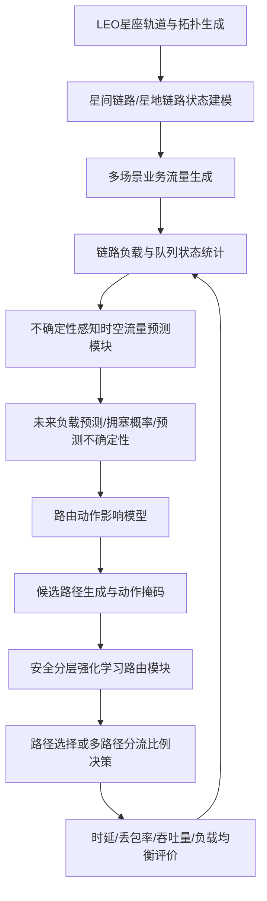

# 基于流量预测与强化学习的低轨卫星网络负载均衡路由算法技术路线

> 研究题目建议：**基于不确定性感知流量预测与安全分层强化学习的低轨卫星网络负载均衡路由算法研究**  
> 简化题目建议：**基于流量预测和分层强化学习的低轨卫星网络主动负载均衡路由算法研究**

---

## 1. 研究背景与问题定位

低轨卫星网络（Low Earth Orbit, LEO）具有覆盖范围广、传输时延低、组网灵活等优势，是未来空天地一体化网络和卫星互联网的重要组成部分。与地面网络相比，低轨卫星网络具有以下典型特征：

1. **拓扑动态性强**：卫星高速运动，星间链路和星地链路会随时间不断变化。
2. **业务流量分布不均**：人口密集区、热点城市、海上航线、航空区域和突发事件区域会形成局部流量高峰。
3. **链路资源有限**：星间链路带宽、星上计算能力和缓存能力有限，容易出现局部拥塞。
4. **路由决策复杂**：路由算法不仅要考虑最短时延，还要考虑负载均衡、链路稳定性、路径切换代价和星上部署复杂度。
5. **预测与路由耦合强**：未来流量变化会影响路由选择，而路由选择本身也会改变未来链路负载分布。

因此，本研究关注的问题不是单纯的“流量预测”，也不是单纯的“强化学习路由”，而是：

> **如何利用对未来链路负载和拥塞风险的预测，引导强化学习路由智能体提前规避潜在拥塞链路，从而实现低轨卫星网络中的主动负载均衡。**

---

## 2. 已有研究基础与需要避开的雷同路线

### 2.1 已有相关研究

目前，低轨卫星网络中的“流量预测 + 强化学习路由”方向已经出现了一些代表性工作：

1. **DLBR：时空流量预测 + 多智能体Dueling Double DQN**
   - 使用 GCN、LSTM 和 Attention 提取低轨卫星网络流量的空间和时间特征；
   - 结合多智能体 Dueling Double DQN 进行动态负载均衡路由；
   - 利用本地负载信息和预测流量信息降低路径最大带宽利用率和平均带宽利用率。

2. **MA-DRL：多智能体深度强化学习分布式路由**
   - 将每颗卫星视为一个智能体；
   - 每个智能体主要依赖局部观测和邻居反馈进行路由决策；
   - 采用离线训练、在线推理的模式，降低对地面集中控制的依赖。

3. **GDRL-SFCR：GNN + DRL 路由**
   - 利用图神经网络提取低轨巨型星座的拓扑特征；
   - 结合深度强化学习进行端到端路由决策；
   - 同时优化传输时延和网络负载，并考虑服务功能链约束。

4. **DTAR：交通感知分域 + GAT + Action-Masked PPO**
   - 先使用 NSGA-II 进行离线交通感知域划分；
   - 再利用 GAT 编码域间链路流量、负载和故障状态；
   - 最后通过带动作掩码的 PPO 进行域间路由决策。

### 2.2 本研究需要避免的简单重复

为了避免与现有研究雷同，本文不建议采用以下直接路线：

| 不建议直接采用的路线 | 原因 |
|---|---|
| GCN-LSTM-Attention + D3QN | 已有 DLBR 研究高度相似 |
| GAT + PPO 交通感知路由 | 已有 DTAR 研究较接近 |
| 只把预测流量加入 Dijkstra 边权 | 创新性不足，更像工程调参 |
| 普通 DQN 下一跳选择 | 已有大量 DRL/Q-routing 类研究 |
| 只优化平均时延和吞吐量 | 指标常规，难以体现负载均衡研究深度 |
| 全局集中式 RL 控制所有卫星 | 状态空间和动作空间过大，不符合大规模星座约束 |

---

## 3. 本研究的核心思想

本文拟提出一种：

> **不确定性感知预测 + 路由动作影响模型 + 安全分层强化学习的低轨卫星网络负载均衡路由方法**

其核心思想是：

1. 不再只预测一个确定的未来流量值，而是预测未来链路负载、拥塞概率和预测不确定性；
2. 不再只预测“自然演化下的未来流量”，而是进一步预测“不同路由动作执行后对未来链路负载的影响”；
3. 不再让强化学习在全网范围内盲目选择路径，而是采用候选路径约束、动作掩码和分层强化学习机制；
4. 在路由决策中综合考虑当前链路状态、预测负载、拥塞风险、路径稳定性和路径切换代价；
5. 通过传统路由回退机制提高算法的安全性和可部署性。

一句话概括：

> **已有方法更多是“预测未来流量后辅助路由”，本文进一步研究“在预测存在不确定性、路由动作会改变未来负载分布的情况下，如何进行主动、安全、可部署的负载均衡路由”。**

---

## 4. 总体技术路线

本文整体技术路线可分为五个阶段：

1. **低轨卫星网络时变拓扑建模**
2. **多场景业务流量建模与链路负载数据生成**
3. **不确定性感知时空流量预测**
4. **路由动作影响模型构建**
5. **基于动作掩码的安全分层强化学习路由决策**

### 4.1 总体流程图



---

## 5. 第一阶段：低轨卫星网络时变拓扑建模

### 5.1 星座模型

构建 Walker 或 Iridium-like 低轨卫星星座。每个时间片生成一张动态网络图：

\[
G_t=(V_t,E_t,W_t)
\]

其中：

- \(V_t\)：时刻 \(t\) 的卫星节点集合；
- \(E_t\)：时刻 \(t\) 的星间链路和星地链路集合；
- \(W_t\)：链路属性集合，包括传播时延、链路容量、队列长度、剩余带宽、链路剩余可见时间等。

### 5.2 建议仿真参数

| 参数 | 建议设置 |
|---|---|
| 轨道类型 | Walker Delta 或 Iridium-like |
| 轨道面数 | 6、8 或 12 |
| 每轨卫星数 | 12、18 或 24 |
| 总卫星数量 | 72、144 或 288 |
| 星间链路 | 同轨前后 + 邻轨左右，4-ISL |
| 时间片长度 | 10 s、30 s 或 60 s |
| 路由更新周期 | 与时间片一致或按事件触发 |

### 5.3 链路模型

链路属性可以包括：

\[
W_{ij}(t)=\{d_{ij}(t), C_{ij}(t), q_{ij}(t), u_{ij}(t), T_{visible}^{ij}(t)\}
\]

其中：

- \(d_{ij}(t)\)：链路传播时延；
- \(C_{ij}(t)\)：链路容量；
- \(q_{ij}(t)\)：链路队列长度；
- \(u_{ij}(t)\)：链路利用率；
- \(T_{visible}^{ij}(t)\)：链路剩余可见时间。

链路利用率定义为：

\[
u_{ij}(t)=\frac{F_{ij}(t)}{C_{ij}(t)}
\]

其中 \(F_{ij}(t)\) 表示链路当前承载流量，\(C_{ij}(t)\) 表示链路容量。

---

## 6. 第二阶段：多场景业务流量建模

为了避免实验只停留在简单随机流量，本文建议构建四类业务流量场景。

### 6.1 均匀流量场景

均匀随机产生源节点和目的节点，作为基础对照场景。  
该场景用于验证算法在普通负载条件下是否稳定。

### 6.2 人口分布驱动流量场景

根据地面区域人口密度、城市分布或用户密集度生成业务需求。  
该场景用于模拟真实卫星互联网中业务需求空间分布不均的问题。

### 6.3 时区周期流量场景

根据不同地区的昼夜时间变化生成业务量波动。  
例如白天业务量较高，夜间业务量较低。  
该场景用于体现业务流量的时间周期性。

### 6.4 突发热点流量场景

模拟灾害应急、赛事活动、海上航线、航空区域或局部热点事件造成的短时间流量激增。  
该场景用于测试算法对突发拥塞的应对能力。

### 6.5 业务需求模型

可将区域 \(r\) 在时刻 \(t\) 的业务需求表示为：

\[
D_r(t)=D_{base}(r,t)+D_{hot}(r,t)+D_{burst}(r,t)
\]

其中：

- \(D_{base}(r,t)\)：基础业务需求；
- \(D_{hot}(r,t)\)：热点区域业务需求；
- \(D_{burst}(r,t)\)：突发业务需求。

---

## 7. 第三阶段：链路负载数据集生成

在每个时间片，根据业务源节点、目的节点和当前路由策略，统计每条链路的负载状态。

### 7.1 链路负载标签

定义下一时间片链路是否拥塞：

\[
y_{ij}(t+1)=
\begin{cases}
1, & u_{ij}(t+1)>\rho \\
0, & u_{ij}(t+1)\leq \rho
\end{cases}
\]

其中 \(\rho\) 为拥塞阈值，可设为 0.8 或 0.9。

### 7.2 记录的数据特征

每条链路在每个时间片记录以下特征：

| 类型 | 特征 |
|---|---|
| 拓扑特征 | 邻接关系、节点度、轨道面编号、链路是否可用 |
| 链路特征 | 传播时延、带宽、剩余容量、链路剩余可见时间 |
| 负载特征 | 当前利用率、历史利用率、队列长度、丢包状态 |
| 业务特征 | 源目的区域、业务类型、业务优先级 |
| 标签 | 下一时刻链路负载、下一时刻拥塞状态 |

---

## 8. 第四阶段：不确定性感知时空流量预测模块

### 8.1 设计目标

已有研究多数使用单点预测值辅助路由，例如预测下一时刻链路流量或节点负载。  
本文拟进一步预测：

\[
\hat{u}_{ij}(t+1), \quad \sigma_{ij}(t+1), \quad P_{ij}^{cong}(t+1)
\]

其中：

- \(\hat{u}_{ij}(t+1)\)：下一时刻链路利用率预测值；
- \(\sigma_{ij}(t+1)\)：预测不确定性；
- \(P_{ij}^{cong}(t+1)\)：链路拥塞概率。

### 8.2 模型结构

建议采用：

> **GNN + TCN/GRU + 不确定性估计**

具体设计如下：

1. **GNN层**：提取低轨卫星网络的空间拓扑相关性；
2. **TCN/GRU层**：提取链路负载的时间变化规律；
3. **MC Dropout 或 Ensemble层**：估计预测不确定性；
4. **输出层**：同时输出未来链路利用率、拥塞概率和预测方差。

### 8.3 输入特征

模型输入为历史窗口内的链路状态序列：

\[
X_t=[U_t,Q_t,D_t,B_t,T_t]
\]

其中：

- \(U_t\)：链路利用率矩阵；
- \(Q_t\)：队列长度矩阵；
- \(D_t\)：传播时延矩阵；
- \(B_t\)：剩余带宽矩阵；
- \(T_t\)：链路剩余可见时间矩阵。

### 8.4 损失函数

预测模型的损失函数可以由回归损失和分类损失组成：

\[
\mathcal{L}_{pred}=\lambda_1 \cdot MAE(\hat{u},u)+\lambda_2 \cdot BCE(\hat{y},y)+\lambda_3 \cdot \mathcal{L}_{uncertainty}
\]

其中：

- \(MAE\)：链路利用率预测误差；
- \(BCE\)：拥塞分类损失；
- \(\mathcal{L}_{uncertainty}\)：不确定性约束项；
- \(\lambda_1,\lambda_2,\lambda_3\)：权重系数。

### 8.5 与已有研究的区别

已有研究多数只关注预测值是否准确，而本文进一步关注预测结果是否适合路由决策。  
因此，本文不是简单输出一个未来流量值，而是输出：

1. 未来负载预测值；
2. 未来拥塞概率；
3. 预测不确定性。

这可以避免强化学习智能体过度相信错误预测结果。

---

## 9. 第五阶段：路由动作影响模型

### 9.1 引入原因

普通流量预测模型通常回答的是：

> 如果网络自然演化，下一时刻哪里可能拥塞？

但在实际路由中，智能体一旦改变路径，未来链路负载也会随之改变。  
因此，仅预测自然流量是不够的，还需要预测不同路由动作对未来负载分布的影响。

### 9.2 模型定义

构建轻量级路由动作影响模型：

\[
\hat{S}_{t+1}=M_\theta(S_t,A_t)
\]

其中：

- \(S_t\)：当前网络状态；
- \(A_t\)：候选路由动作；
- \(\hat{S}_{t+1}\)：执行该动作后的预测网络状态。

### 9.3 输入与输出

| 项目 | 内容 |
|---|---|
| 输入 | 当前拓扑、当前链路负载、当前队列状态、候选路径或分流比例 |
| 输出 | 执行动作后的下一时刻链路负载、拥塞概率、负载均衡程度 |
| 作用 | 为强化学习智能体提供前瞻性决策依据 |

### 9.4 创新意义

该模块的核心创新在于：

> 将路由动作作为影响未来链路负载演化的重要因素，而不是将流量预测视为独立于路由决策之外的模块。

这样可以避免以下问题：

1. 预测模块认为某条链路会拥塞；
2. 路由算法把流量绕开；
3. 结果另一条链路又成为新的拥塞点；
4. 原预测结果与实际路由后的状态不一致。

---

## 10. 第六阶段：安全分层强化学习路由模块

### 10.1 强化学习建模

将低轨卫星网络路由问题建模为马尔可夫决策过程：

\[
MDP = \langle S,A,R,P,\gamma \rangle
\]

其中：

- \(S\)：网络状态空间；
- \(A\)：路由动作空间；
- \(R\)：奖励函数；
- \(P\)：状态转移概率；
- \(\gamma\)：折扣因子。

### 10.2 智能体设计

不建议每颗卫星单独设置一个复杂智能体。  
本文建议采用**区域/分域智能体**：

- 一个轨道面作为一个域；
- 或多个相邻轨道面组成一个域；
- 或按地理覆盖区域划分域。

这样可以降低状态空间和动作空间规模，提高训练稳定性。

### 10.3 状态空间设计

状态空间包括：

\[
S_t = \{G_t,U_t,Q_t,D_t,\hat{U}_{t+1},\sigma_{t+1},P_{cong},R_t\}
\]

其中：

- \(G_t\)：当前拓扑；
- \(U_t\)：当前链路利用率；
- \(Q_t\)：当前队列长度；
- \(D_t\)：传播时延；
- \(\hat{U}_{t+1}\)：预测链路利用率；
- \(\sigma_{t+1}\)：预测不确定性；
- \(P_{cong}\)：未来拥塞概率；
- \(R_t\)：链路剩余可见时间或路径稳定性。

### 10.4 动作空间设计

为了避免动作空间过大，本文采用候选路径动作空间。  
先通过 K 最短路径或负载感知 Dijkstra 生成候选路径集合：

\[
\mathcal{P}_{s,d}=\{p_1,p_2,\ldots,p_K\}
\]

强化学习智能体只需在候选路径集合中选择：

\[
A_t \in \{p_1,p_2,\ldots,p_K\}
\]

如果进行多路径负载均衡，则动作可以表示为：

\[
A_t=(\lambda_1,\lambda_2,\ldots,\lambda_K)
\]

其中 \(\lambda_k\) 表示第 \(k\) 条路径的分流比例。

为降低实现难度，可先采用离散分流比例，例如：

| 动作编号 | 分流比例 |
|---|---|
| 1 | 100%-0%-0% |
| 2 | 70%-30%-0% |
| 3 | 50%-30%-20% |
| 4 | 40%-40%-20% |

### 10.5 动作掩码机制

为了避免强化学习选择不可行或高风险路径，引入动作掩码机制。

如果候选路径满足以下条件之一，则将其屏蔽：

1. 路径中存在即将断开的链路；
2. 路径中存在容量不足链路；
3. 路径预测拥塞概率过高；
4. 路径跳数超过阈值；
5. 路径时延超过业务约束；
6. 路径预测不确定性过高。

掩码规则示例：

\[
Mask(p_k)=0,\quad if\quad \max_{(i,j)\in p_k}P_{ij}^{cong}>\tau
\]

或者：

\[
Mask(p_k)=0,\quad if\quad T_{visible}(p_k)<T_{min}
\]

### 10.6 强化学习算法选择

建议使用：

> **Masked PPO / Safe PPO / Hierarchical PPO**

原因：

1. PPO训练相对稳定；
2. 动作掩码可以排除不可行动作；
3. 适合处理动态拓扑下的候选路径选择；
4. 可以和分层控制机制结合；
5. 比普通 DQN 更适合较复杂的策略优化场景。

---

## 11. 奖励函数设计

奖励函数需要体现负载均衡、时延、丢包、路径稳定性和预测风险。

可设计为：

\[
R_t= -\alpha Delay_t-\beta MLU_t-\gamma PLR_t-\delta J_t-\eta Risk_t-\mu Switch_t
\]

其中：

- \(Delay_t\)：平均端到端时延；
- \(MLU_t\)：最大链路利用率；
- \(PLR_t\)：丢包率；
- \(J_t\)：链路负载不均衡度；
- \(Risk_t\)：预测拥塞风险；
- \(Switch_t\)：路径切换惩罚；
- \(\alpha,\beta,\gamma,\delta,\eta,\mu\)：权重系数。

### 11.1 负载不均衡度

\[
J_t=\frac{1}{|E|}\sum_{(i,j)\in E}(u_{ij}(t)-\bar{u}(t))^2
\]

### 11.2 预测风险项

\[
Risk_t=\sum_{(i,j)\in p}P_{ij}^{cong}(t+1)\cdot\sigma_{ij}(t+1)
\]

其中，拥塞概率越高、预测不确定性越大，该路径受到的惩罚越强。

---

## 12. 算法整体流程

本文方法可以命名为：

> **UPHR：Uncertainty-aware Predictive Hierarchical Routing**  
> 中文名：**不确定性感知预测分层路由算法**

### 12.1 离线阶段

1. 构建 LEO 星座；
2. 生成时变拓扑；
3. 构建多场景业务流量；
4. 使用基线路由算法生成链路负载数据；
5. 训练不确定性感知时空流量预测模型；
6. 训练路由动作影响模型；
7. 训练安全分层强化学习路由智能体。

### 12.2 在线阶段

每个时间片执行：

1. 获取当前局部链路状态；
2. 预测下一时刻链路负载、拥塞概率和预测不确定性；
3. 生成源目的节点之间的候选路径集合；
4. 根据链路可用性、拥塞风险和预测不确定性生成动作掩码；
5. 强化学习智能体选择路径或多路径分流比例；
6. 执行路由动作并更新链路负载；
7. 若预测置信度较低，则回退到负载感知 Dijkstra。

### 12.3 伪代码

```text
Algorithm: UPHR 不确定性感知预测分层路由算法

Input:
    当前拓扑 G_t
    当前链路状态 U_t, Q_t, D_t
    源目的业务请求 R_t
    历史链路状态序列 H_t

Output:
    路由路径 p 或多路径分流比例 λ

1. 根据 G_t 和业务请求 R_t 生成候选路径集合 P = {p1, p2, ..., pK}
2. 将历史链路状态 H_t 输入时空流量预测模型
3. 得到未来链路负载预测值、拥塞概率和预测不确定性
4. 对每条候选路径计算风险分数 Risk(pk)
5. 根据链路可用性、剩余可见时间、拥塞概率和不确定性生成动作掩码 Mask(P)
6. 将当前状态、预测状态和动作掩码输入强化学习智能体
7. 智能体选择路由动作 A_t
8. 使用路由动作影响模型预测执行 A_t 后的未来负载状态
9. 若动作风险可接受，则执行该动作
10. 否则回退到负载感知 Dijkstra 或备选安全路径
11. 更新网络状态并计算奖励 R_t
12. 返回最终路径或分流比例
```

---

## 13. 实验设计

### 13.1 仿真平台

建议分阶段实现：

| 阶段 | 平台 | 用途 |
|---|---|---|
| 阶段1 | Python + NetworkX + SGP4 | 快速构建拓扑、路由和算法验证 |
| 阶段2 | STK + Python | 生成更真实的卫星轨道和可见性数据 |
| 阶段3 | ns-3 可选 | 验证队列、吞吐、丢包等网络层性能 |

硕士论文建议以 Python + NetworkX 为主，STK 作为轨道数据增强，ns-3 可作为后续扩展。

### 13.2 对比算法

| 类型 | 对比算法 |
|---|---|
| 传统最短路 | Dijkstra / Shortest Path |
| 负载感知传统算法 | Load-aware Dijkstra |
| 多路径算法 | K-shortest path + ECMP |
| 强化学习算法 | DQN / Dueling DQN |
| 多智能体算法 | MA-DRL |
| 普通预测辅助算法 | GCN-LSTM + DQN 或简化 DLBR |
| 本文算法 | 不确定性感知预测 + 动作影响模型 + Masked PPO |

### 13.3 消融实验

| 实验组 | 目的 |
|---|---|
| 去掉预测模块 | 验证流量预测是否有效 |
| 去掉不确定性估计 | 验证不确定性感知是否能降低错误预测影响 |
| 去掉路由动作影响模型 | 验证 World Model 思想是否有效 |
| 去掉动作掩码机制 | 验证动作掩码是否提高训练稳定性和可行性 |
| 去掉路径切换惩罚 | 验证路径稳定性约束是否有效 |

### 13.4 评价指标

| 指标 | 含义 |
|---|---|
| 平均端到端时延 | 衡量时延性能 |
| 丢包率 | 衡量拥塞和可靠性 |
| 吞吐量 | 衡量网络传输能力 |
| 最大链路利用率 MLU | 衡量热点链路压力 |
| 链路利用率方差 | 衡量负载均衡程度 |
| 路由成功率 | 衡量可达性 |
| 路径切换次数 | 衡量路由稳定性 |
| 推理时间 | 衡量算法可部署性 |
| 预测误差 | MAE、RMSE、MAPE |
| 拥塞预测性能 | Precision、Recall、F1 |

其中，最重要的评价指标应为：

1. 最大链路利用率；
2. 链路利用率方差；
3. 平均端到端时延；
4. 丢包率；
5. 路由成功率；
6. 推理时间。

---

## 14. 预期创新点

### 创新点一：不确定性感知的链路拥塞风险预测方法

现有低轨卫星网络预测路由方法多使用单点流量预测结果辅助路由决策，难以反映预测误差对路径选择的影响。  
本文拟在时空流量预测模型中引入不确定性估计机制，同时预测未来链路负载、拥塞概率和预测置信度，使路由算法能够规避高风险、高不确定性的链路。

### 创新点二：面向路由动作影响的未来负载预测机制

现有研究通常将流量预测视为独立模块，忽略了路由动作本身会改变未来链路负载分布。  
本文借鉴 World Model 思想，将当前网络状态和候选路由动作共同作为输入，预测执行不同路由动作后的未来链路负载状态，为强化学习智能体提供前瞻性决策依据。

### 创新点三：安全分层强化学习负载均衡路由算法

针对 LEO 卫星网络拓扑动态、动作空间大和星上资源受限的问题，本文拟采用候选路径约束和动作掩码机制，将强化学习动作空间限制在可行路径集合内，并结合预测拥塞风险、路径稳定性和链路剩余可见时间进行安全路由决策，从而提高训练稳定性和算法可部署性。

### 创新点四：传统路由回退机制

考虑到 AI 模型在预测错误、异常流量或突发链路失效时可能出现不稳定决策，本文拟设计负载感知 Dijkstra 回退机制。当预测置信度低或动作风险过高时，系统自动切换到传统安全路由策略，提高算法鲁棒性。

---

## 15. 与现有研究的本质区别

| 对比维度 | 已有 DLBR / MA-DRL / DTAR 类研究 | 本文研究 |
|---|---|---|
| 流量预测 | 多数预测一个未来流量值 | 预测负载、拥塞概率和不确定性 |
| 预测与路由关系 | 预测结果作为状态输入 | 预测不同路由动作造成的未来负载变化 |
| 强化学习动作 | 下一跳或域间路径选择 | 候选路径选择 / 多路径分流 / 动作掩码 |
| 决策依据 | 当前状态 + 预测状态 | 当前状态 + 风险预测 + 动作后果预测 |
| 鲁棒性 | 较少分析预测误差影响 | 显式考虑预测不确定性和回退机制 |
| 可部署性 | 模型可能偏复杂 | 离线训练、在线轻量推理、传统算法兜底 |

---

## 16. 预期研究成果

本文预期实现以下成果：

1. 构建一个低轨卫星网络时变拓扑和多场景业务流量仿真平台；
2. 提出一种不确定性感知的时空流量预测模型；
3. 构建路由动作影响预测模型；
4. 设计基于动作掩码的安全分层强化学习负载均衡路由算法；
5. 通过多场景仿真实验证明所提算法在负载均衡、时延、丢包率和路由成功率方面优于传统方法；
6. 通过消融实验验证预测不确定性、动作影响模型和动作掩码机制的有效性。

---

## 17. 论文结构建议

### 第1章 绪论

- 研究背景与意义；
- 低轨卫星互联网发展现状；
- 低轨卫星网络路由面临的问题；
- 本文研究内容与创新点。

### 第2章 国内外研究现状

- 低轨卫星网络传统路由；
- 负载均衡路由；
- 流量预测方法；
- 深度强化学习路由；
- 现有研究不足。

### 第3章 低轨卫星网络建模与问题定义

- 星座模型；
- 链路模型；
- 业务流量模型；
- 队列与负载模型；
- 优化目标；
- MDP 建模。

### 第4章 不确定性感知时空流量预测方法

- 时空图建模；
- GNN + TCN/GRU 预测；
- 拥塞概率预测；
- 不确定性估计；
- 预测模型评估。

### 第5章 基于安全分层强化学习的负载均衡路由算法

- 候选路径生成；
- 路由动作影响模型；
- 状态空间；
- 动作空间；
- 奖励函数；
- Masked PPO 训练；
- 算法复杂度分析。

### 第6章 仿真实验与结果分析

- 实验环境；
- 对比算法；
- 不同业务流量场景；
- 不同星座规模；
- 消融实验；
- 推理时间和复杂度分析。

### 第7章 总结与展望

- 本文工作总结；
- 存在不足；
- 后续拓展方向。

---

## 18. 可行性分析

### 18.1 技术可行性

本文方法可以基于 Python 实现，主要依赖：

- NetworkX：拓扑图建模与路由计算；
- SGP4 或 STK：卫星轨道与可见性计算；
- PyTorch：时空预测模型与强化学习模型训练；
- Gymnasium / Stable-Baselines3：强化学习环境构建；
- NumPy / Pandas：数据处理；
- Matplotlib：实验结果可视化。

### 18.2 工作量可控性

本文不直接追求真实商业星座全规模仿真，而是先在可控规模的 Walker 星座中进行算法验证。  
星座规模可以从 72 颗卫星逐步扩展到 144 或 288 颗卫星。

### 18.3 风险控制

| 可能风险 | 应对策略 |
|---|---|
| 强化学习训练不稳定 | 使用 PPO、动作掩码和候选路径约束 |
| 预测模型效果不明显 | 增加拥塞分类任务和不确定性估计 |
| 仿真场景过于简单 | 构建均匀、热点、周期和突发四类流量 |
| 算法复杂度过高 | 使用轻量 GNN + GRU/TCN，在线只做推理 |
| 结果说服力不足 | 增加消融实验和多场景对比 |

---

## 19. 参考文献与资料链接

1. Ying Ju, Jiaxin Song, Wenjin Li, et al. **Dynamic Load-Balancing Routing Strategy for LEO Satellite Networks Based on Spatio-Temporal Traffic Prediction**. IEEE Transactions on Aerospace and Electronic Systems, 2025.  
   链接：https://ui.adsabs.harvard.edu/abs/2025ITAES..6111954J/abstract

2. Chen Zhou, Jiangtao Luo, Yongyi Ran. **Traffic-Aware Domain Partitioning and Load-Balanced Inter-Domain Routing for LEO Satellite Networks**. arXiv, 2026.  
   链接：https://arxiv.org/abs/2604.12382

3. Peng Xu, et al. **Multi-agent deep reinforcement learning for service function chain deployment in LEO space-ground integrated networks**. Computer Communications, 2025.  
   链接：https://www.sciencedirect.com/science/article/abs/pii/S0140366425002993

4. Yan Chen, Huan Cao, Longhe Wang, et al. **Deep Reinforcement Learning-Based Routing Method for Low Earth Orbit Mega-Constellation Satellite Networks with Service Function Constraints**. Sensors, 2025.  
   链接：https://www.mdpi.com/1424-8220/25/4/1232

5. Xiaoqian Qi, Haoye Chai, Yue Wang, Yong Li. **Beyond Static Forecasting: Unleashing the Power of World Models for Mobile Traffic Extrapolation**. arXiv, 2026.  
   链接：https://arxiv.org/abs/2604.08199

6. Haoye Chai, Yuan Yuan, Yong Li. **MobiWorld: World Models for Mobile Wireless Network**. arXiv, 2025.  
   链接：https://arxiv.org/abs/2507.09462

7. 3GPP. **NTN & Satellite in 5G and 6G**.  
   链接：https://www.3gpp.org/technologies/ntn-overview

---

## 20. 开题报告中可直接使用的研究内容表述

本文拟研究一种基于流量预测和强化学习的低轨卫星网络主动负载均衡路由算法。首先，构建低轨卫星时变拓扑模型和多场景业务流量模型，刻画低轨卫星网络中由卫星高速运动、用户分布不均和突发业务引起的链路负载动态变化。其次，设计不确定性感知的时空流量预测模型，利用历史链路负载、拓扑结构、链路剩余可见时间和队列状态预测未来链路负载、拥塞概率及预测不确定性。进一步，针对现有预测辅助路由方法未充分考虑路由动作对未来负载分布影响的问题，构建轻量级路由动作影响模型，预测不同候选路由动作执行后可能造成的链路负载变化。在此基础上，设计基于动作掩码的分层强化学习路由算法，将预测负载、拥塞风险、当前链路状态和路径稳定性纳入状态空间，通过综合考虑端到端时延、最大链路利用率、丢包率、负载均衡程度和路径切换代价的奖励函数，实现对潜在拥塞链路的主动规避和网络负载的动态均衡。最后，通过 Python/NetworkX/STK 构建仿真平台，与最短路径、负载感知 Dijkstra、DQN、MA-DRL 和普通预测辅助路由算法进行对比，验证所提算法在不同星座规模、不同业务负载和突发流量场景下的有效性。
